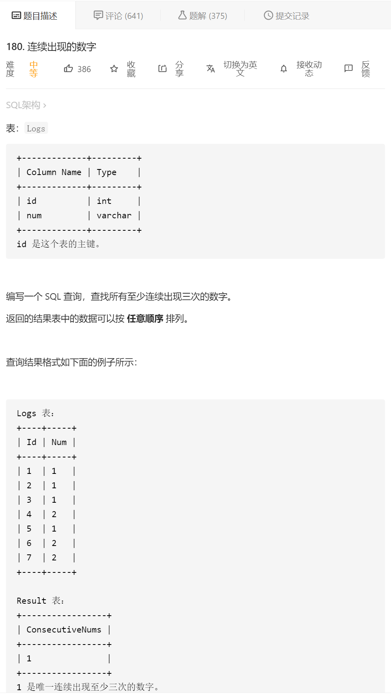
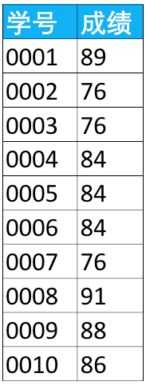
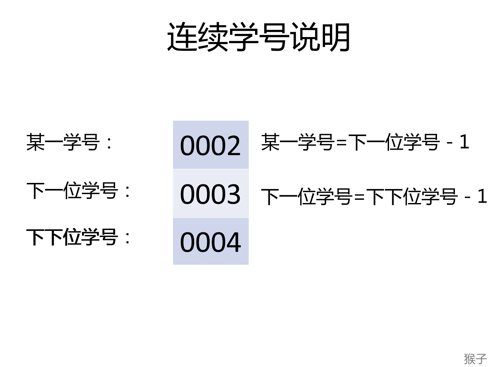
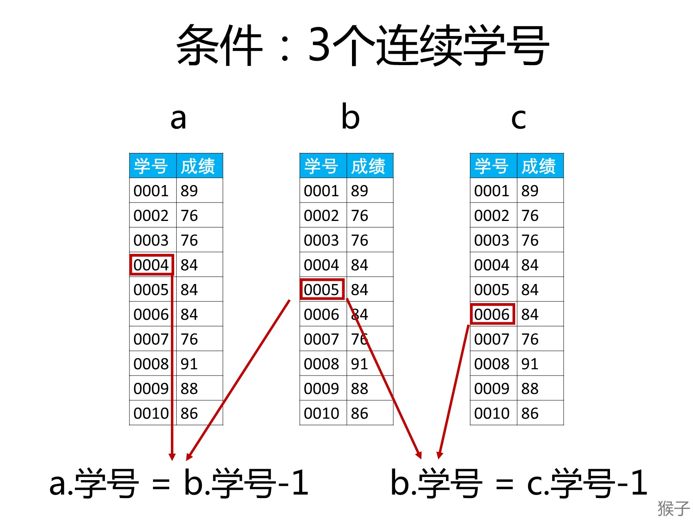

#### [180. 连续出现的数字](https://leetcode-cn.com/problems/consecutive-numbers/)



思路1：三表连接

**【题目】**

下面是学生的成绩表（表名score，列名：学号、成绩），使用SQL查找所有至少连续出现3次的成绩。



例如，“成绩”这一列里84是连续出现3次的成绩。

1.什么是连续出现3次？
假设“学号”是按顺序排列的（如果不是，可以使用增加一列，让学号是按序号顺序排列的），所以每一学号与上一学号相差1。例如下图的3个学号是连续学号，他们之间的关系是：

某一学号（0002）=下一位的学号（0003）-1
下一位学号（0003）=下下位学号（0004）-1



2.如果这3个连续学号的成绩相等，就是题目要求的“至少连续出现3次的成绩”。

3.利用“自连接（自身连接）“的思路

自连接（自身连接）的本质是把一张表复制出多张一模一样的表来使用。SQL语法：

```
select 列明 
from 表名 as 别名1,表名 as 别名2;
```

步骤1）将成绩表（score）复制3分，分别命名为a、b、c

```
select *
from score as a,
   score as b,
   score as c;
```

步骤2）我们需要找到这3个表中3个**连续**的学号，这个条件如下
a.学号 = b.学号-1 and b.学号 = c.学号-1




三表连接

步骤3）还要让这3个学号连续的人“成绩相等”，这个条件如下
a.成绩 = b.成绩 and b.成绩 = c.成绩

将步骤2和步骤3的条件合并起来就是下面SQL里的where字句：

```
select *
from score as a,
   score as b,
   score as c;
 where a.学号 = b.学号 - 1
   and b.学号 = c.学号 - 1
   and a.成绩 = b.成绩
   and b.成绩 = c.成绩;
```

步骤4）前面步骤已经将连续3人相等的成绩找出，现在用distinct去掉自连接产生的重复数。最终SQL如下：

```java
select distinct a.成绩 as 最终答案
from score as a,
   score as b,
   score as c;
 where a.学号 = b.学号 - 1
   and b.学号 = c.学号 - 1
   and a.成绩 = b.成绩
   and b.成绩 = c.成绩;
```

如果不用distinct的话 如果有个连续出现了4次 就会有两个重复出现三次的情况


这边来个额外的知识：

这边有个小知识 就是那些个聚合函数不能用再where后面

找到出现超过三次的num个数：

```
# Write your MySQL query statement below
select count(num),num
from logs
group by num
having count(num)>1
```

或者

```
# Write your MySQL query statement below
select num
from logs
group by num
having count(num)>1
```

