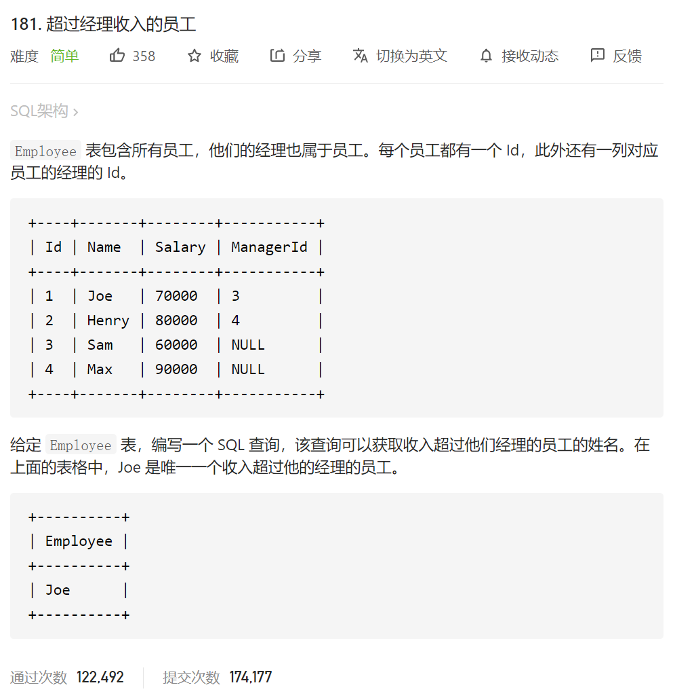

经典自连接问题

案例：查询员工名和直接上级的名称

```
SELECT e.last_name,m.last_name
FROM employees e,employees m 
WHERE e.`manager_id`=m.`employee_id`;
```

```
SELECT e.last_name,m.last_name
FROM employees e
JOIN employees m ON e.`manager_id`=m.`employee_id`;
```


然后回到本题

自己的代码

```
select e.name as "Employee"
from Employee e,Employee m
where e.ManagerId =m.id  
and 
e.Salary >m.Salary
```

答案：

```
SELECT
    a.Name AS 'Employee'
FROM
    Employee AS a,
    Employee AS b
WHERE
    a.ManagerId = b.Id
        AND a.Salary > b.Salary
;
```

```
SELECT
     a.NAME AS Employee
FROM Employee AS a JOIN Employee AS b
     ON a.ManagerId = b.Id
     AND a.Salary > b.Salary
;
```

