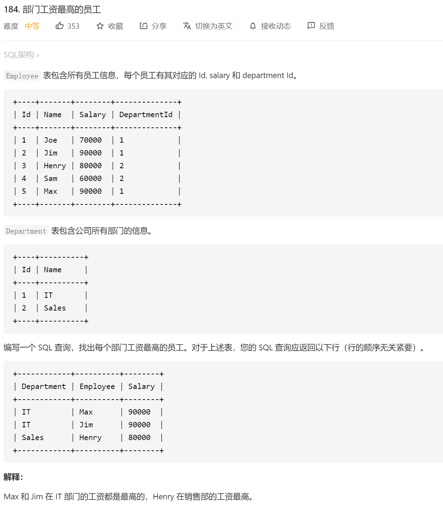
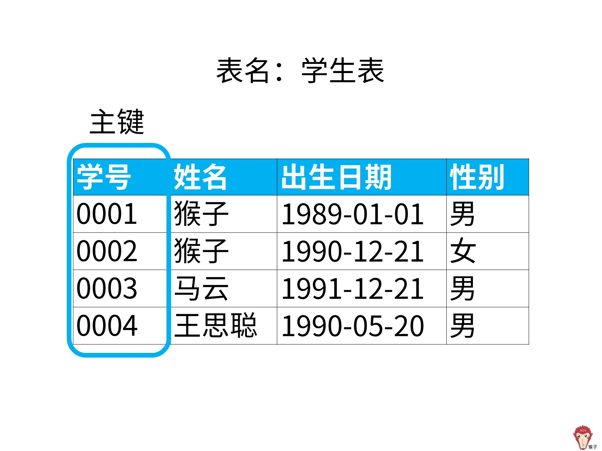
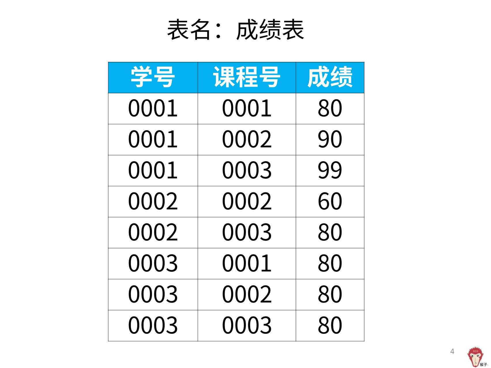
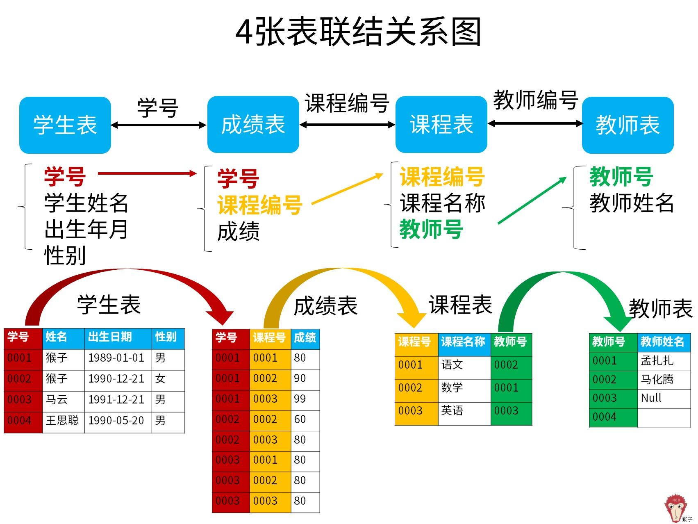
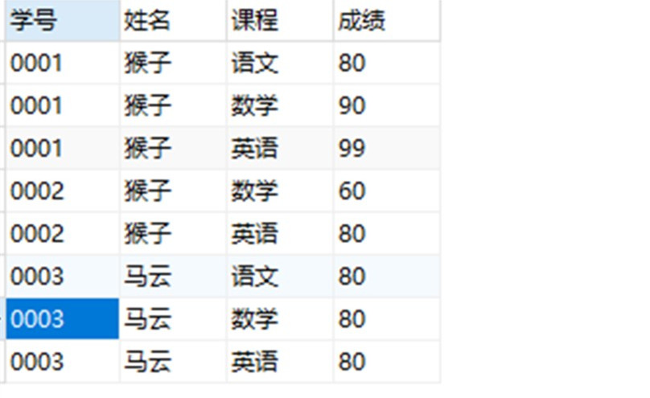
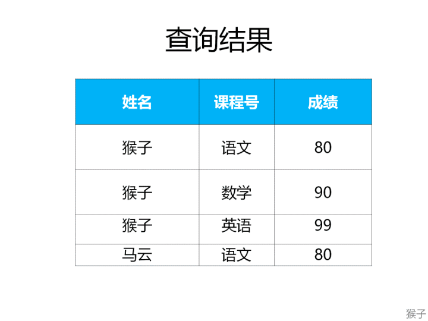

本题思路：

1.先找到每个部门对应的最高工资是多少

2.然后把两个表连接，用 where in 判断这个字段是否满足 是这个部门的对应的最高的工资。

自己的答案

```
select  d.name as 'Department', e.name as 'Employee',e.Salary as 'Salary'
from Employee e
left join Department d
on e.DepartmentId =d.id
where (e.DepartmentId,e.Salary) in
#这边先找到部门所对应的最大值
(select d.id ,max(e.Salary)
from Employee e
left join Department d
on e.DepartmentId =d.id
group by d.id)

```

关于这题

所以多表联结的sql如下：

```
from Employee
left join Department on Employee.DepartmentId = Department.Id
```

```
2）找出每个部门内最高的工资作为子查询从而确定查询的条件
```

```
where (Employee.DepartmentId,Salary) in
(select DepartmentId,max(Salary) 
from Employee 
group by DepartmentId)

。
```

```
3）最终sql如下
select Department.name,Employee.name,Salary
from Employee
left join Department on Employee.DepartmentId = Department.Id
where (Employee.DepartmentId,Salary) in
(select DepartmentId,max(Salary) 
from Employee 
group by DepartmentId);


```


例子：

现在有三个表，“学生表”，“课程表”，“成绩表”。

“学生表”记录了学生的基本信息，有“学号”、“姓名”、“出生日期”、“性别”。



“成绩表”记录了学生选修课程的成绩，包括“学号”，选修的“课程号”以及对应课程的“成绩”。



“课程表”记录了学生选修的课程信息，包括课程号、课程及其对应的“老师号”


“学生表”和“成绩表”通过“学号”联结，“成绩表”和“课程表”通过“课程编号”联结。



现在要查找出每门课程中成绩最好的学生的姓名和该学生的课程及成绩。

需要注意：可能出现并列第一的情况。

# 【解题思路】

**1.确定查询结果**

题目要求每门课程中成绩最好的学生的姓名和该学生的课程及成绩。可以知道查询结果是：

```
select 姓名,课程名称,成绩
```

查询结果的“姓名”在“学生表”里，“课程名称”在“课程表”里，“成绩”在“成绩表”里。这里涉及到了3个表，所以需要进行多表查询。

**2.如何进行多表查询？**

涉及到多表查询，在之前的课程《从零学会sql：多表查询》里讲过需要用到多表联结。

涉及到多表联结，要考虑清楚两个问题：哪种联结类型？如何联结？

1）哪种联结类型？

多表的联结又分为以下几种类型：

左联结（left join），联结结果保留左表的全部数据
右联结（right join），联结结果保留右表的全部数据
内联结（inner join），取两表的公共数据

其中“成绩表”作为3个表联结的中间桥梁，所以要以“成绩表”表进行左联结，保留左边表（成绩表）里的全部数据。


2）如何联结？

“学生信息表”和“成绩表”都有“学号”，所以联结条件为学号。

on a.学号=c.学号

“课程表”和“成绩表”都有“课程号”，所以联结条件为课程号。

on a.课程号=b.课程号

多表联结的sql如下：

```
from 成绩表 a
left join 课程表 b on a.课程号=b.课程号
left join 学生信息表 c on a.学号=c.学号
```

3）结合前面两步的sql如下：

```
select c.学号,c.姓名,b.课程,a.成绩
from 成绩表 a
left join 课程表 b on a.课程号=b.课程号
left join 学生信息表 c on a.学号=c.学号;

```



3.确定查询条件

题目要求的查询条件是：每门课程中成绩最高的学生。

我们来看这句话里的关键词：

1）“每门课程”，每当出现“每”就是要用分组汇总了，所以是子句（group by课程号）

2）“成绩最好” ，就是最大成绩了，所以是max(成绩)

因此，查询条件是：

```
select 课程号,max(成绩) 
from 成绩表 
group by 课程号;
```

需要注意的是，当两列同时作为关键字段进行条件查询时，比如这个案例里是(课程号,成绩) in，是将两列合成一个值来查找。比如，“语文”和“90”合并为值“语文 90”。

所以这两列的顺序要和子查询里列的顺序保持一致。如果列的段顺序不一样，比如“90 语文”和“语文 90”就匹配不上，那么查询结果就是空的了。

最终sql：

```
select c.学号,c.姓名,b.课程,a.成绩
from 成绩表 a
left join 课程表 b on a.课程号=b.课程号
left join 学生表 c on a.学号=c.学号
where (a.课程号,a.成绩) in
(select 课程号,max(成绩) from 成绩表 group by 课程号);
。
```



