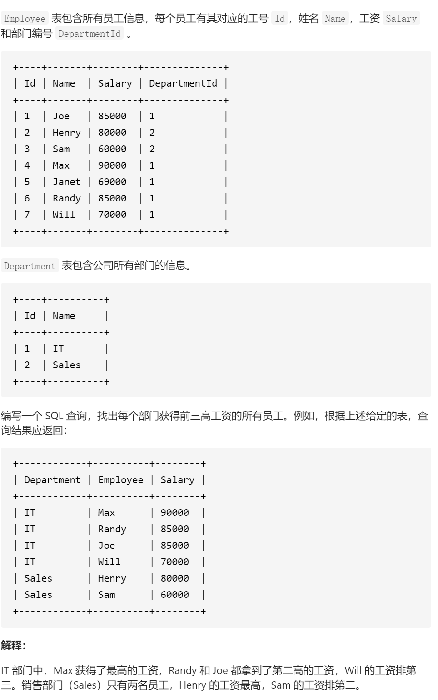
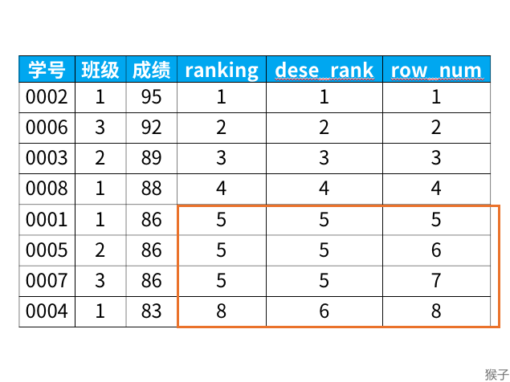
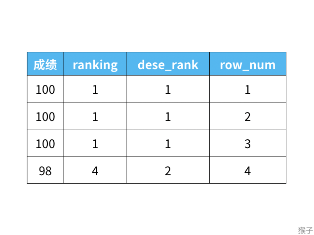
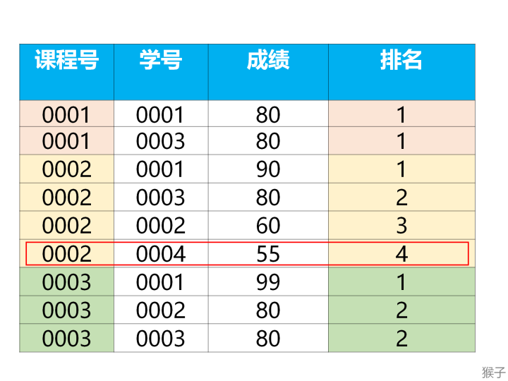

#### [185. 部门工资前三高的所有员工](https://leetcode-cn.com/problems/department-top-three-salaries/)




经典TopK问题

例子：

“成绩表”记录了学生的学号，学生选修的课程，以及对应课程的成绩。

为了对学生成绩进行考核，现需要查询每门课程的前3高成绩。
注意：如果出现并列第一的情况，则同为第一名。

题目要求找出每个课程获得前三高成绩的所有学生。难点在于每个课程前3高成绩。
前3高的成绩意味着要对成绩排名。

这种题类型其实是“分组排名”，遇到这类型题就要想到用《猴子 从零学会sql》里讲过的窗口函数。

专用窗口函数rank, dense_rank, row_number有什么区别呢？

它们的区别我举个例子，你们一下就能看懂：

```
select *,
   rank() over (order by 成绩 desc) as ranking,
   dense_rank() over (order by 成绩 desc) as dese_rank,
   row_number() over (order by 成绩 desc) as row_num
from 班级;


```



从上面的结果可以看出：
1)rank函数：这个例子中是5位，5位，5位，8位，也就是如果有并列名次的行，会占用下一名次的位置。比如正常排名是1，2，3，4，但是现在前3名是并列的名次，结果是：1，1，1，4。

2)dense_rank函数：这个例子中是5位，5位，5位，6位，也就是如果有并列名次的行，不占用下一名次的位置。比如正常排名是1，2，3，4，但是现在前3名是并列的名次，结果是：1，1，1，2。

3)row_number函数：这个例子中是5位，6位，7位，8位，也就是不考虑并列名次的情况。比如前3名是并列的名次，排名是正常的1，2，3，4。

这三个函数的区别如下：



题目要求“如果出现并列第一的情况，则同为第一名”。所以，我们使用窗口函数dense_rank。

步骤一：按课程分组(partiotion by 课程号)，并按成绩降序排列(order by 成绩 desc)，套入窗口函数的语法，就是下面的sql语句：

```
select *,
     dense_rank() over(partition by 课程号
                       order by 成绩 desc) as排名
from 成绩表;
```



步骤二：筛选出前3高的成绩，所以我们在上一步基础上加入一个where字句来筛选出符合条件的数据。（where 排名 <=3）

```sql
代码块select 课程号,学号,成绩,排名 from
(select *,
     dense_rank() over (partition by 课程号
                  order by 成绩 desc) as 排名
from 成绩表) as aa
where 排名 <=3;
```

# 【本题考点】

1）考察如何使用窗口函数及专用窗口函数排名的区别：rank, dense_rank, row_number
2）经典topN问题：每组最大的N条记录。这类问题涉及到“既要分组，又要排序”的情况，要能想到用窗口函数来实现。

```
# topN问题 sql模板
select *
from (
   select *, 
          row_number() over (partition by 要分组的列名
                       order by 要排序的列名 desc) as 排名
   from 表名) as a
where 排名 <= N;

```


```

select d.name AS Department,a.name AS Employee,a.Salary
from 
(
select *,dense_rank() over(partition by departmentid order by salary desc) as t from Employee
) as a,department as d
WHERE a.departmentid = d.id and t<=3

```


