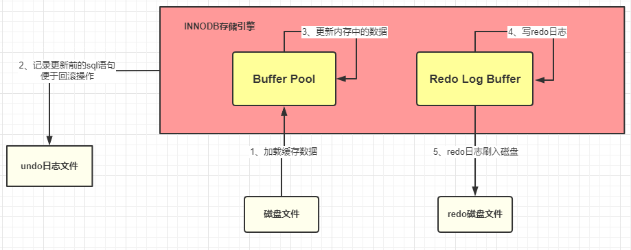

## SQL执行的过程

参考文章：

https://juejin.cn/post/6897388295060684807

https://juejin.cn/post/6920076107609800711

https://blog.csdn.net/a745233700/article/details/113927318

## 一、客户端的MySQL驱动：

​    我们的系统在和 MySQL 数据库进行通信前，需要先和数据库建立连接，而这个功能就是由MySQL驱动底层帮我们完成的，建立完连接之后，我们只需要发送 SQL 语句就可以执行 CRUD 了。如下图所示：

​	

一次 SQL 请求就会建立一个连接，多个请求就会建立多个连接。假设我们的系统是部署在 tomcat 容器中的， tomcat 是可以并发处理多个请求的，这就会导致多个请求会去建立多个连接，然后使用完再都去关闭，这样会有什么问题呢？Java系统在通过 MySQL 驱动 和 MySQL 数据库连接的时候是基于 TCP/IP 协议的，所以如果每个请求都是新建连接和销毁连接，这样频繁的创建和销毁连接势必会大大降低我们系统的性能。

为了解决上面的问题，采用了“池化”的思想，通过连接池维护一定数量的连接线程，当需要使用连接时，就直接从线程池中获取，使用完毕之后，再归还给线程池。通过线程池大大减少了不断创建与销毁线程的开销，也不需要我们去关心连接的创建与销毁，以及线程池是怎么去维护这些连接的。常见的数据库连接池有 Druid、C3P0、DBCP。
	

## 二、MySql架构的Server层：

在介绍MySQL数据库中SQL语句在Server的执行步骤前，我们先了解下MySQL的整体架构：


如果上图不清楚，可以再看看下面的图：


通过上面的架构图可以得知，Server层中主要由 连接器、查询缓存、解析器/分析器、优化器、执行器 几部分组成的，下面将主要描述下这几部分。


客户端-》连接器-》查询缓存（命中直接返回）

​                 连接器-》分析器（词法语法分析）-》查询缓存（命中直接返回）

​										-》优化器（执行计划生成，索引选择）

​										-》执行器（操作引擎，返回结果）

​										-》	存储引擎

### **1、连接器：**

	客户端想要对数据库进行操作时，前提是与数据库建立好连接；而连接器就是用来负责跟客户端建立连接、获取权限、维持和管理连接的。

（1）连接方式：

MySQL既支持短连接，也支持长连接。短连接就是操作完毕后，马上close关掉。长连接可以保持打开，减少服务端创建和释放连接的消耗，后续程序访问的时候还可以使用这个连接。

（2）连接池：

与客户端的连接池一样，为了减少频繁创建和销毁连接造成的不必要的性能损失，这里也采用了“池化”的思想，通过数据库连接池去管理连接。一般我们会在连接池中使用长连接，例如：druid、c3p0、dbcp等

### **2、查询缓存：**

MySQL缓存是默认关闭的，也就是说不推荐使用缓存，并且在 **MySQL 8.0** 版本直接将查询缓存的整块功能删掉了

1）MySql为什么默认不开启缓存呢？

主要是由于它的使用场景限制的：

① 先说下缓存中数据存储格式：key（sql语句）- value（数据值），所以如果SQL语句（key）只要存在一点不同之处就会直接进行数据库查询了；

② 由于表中的数据不是一成不变的，大多数是经常变化的，而当数据库中的数据变化了，那么相应的与此表相关的缓存数据就需要移除掉；


### **3、分析/解析器：**

分析器的工作主要是对要执行的SQL语句进行解析，最终得到抽象语法树，然后再使用预处理器判断抽象语法树中的表是否存在，如果存在的话，在接着判断select投影列字段是否在表中存在等。

（1）词法分析：

词法分析用于将SQL拆解为不可再分的原子符号，称为Token。并根据不同数据库方言所提供的字典，将其归类为关键字，表达式，字面量和操作符。

（2）语法分析：

语法分析就是根据词法分析拆解出来的Token（原子符号）将SQL语句转换为抽象语法树。

下面就直接举例说明，看一个SQL它的抽象语法书到底长什么样：

```
SELECT id, name FROM t_user WHERE status = 'ACTIVE' AND age > 18
```

然后上面的SQL语句经过词法分析、语法分析后得到的抽象语法书如下：

​	

注意，为了便于理解，抽象语法树中的关键字的Token用绿色表示，变量的Token用红色表示，灰色表示需要进一步拆分。

（3）预处理器：

预处理是用来对生成的 **抽象语法树** 进行语义校验，语义校验就是对查询的表、select投影列字段进行校验，判断表、字段是否存在等；

### **4、优化器：**

优化器的作用主要是将SQL经过词法解析/语法解析后得到的语法树，通过MySQL的数据字典和统计信息的内容，经过**一系列运算** ，最终得出一个**执行计划**，包括选择使用哪个索引。

在优化过程中，经过的一系列运算是什么呢？

（1）逻辑变换：例如SQL的where条件中存在 8>9，那逻辑转换就是将语法树中存在的这种常量表达式直接进行化简，化简为 false；除了化简还有常量表达式计算等。

（2）代价优化：就是通过付出一些数据统计分析的代价，来得到这个SQL执行是否可以走索引，以及走哪些索引；除此之外，在多表关联查询中，确定最终表join的顺序等；

```
在分析是否走索引查询时，是通过进行动态数据采样统计分析出来；只要是统计分析出来的，那就可能会存在分析错误的情况，所以在SQL执行不走索引时，也要考虑到这方面的因素
```

MySql执行计划怎么查看呢？在执行的SQL语句前添加上 explain 关键字即可；

### **5、执行器：**

		MySQL 通过分析器知道了你要做什么，通过优化器知道了该怎么做，于是就进入了执行器阶段，开始执行语句。执行器最终就是根据一系列的执行计划去调用存储引擎提供的API接口去调用操作数据，完成SQL的执行。

​	开始执行的时候，要先判断一下建立连接的对象对这个表有没有执行操作的权限，如果没有，就会返回没有权限的错误；如果有，就按照生成的执行计划进行执行。


## **三、InnoDB存储引擎：**

		存储引擎是对底层物理数据执行实际操作的组件，为Server服务器层提供各种操作数据的 API，数据是被存放在内存或者是磁盘中的。MySQL 支持插件式的存储引擎，包括 InnoDB 、MyISAM、Memory 等。一般情况下，MySQL默认使用的存储引擎是 InnoDB。如下图所示，InnoDB存储引擎整体分为内存架构（Memory Structures）和磁盘架构（Disk Structures）


### 1、Buffer Pool：

​		Buffer Pool （缓冲池）是 InnoDB 存储引擎中非常重要的内存结构，类似 Redis 一样的作用，起到一个缓存的作用。MySQL 的数据最终是存储在磁盘中的，如果没有 Buffer Pool，那么每次的数据库请求都会磁盘中查找，这样必然会存在 IO 操作。但是有了 Buffer Pool，只有第一次在查询的时候会将查询的结果存到 Buffer Pool 中，这样后面再有请求的时候就会先从缓冲池中去查询，如果没有再去磁盘中查找，然后在放到 Buffer Pool 中，如下图：

​	

​	

```sql
UPDATE students SET stuName = '小强' WHERE id = 1
```


比如这条SQL，按照上面的那幅图，SQL 语句的执行步骤大致是这样子的：

```
（1）innodb 存储引擎先在缓冲池中查找 id=1 的这条数据是否存在
（2）如果缓存不存在，那么就去磁盘中加载，并将其存放在缓冲池中
（3）该条记录会被加上一个独占锁
```

备注：

```
buffer pool 和 查询缓存的区别：

（1）查询缓存：查询缓存位于Server层，MySQL Server首选会从查询缓存中查看是否曾经执行过这个SQL，如果曾经执行过的话，之前执行的查询结果会以Key-Value的形式保存在查询缓存中。key是SQL语句，value是查询结果。我们将这个过程称为查询缓存！

（2）Buffer Pool位于存储引擎层。Buffer Pool就是MySQL存储引擎为了加速数据的读取速度而设计的缓冲机制
```

### 2、undo日志文件：记录数据被修改前的样子

	Innodb 存储引擎的最大特点就是支持事务，如果事务提交失败，那么该事务中所有的操作都必须回滚到执行前的样子，而这个回滚的操作，就是利用undo log文件完成的。

​	undo 顾名思义，就是没有做，没发生的意思。undo log 就是没有发生事情（原本事情是什么）的一些日志

	刚才我们介绍过了，在准备更新一条SQL语句的时候，该条语句对应的数据已经被加载到 Buffer pool 中了，实际上这里还有这样的操作，就是在将该条语句加载到 Buffer Pool 中的时候同时会往 undo 日志文件中插入一条日志，也就是将 id=1 的这条记录的原来的值记录下来，便于事务失败后进行回滚。

到这一步，我们执行的 SQL 语句对应的数据已经被加载到 Buffer Pool 中了，然后开始更新这条语句，更新的操作实际是在Buffer Pool中执行的。那问题来了，更新完数据之后，Buffer Pool缓冲池中的中的数据就会和数据库中的数据库不一致，那就是说Buffer Pool 中的数据成了脏数据？没错，目前这条数据就是脏数据，Buffer Pool 中的记录是“小强”数据库中的记录是“旺财” ，这种情况 MySQL是怎么处理的呢？我们接着往下看

### 3、redo日志文件：记录数据被修改后的样子s

```
前言：redo 日志文件是 InnoDB 特有的，他是存储引擎级别的，不是 MySQL 级别的
```

除了从磁盘中加载文件和将操作前的记录保存到 undo 日志文件中之外，其他的操作是在内存中完成的，内存中的数据的特点就是：断电丢失。如果此时 MySQL 所在的服务器宕机了，那么 Buffer Pool 中的数据会全部丢失的。这个时候 redo 日志文件就需要来大显神通了

redo 就是准备去做、将要去做的意思，redo log 记录的是将要做的一些操作。例如，此时将要做的是update students set stuName='小强' where id=1; 那么这条操作就会被记录到 redo log buffer 中，redo log buffer是MySQL 为了提高效率，所以将这些操作都先放在内存中去完成

```
这时候假设服务器宕机了，那么缓存中的数据还是丢失了。那能不能不要放在内存中，直接保存到磁盘呢？很显然不行，因为在上面也已经介绍了，在内存中的操作目的是为了提高效率。此时，如果 MySQL 真的宕机了，那么没关系的，因为 MySQL 会认为本次事务是失败的，所以数据依旧是更新前的样子，并不会有任何的影响。
```

到了这里，SQL语句也更新好了，那么需要将更新的值提交了，也就是需要提交本次的事务，只要事务成功提交了，才会将最后的变更保存到数据库，在提交事务前会将 redo Log Buffer 中的数据持久化到磁盘中，就是将 redo log buffer 中的数据写入到 redo log 磁盘文件中。

```
如果 redo log Buffer 刷入磁盘后，数据库服务器宕机了，那我们更新的数据怎么办？此时数据是在内存中，数据岂不是丢失了？不，这次数据就不会丢失了，因为 redo log buffer 中的数据已经被写入到磁盘了，已经被持久化了，就算数据库宕机了，在下次重启的时候 MySQL 也会将 redo 日志文件内容恢复到 Buffer Pool 中
```



```
（1）准备更新一条 SQL 语句

（2）MySQL（innodb）会先去缓冲池（Buffer Pool）中去查找这条数据，没找到就会去磁盘中查找，如果查找到就会将这条数据加载 到缓冲池（Buffer Pool）中

（3）在加载到 Buffer Pool 的同时，会将这条数据的原始记录保存到 undo 日志文件中

（4）innodb 会在 Buffer Pool 中执行更新操作

（5）更新后的数据会记录在 redo log buffer 中

（6）MySQL 提交事务的时候，会将 redo log buffer 中的数据写入到 redo 日志文件中，刷磁盘可以通过 innodb_flush_log_at_trx_commit 参数来设置：

0：每秒将 redo log buffer 中的数据将以写入到日志文件中，同时flush到磁盘。在机器crash并重启后，会丢失一秒的事务日志数据
1：每次事务提交时，将 redo log buffer 中的数据写入日志文件，并同时flush到磁盘。在机器crash并重启后，不会丢失事务日志
2：每次事务提交时，将 redo log buffer 中的数据写入日志文件，并每秒flush一次到磁盘。在机器crash并重启后，有可能丢失数据
（7）myslq 重启的时候会将 redo 日志恢复到缓冲池中

```

### 4、bin log日志文件：记录整个操作过程

```
前言：bin log和 redo log有些相似，两者的主要区别有：

（1）redo log是 InnoDB 存储引擎特有的日志文件，而bin log属于是 MySQL 级别的日志

（2）redo log适用于崩溃恢复，bin log适用于主从复制和数据恢复
```

redo log记录的东西是偏向于物理性质的，如：“对什么数据，做了什么修改”。bin log是偏向于逻辑性质的，类似于：“对 students 表中的 id 为 1 的记录租了更新操作” 。

bin log文件是如何刷入磁盘的? bin log的刷盘策略可以通过sync_bin log来修改，默认为0，表示先写入 os cache，也就是说在提交事务的时候，数据不会直接到磁盘中，这样如果宕机bin log数据仍然会丢失。所以建议将sync_bin log设置为 1 表示直接将数据写入到磁盘文件中。

既然bin log也是日志文件，那它是在什么记录数据的呢？其实 MySQL 在提交事务的时候，不仅仅会将 redo log buffer 中的数据写入到redo log 文件中，同时也会将本次修改的数据记录到 bin log文件中，同时会将本次修改的bin log文件名和修改的内容在bin log中的位置记录到redo log中，最后还会在redo log最后写入 commit 标记，这样就表示本次事务被成功的提交了。

```
如果在数据被写入到bin log文件的时候，刚写完，数据库宕机了，数据会丢失吗？

首先可以确定的是，只要redo log最后没有 commit 标记，说明本次的事务一定是失败的。但是数据是没有丢失了，因为已经被记录到redo log的磁盘文件中了。在 MySQL 重启的时候，就会将 redo log 中的数据恢复（加载）到Buffer Pool中。
```


​	好了，到目前为止，一个更新操作我们基本介绍得差不多，但是你有没有感觉少了哪件事情还没有做？是不是你也发现这个时候被更新记录仅仅是在内存中执行的，哪怕是宕机又恢复了也仅仅是将更新后的记录加载到Buffer Pool中，这个时候 MySQL 数据库中的这条记录依旧是旧值，也就是说内存中的数据在我们看来依旧是脏数据，那这个时候怎么办呢？

其实 MySQL 会有一个后台线程，它会在某个时机将我们Buffer Pool中的脏数据刷到 MySQL 数据库中，这样就将内存和数据库的数据保持统一了。


### 5、小结：

```
（1）首先MySQL执行器根据 执行计划 调用存储引擎的API查询数据
（2）存储引擎先从缓存池buffer pool中查询数据，如果没有就会去磁盘中查询，如果查询到了就将其放到缓存池中
（3）在数据加载到 Buffer Pool 的同时，会将这条数据的原始记录保存到 undo 日志文件中
（4）innodb 会在 Buffer Pool 中执行更新操作
（5）更新后的数据会记录在 redo log buffer 中
（6）提交事务在提交的同时会做以下三件事
（7）（第一件事）将redo log buffer中的数据刷入到redo log文件中
（8）（第二件事）将本次操作记录写入到 bin log文件中
（9）（第三件事）将bin log文件名字和更新内容在 bin log 中的位置记录到redo log中，同时在 redo log 最后添加 commit 标记
（10）使用一个后台线程，它会在某个时机将我们Buffer Pool中的更新后的数据刷到 MySQL 数据库中，这样就将内存和数据库的数据保持统一了
```

