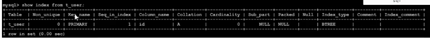
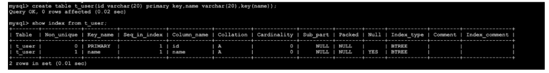
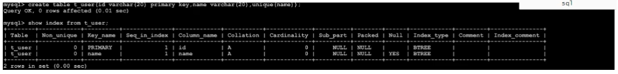
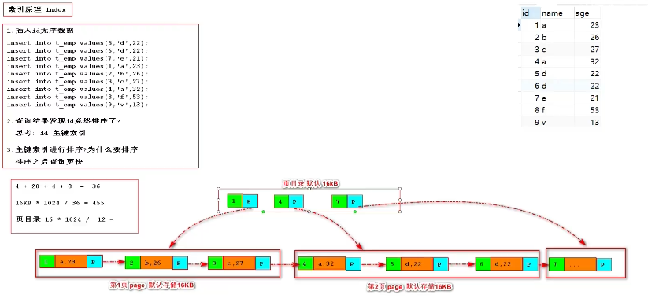
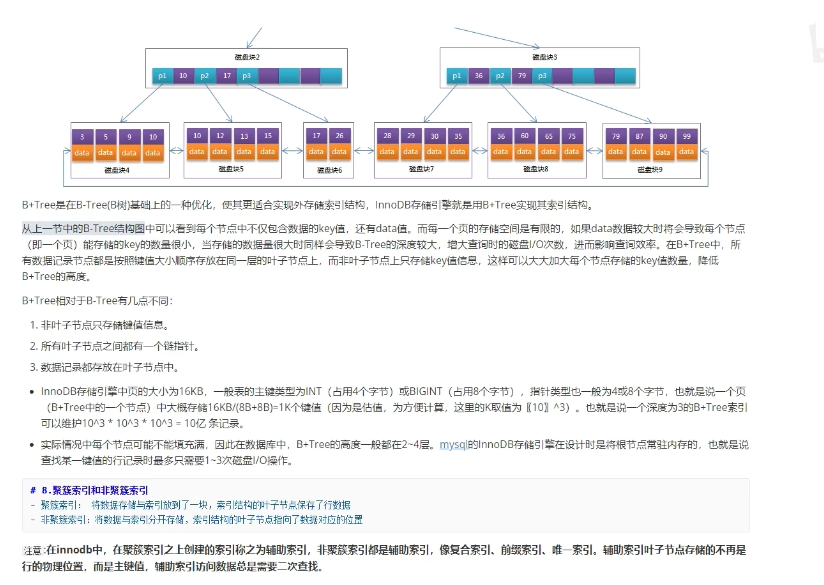
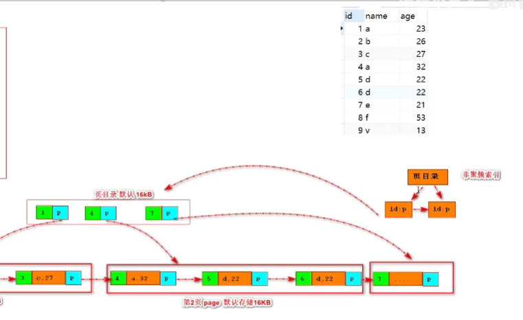
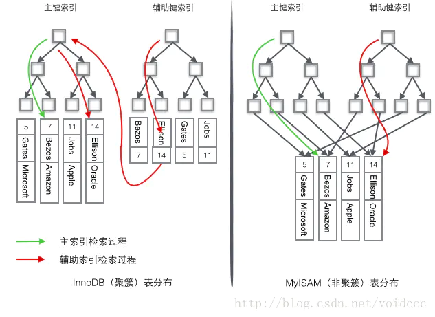
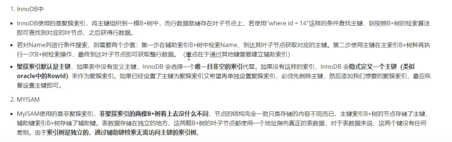
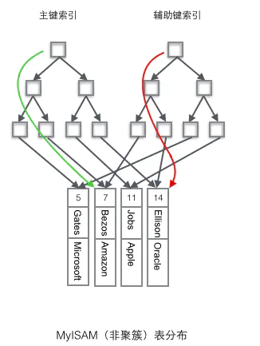

MySQL索引

## 1.什么是索引

​	官方定义：一种帮助mysql提高查询效率的数据结构

​	索引的优点：1.大大加快了数据查询的速度

​	索引的缺点：

​	1.维护索引需要耗费的数据库资源

​	2.索引需要占用磁盘空间

​	3.当对表的数据进行增删改查的时候，因为要维护索引，速度会受到影响。

## 2.索引分类

a.主键索引（有主键的时候，会自动生成）

​		设定为主键后数据库会自动建立索引，innodb为聚餐索引。

b.单值索引、单列索引、普通索引

​		即，一个索引只包含单个列，一个表可以有多个单列索引。  id  name（index） age（index） bir  对name和age分别进行索引创建

c.唯一索引

​	索引值必须是唯一，但允许有空值。

​	唯一索引，mysql里面允许有多个，sqlServer只能有一个。

d.复刻索引、组合索引。

一个索引包含多个列。      比如将name和age同时建立一个组合索引。  id  （name  age） index  bir  

为什么要有组合索引呢？因为我如果 同时查询 where name= and age= 的时候，分别在这两个列上建立的单列索引是没有用的。

## 3.索引的基本操作

### 1.主键索引  自动创建

---建表  主键自动创建主键索引

create table t_user(id varchar(20)) primary key,name varchar(20));

--查看索引

show index from t_user

2.单列索引（普通索引 单值索引）

--建表的时候创建

create table t_user(id varchar(20) primary key, new varchar(20) ,key(name))

注意：随表一起建立的索引，索引名与列名一致

--建表后创建（索引名自定义）

create index  nameIndex on t_user(name);

--删除索引

drop index 索引名 on 表名

3.唯一索引

---建表时创建

create table t_user(id varchar(20) primary key,name varchar(20),unique(name));

--建表后创建

create unique index nameindex on t_user(name);

4.组合索引（1.最左前缀原则：必须要复合我的左前缀的顺序，才能用复合索引  2.为了更好地利用索引，会动态调整查询字段的顺序，以便利用索引）

---建表时进行创建

create table t_user(id varchar(20) primary key,name varchar(20),age int, key(name,age));

---建表后创建

create index nameageindex on t_user(name,age);

组合索引，经典的面试题：

name  age bir  三个四段进行复合索引的构建

name bir age   能否使用索引？  可以

name age bir   能否用索引？      可以

age bir                                           不行

age bir name                                可以

bir age  name                               可以

回答（这边其实还有一些知识点，回头需要整理一下）：

https://www.cnblogs.com/lanqi/p/10282279.html

1.最左前缀匹配原则： 只能对于name  age bir ；name  age；name查是可以的。其余全部都不行

2.动态调整语句顺序（只有=和in可以乱序）：name bir age 去查询的时候会动态调整为name  age bir

3.最左优先，以最左边的为起点任何连续的索引都能匹配上。同时遇到**范围查询(>、<、between、like)就会停止匹配。**
例如：b = 2 如果建立(a,b)顺序的索引，是匹配不到(a,b)索引的；但是如果查询条件是a = 1 and b = 2或者a=1(又或者是b = 2 and a = 1)就可以，因为优化器会自动调整a,b的顺序。再比如a = 1 and b = 2 and c > 3 and d = 4 如果建立(a,b,c,d)顺序的索引，d是用不到索引的，因为c字段是一个范围查询（之后的d是不能保证有序的，这样索引就用不上了），它之后的字段会停止匹配。 但是，如果建立(a,b,d,c)的索引则都可以用到（因为前面的a,b,d都是保证有序了）a,b,d的顺序可以任意调整。

## 4.索引的数据结构

树到3层已经比较大了

一个节点是16kb

一个int 4个字节  一个varchr 20 一个int 4个字节 一个指针6-8个字节

4+20+4+8=36 字节

16kb *1024 /36 =455  一个页能存 455个

页目录  16*1024/(4(int)+8(ptr)) = 1365页

1365页*455  两层就是这个数

三层就有千万 亿级的数据量了

**顶层节点常驻内存**

所以3层b+ 只需要2次IO

## 5.聚簇索引和非聚簇索引

聚簇索引：将数据存储和索引放在了一块，索引结构的叶子节点保存了行数据。（就是上面画的那个b+tree）

聚簇索引不一定是主键索引，主键索引一定是聚簇索引。

非聚簇索引：将数据和索引分开存储，索引结构的叶子节点指向了数据对应的位置。

在聚簇索引之上，建立的索引都是非聚簇索引（辅助索引）。

我们基于name建立索引，找到最终是个id，再拿着这个id，去聚簇索引那边去找

如上图的辅助键索引，我们会先去辅助键的索引里面去找，找到对应的id之后，再拿着这个id，去主键索引里面去找。

那为什么记录的是主键值，不是数据地址呢？

因为有增删改查，如果存的是地址，那我非聚簇索引树上的地址也会进行修改。

这种数据 辅助索引和主键索引没有区别，这个时候没有二次查找

## 使用聚簇索引需要注意什么?

- 当使用主键为聚簇索引时，主键最好不要使用uuid，因为uuid的值太过离散，不适合排序且可能出线新增加记录的uuid，会插入在索引树中间的位置，导致索引树调整复杂度变大，消耗更多的时间和资源。
- 建议使用int类型的自增，方便排序并且默认会在索引树的末尾增加主键值，对索引树的结构影响最小。而且，主键值占用的存储空间越大，辅助索引中保存的主键值也会跟着变大，占用存储空间，也会影响到IO操作读取到的数据量。

https://www.jianshu.com/p/fa8192853184
