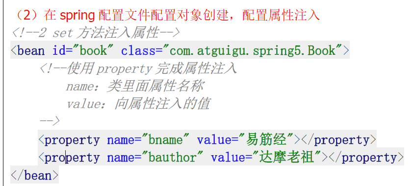
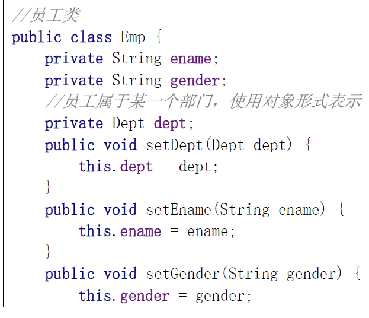

# 控制反转（IOC）

# 1.IOC概念和原理

## 1、什么是IOC

（1）控制反转，把对象创建和对象之间的调用过程，交给Spring进行管理
（2）使用IOC目的：为了耦合度降低
（3）做入门案例就是IOC实现

## 2、IOC底层原理

（1）xml解析、工厂模式、反射

### 2.1创建对象，调用对象方法原始的方式：

**缺点：耦合度太高了**

如果Dao的路径变化了 我的service也要变。方法变了 我的service也要变

### 2.2工厂模式

建立一个工厂类，建立一个方法，直接返回一个新的对象；

降低了service和Factory的耦合度

### 2.3.xml解析 和 反射

反射：通过得到你类的字节码文件，然后操作类中所有内容，

### 2.4 IOC解耦过程

## 3.IOCBeanFactory接口

1、IOC思想基于IOC容器完成，IOC容器底层就是对象工厂

2、Spring提供IOC容器实现两种方式：（两个接口）
（1）BeanFactory：IOC容器基本实现，是Spring内部的使用接口，不提供开发人员进行使用

​       加载配置文件时候不会创建对象，在获取对象（使用）才去创建对象

（2）ApplicationContext：BeanFactory接口的子接口，提供更多更强大的功能，一般由开发人员进行使用

​         加载配置文件时候就会把在配置文件对象进行创建（耗时耗资源的事情交给服务器去做）
3、ApplicationContext接口有实现类

# 4.IOC Bean 管理

## 4.1什么是Bean管理

（0）Bean管理指的是两个操作
（1）Spring创建对象
（2）Spirng注入属性

## 4.2 Bean管理操作有两种方式

（1）基于xml配置文件方式实现
（2）基于注解方式实现

# 5.IOC操作Bean管理（xml）

## 5.1基于xml创建对象

（1）在spring配置文件中，使用bean标签，标签里面添加对应属性，就可以实现对象创建
（2）在bean标签有很多属性，介绍常用的属性

* id属性：唯一标识
* class属性：类全路径（包类路径）
（3）创建对象时候，默认也是执行**无参数构造方法完成对象创建**

## 5.2 基于xml方式注入属性

（1）DI：依赖注入，就是注入属性。（这个是IOC的一种具体实现）

## 5.3、第一种注入方式：使用set方法进行注入（先创建对象）

（1）创建类，定义属性和对应的set方法 

## 5.4、第二种注入方式：使用有参数构造进行注入

### （1）创建类，定义属性，创建属性对应有参数构造方法

对有参数构造的一个配置：

## 5.5 p名称空间注入（了解）

（1）使用p名称空间注入，可以简化基于xml配置方式

# 6.IOC操作Bean管理（xml 注入其它类型属性）

## 6.1字面量（设定固定值）

（1）null值

（2）属性值包含特殊符号

## 6.2、注入属性-外部bean

（1）创建两个类 service类和dao类
（2）在service调用dao里面的方法
（3）在spring配置文件中进行配置

## 6.3注入属性-内部bean

（1）一对多关系：部门和员工
一个部门有多个员工，一个员工属于一个部门
部门是一，员工是多
（2）在实体类之间表示一对多关系，员工表示所属部门，使用对象类型属性进行表示

（3）在spring配置文件中进行配置

## 6.4、注入属性-级联赋值 

（1）第一种写法

（2）第二种写法

# 7.IOC操作Bean管理（xml注入集合类型属性）

1、注入数组类型属性
2、注入List集合类型属性
3、注入Map集合类型属性

## （1）创建类，定义数组、list、map、set类型属性，生成对应set方法

## （2）在spring配置文件进行配置

## 4、在集合里面设置对象类型值

## 5、把集合注入部分提取出来

# 8.IOC操作Bean管理（FactoryBean）

## 1、Spring有两种类型bean，一种普通bean，另外一种工厂bean（FactoryBean）

## 2、普通bean：在配置文件中定义bean类型就是返回类型

定义什么类型就是什么类型

## 3、工厂bean：在配置文件定义bean类型可以和返回类型不一样

第一步 创建类，让这个类作为工厂bean，实现接口 FactoryBean
第二步 实现接口里面的方法，在实现的方法中定义返回的bean类型

# 9.IOC操作Bean管理（bean 作用域）

## 1、在Spring里面，可以设置创建bean实例是单实例还是多实例

## 2、在Spring里面，默认情况下，bean是单实例对象

## 3、如何设置单实例还是多实例

## 10.IOC操作Bean管理（bean生命周期）

### 1、生命周期

（1）从对象创建到对象销毁的过程

### 2、bean生命周期

（1）通过构造器创建bean实例（无参数构造）
（2）为bean的属性设置值和对其他bean引用（调用set方法）
（3）调用bean的初始化的方法（需要进行配置初始化的方法）
（4）bean可以使用了（对象获取到了）
（5）当容器关闭时候，调用bean的销毁的方法（需要进行配置销毁的方法）

### 3、演示bean生命周期

### 4.bean的后置处理器，bean生命周期有七步

（1）通过构造器创建bean实例（无参数构造）
（2）为bean的属性设置值和对其他bean引用（调用set方法） 

（3）把bean实例传递bean后置处理器的方法postProcessBeforeInitialization
（4）调用bean的初始化的方法（需要进行配置初始化的方法）

（5）把bean实例传递bean后置处理器的方法 postProcessAfterInitialization
（6）bean可以使用了（对象获取到了）
（7）当容器关闭时候，调用bean的销毁的方法（需要进行配置销毁的方法）

### 5、演示添加后置处理器效果

（1）创建类，实现接口BeanPostProcessor，创建后置处理器

## 10.IOC操作Bean管理（xml自动装配）

1、什么是自动装配
（1）根据指定装配规则（属性名称或者属性类型），Spring自动将匹配的属性值进行注入

2、演示自动装配过程
（1）根据属性名称自动注入

……

