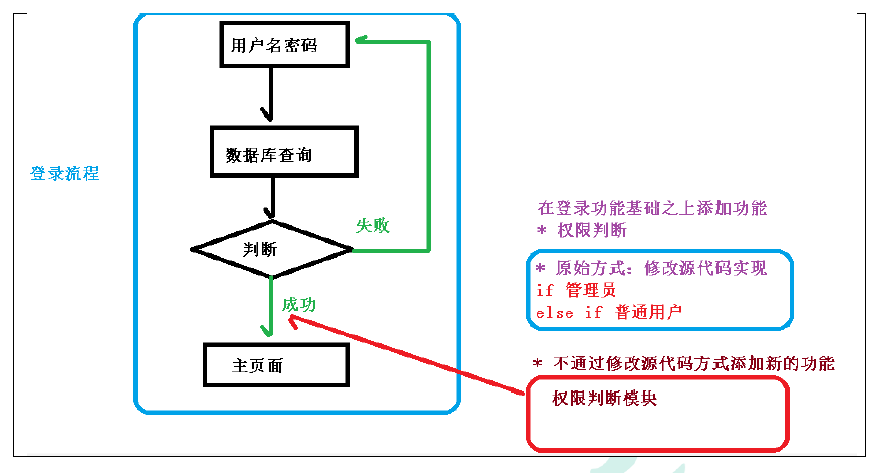
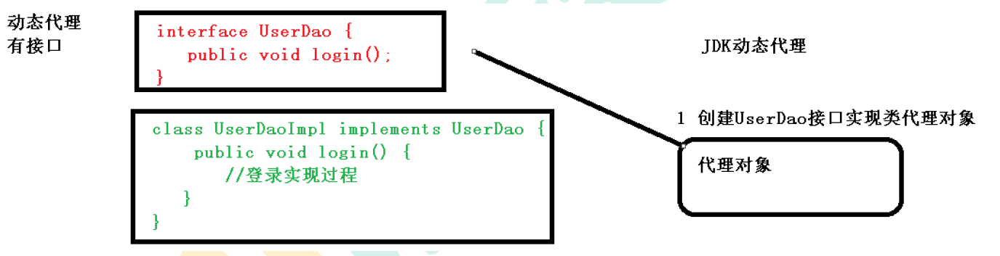
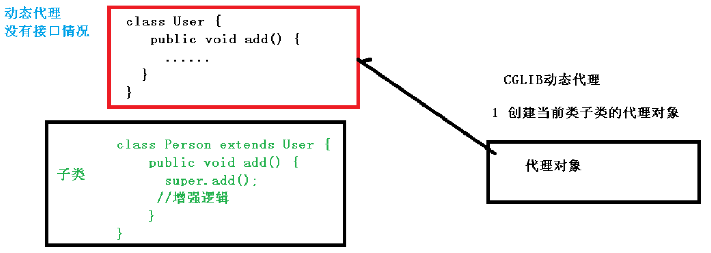
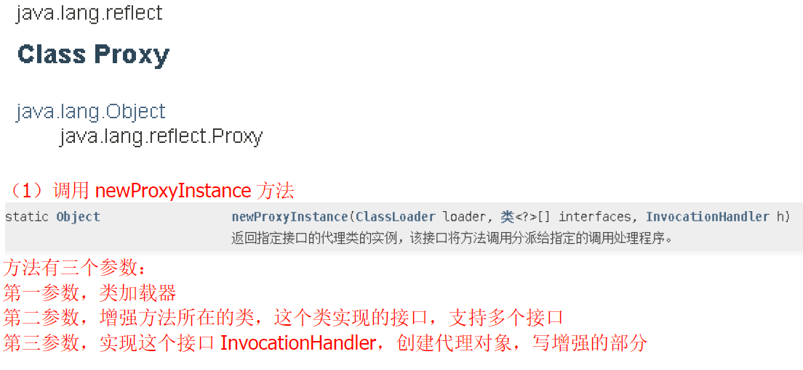
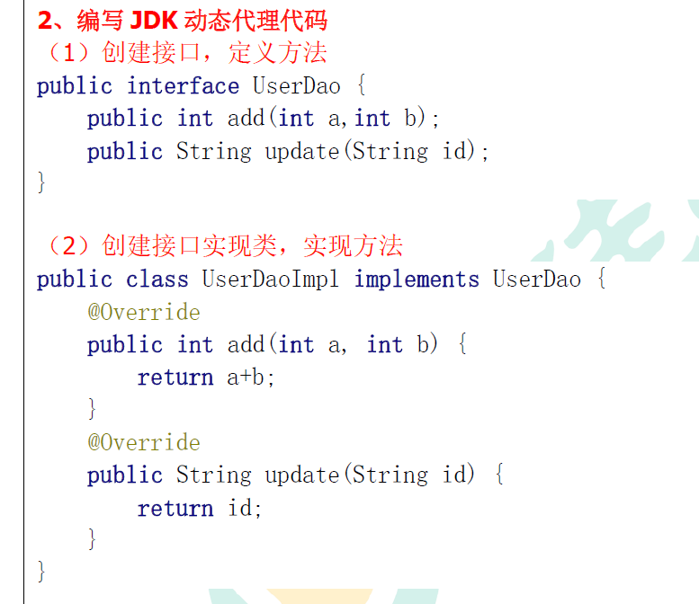
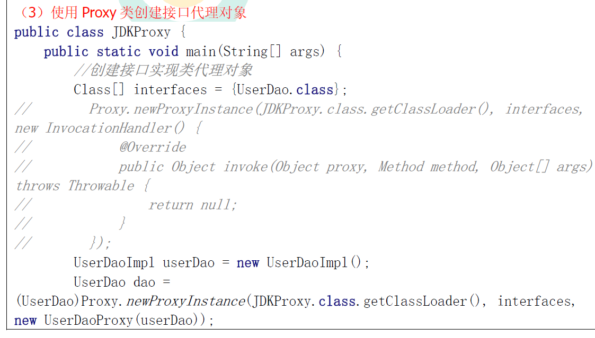
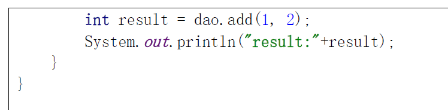
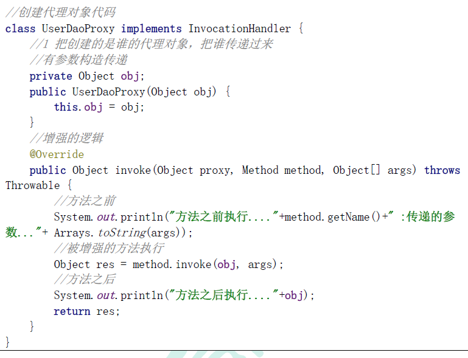

# AOP面向切面编程

（1）面向切面编程（方面），利用AOP可以对业务逻辑的各个部分进行隔离，从而使得业务逻辑各部分之间的耦合度降低，提高程序的可重用性，同时提高了开发的效率。
（2）通俗描述：不通过修改源代码方式，在主干功能里面添加新功能
（3）使用登录例子说明AOP

# 1.AOP底层原理

1、AOP底层使用动态代理
（1）有两种情况动态代理
第一种 有接口情况，使用JDK动态代理

创建接口实现类代理对象，增强类的方法

第二种 没有接口情况，使用CGLIB动态代理
⚫ 创建子类的代理对象，增强类的方法

# 2.AOP（JDK动态代理）

