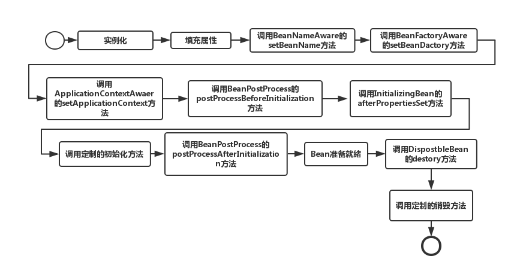

# Spring中Bean的生命周期：

总结：

实例化，填充属性，name，factory，applicationContext，before-init，init，after-init，调用，destory

作者：程序员cxuan
链接：https://www.zhihu.com/question/38597960/answer/1676905270
来源：知乎
著作权归作者所有。商业转载请联系作者获得授权，非商业转载请注明出处。

**Spring启动，查找并加载需要被Spring管理的bean，进行Bean的实例化**

**Bean实例化后对将Bean的引入和值注入到Bean的属性中**

**如果Bean实现了BeanNameAware接口的话，Spring将Bean的Id传递给setBeanName()方法**

**如果Bean实现了BeanFactoryAware接口的话，Spring将调用setBeanFactory()方法，将BeanFactory容器实例传入**

**如果Bean实现了ApplicationContextAware接口的话，Spring将调用Bean的setApplicationContext()方法，将bean所在应用上下文引用传入进来**

**如果Bean实现了BeanPostProcessor接口，Spring就将调用他们的postProcessBeforeInitialization()方法。**

**如果Bean 实现了InitializingBean接口，Spring将调用他们的afterPropertiesSet()方法。类似的，如果bean使用init-method声明了初始化方法，该方法也会被调用**

**如果Bean 实现了BeanPostProcessor接口，Spring就将调用他们的postProcessAfterInitialization()方法。**

**此时，Bean已经准备就绪，可以被应用程序使用了。他们将一直驻留在应用上下文中，直到应用上下文被销毁。**

**如果bean实现了DisposableBean接口，Spring将调用它的destory()接口方法，同样，如果bean使用了destory-method 声明销毁方法，该方法也会被调用。**

\1. 实例化一个Bean，也就是我们通常说的new

\2. 按照Spring上下文对实例化的Bean进行配置，也就是IOC注入

\3. 如果这个Bean实现了BeanNameAware接口，会调用它实现的setBeanName(String beanId)方法，此处传递的是Spring配置文件中Bean的ID

\4. 如果这个Bean实现了BeanFactoryAware接口，会调用它实现的setBeanFactory()，传递的是Spring工厂本身（可以用这个方法获取到其他Bean）

\5. 如果这个Bean实现了ApplicationContextAware接口，会调用setApplicationContext(ApplicationContext)方法，传入Spring上下文，该方式同样可以实现步骤4，但比4更好，以为ApplicationContext是BeanFactory的子接口，有更多的实现方法

\6. 如果这个Bean关联了BeanPostProcessor接口，将会调用postProcessBeforeInitialization(Object obj, String s)方法，BeanPostProcessor经常被用作是Bean内容的更改，并且由于这个是在Bean初始化结束时调用After方法，也可用于内存或缓存技术

\7. 如果这个Bean在Spring配置文件中配置了init-method属性会自动调用其配置的初始化方法

\8. 如果这个Bean关联了BeanPostProcessor接口，将会调postAfterInitialization(Object obj, String s)方法

注意：以上工作完成以后就可以用这个Bean了，那这个Bean是一个single的，所以一般情况下我们调用同一个ID的Bean会是在内容地址相同的实例

\9. 当Bean不再需要时，会经过清理阶段，如果Bean实现了DisposableBean接口，会调用其实现的destroy方法

\10. 最后，如果这个Bean的Spring配置中配置了destroy-method属性，会自动调用其配置的销毁方法