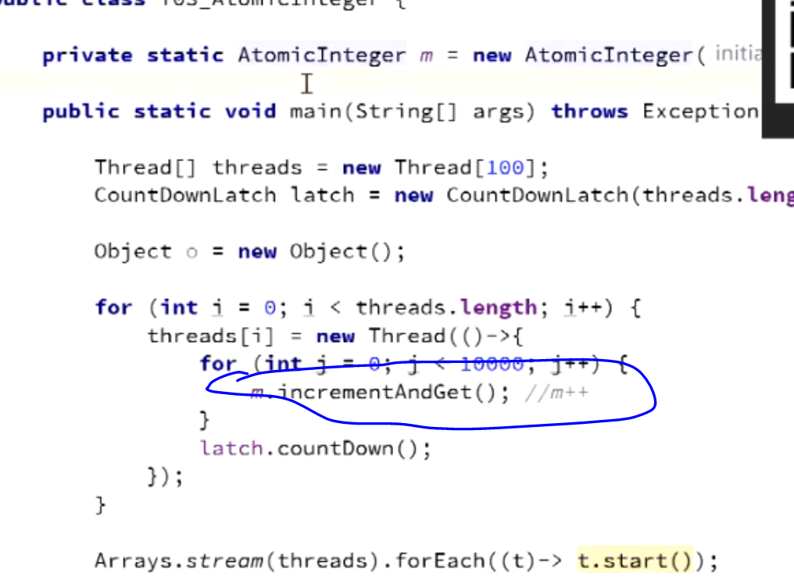
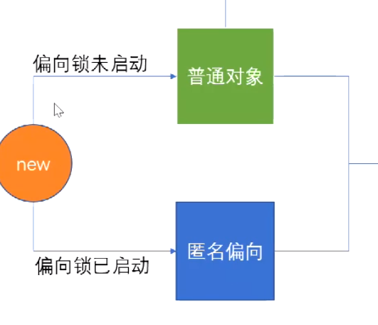

# 1.CAS（CAS：Compare and Swap）

什么是cas？

比较并且交换

举个例子：

内存中有个0，要对这个0进行修改。那我们必须得用sychornized 同步代码块 

除了这种，还有就是CAS的操作，就是一个线程要修改 就是 读取0  改为1  然后往回写的时候，做一个比较，看我读出来的这个值和往回写的时候的这个值 是不是还是0  如果是0 说明在我修改的过程中，没有人动过这个数据，那我直接对其进行修改就行了，那我就不需要上锁了。

那如果这个时候有人动过这个数据了呢？那我就再吧这个3拿出来，写个循环，直到读的时候和写的时候 值不变的情况下，才写回去

 ABA问题。就是 我在把这个数字给读出来的过程中，内存中的这个数字 经历了 aba的过程，那对于简单数字来说，其实只要你这个值不变，就没啥问题。但是 在某些情况下，是不行的。 那怎么办呢？ 加个版本号就行

原子int类型 

怎么做到的？

native 是c++的代码 Hotspot代码

asm 汇编语言

调用了cmpxchg

MP是多处理器的意思 就是你如果是多处理器 你得lock一下

lock cmpxchg

CPU有一条汇编指令lock cmpxchg。但是这条指令不是原子的。拿到0往回写的时候，比较的时候，照样会被打断。所以需要lock  所以 我在进行cmp和exchange的过程中 不能被任何人打断，

换句话说单cpu就不需要lock

# 2.JOL

对象内存布局

markword 干嘛用的？

（锁定是锁的某个对象）

锁定前后的markword

我们所谓的锁定某个对象 就是用来修改markword的。

markword里面有锁信息。GC信息。  hashcode

## 1.用户态和内核态、

早起app能访问硬件

现在就是分为两层，

app 访问比较重要的硬件的时候 得用内核态来调用。

用户态到内核态的调用是什么过程？

0x80中断

一些复杂的操作 必须要用户态到内核态，然后再返回用户态。

早起的synchronized是重量级锁，是需要经过操作系统老大的允许。

优化的之后，我们不需要老大的允许了，再用户控件就能运行了，比如cas。

# 3无锁到偏向锁

偏向锁 - markword 上记录当前线程指针，下次同一个线程加锁的时候，不需要争用，只需要判断线程指针是否同一个，所以，偏向锁，偏向加锁的第一个线程 。hashCode备份在线程栈上 线程销毁，锁降级为无锁

## 偏向锁：往markword上写了个我线程的id号   就不需要跟操作系统去要锁了

大多只有一个线程使用sb

# 4.偏向锁到轻量级锁

## 当有两个线程的时候，就用轻量级锁。

当有多个人要用的时候，开抢。CAS

有争用 - 锁升级为轻量级锁 - 每个线程有自己的LockRecord在自己的线程栈上，用CAS去争用markword的LR的指针，指针指向哪个线程的LR，哪个线程就拥有锁

把偏向锁扯下来，开始自旋锁。谁写成功 这坑就归谁了。 

一堆人领着裤腰带 等。

竞争更激烈了后。大锁

# 5.轻量级锁升级为重量级锁

耗时间长了，就升级为重量级

自旋超过10次，升级为重量级锁 - 如果太多线程自旋 CPU消耗过大，不如升级为重量级锁，进入等待队列（不消耗CPU）-XX:PreBlockSpin

自旋锁在 JDK1.4.2 中引入，使用 -XX:+UseSpinning 来开启。JDK 6 中变为默认开启，并且引入了**自适应的自旋锁**（适应性自旋锁）。

自适应自旋锁意味着自旋的时间（次数）不再固定，而是由前一次在同一个锁上的自旋时间及锁的拥有者的状态来决定。如果在同一个锁对象上，自旋等待刚刚成功获得过锁，并且持有锁的线程正在运行中，那么虚拟机就会认为这次自旋也是很有可能再次成功，进而它将允许自旋等待持续相对更长的时间。如果对于某个锁，自旋很少成功获得过，那在以后尝试获取这个锁时将可能省略掉自旋过程，直接阻塞线程，避免浪费处理器资源。

自旋锁占用CPU计算资源的。重量级锁不需要占用资源，里面有个队列，waitSet，什么时候到你了，再把你叫醒，轮不到你的时候，你别消耗资源。（阻塞）

偏向锁默认启动，延迟4s

# 偏向锁效率一定大于自旋锁嘛？ 绝对不一定

为什么？

如果 明确知道某一个资源会有多个资源去竞争。那我们偏向锁有一个撕下来的过程，直接用轻量级锁。

为什么要延迟4s？

因为jvm启动单时候，有很多需要上锁的时候，明确知道有很多人回去抢，直接上轻量级锁。

偏向锁启动了：开始没有偏向，就是匿名偏向（4s之后）

没启动：直接是普通对象

