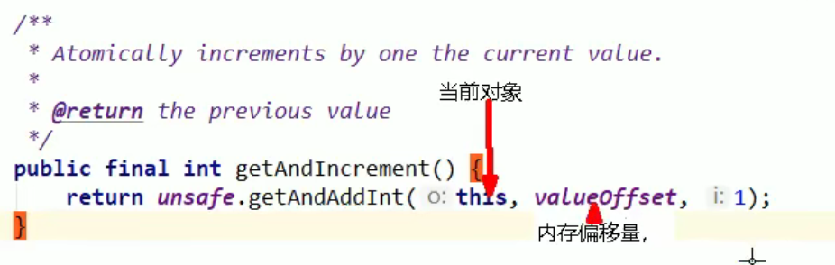
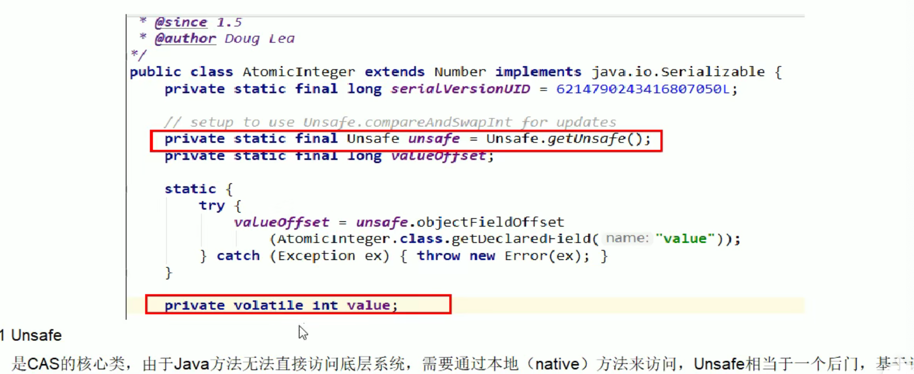
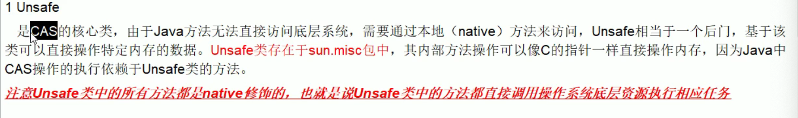
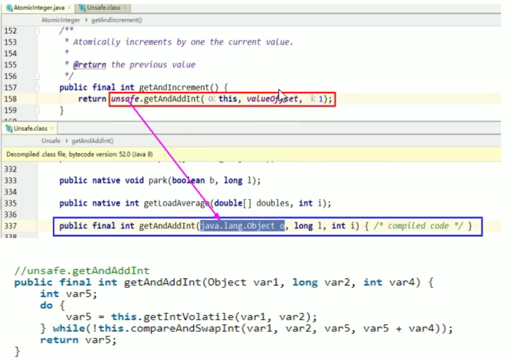
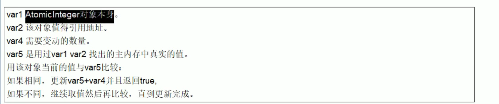
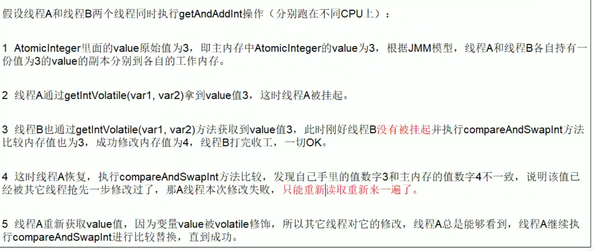
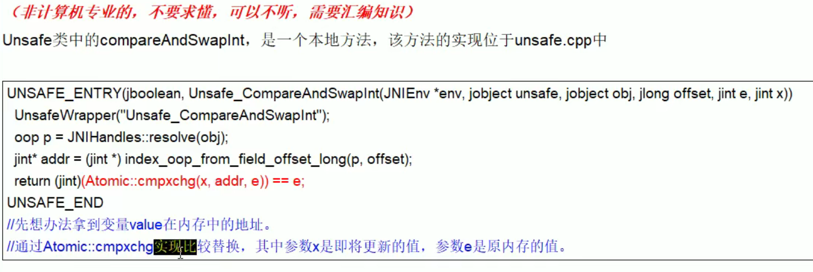
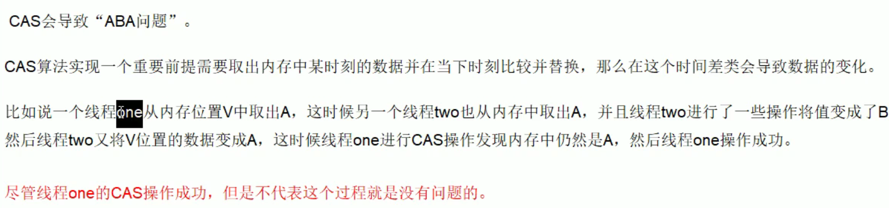

# atomicInteger.getAndIncrement();




这个得去rt.jar去找源码

# unsafe类





```
public class AtomicInteger extends Number implements java.io.Serializable {
    private static final long serialVersionUID = 6214790243416807050L;

    // setup to use Unsafe.compareAndSwapInt for updates
    private static final Unsafe unsafe = Unsafe.getUnsafe();
    private static final long valueOffset;

    static {
        try {
            valueOffset = unsafe.objectFieldOffset
                (AtomicInteger.class.getDeclaredField("value"));
        } catch (Exception ex) { throw new Error(ex); }
    }

    private volatile int value;

```

## 1.unsafe

Unsafe是CAS的核心类，由于java方法无法直接访问底层系统，需要通过本地的native方法来访问，Unsafe相当于一个后门，基于该类可以直接操作特定的内存数据。Unsafe类存在于misc包中，其内部方法操作可以像C的指针一样直接操作内存，因为java中的CAS操作的执行依赖于Unsafe类的方法。

注意unsafe类中所有方法都是native修饰的，也就是unsafe类中的方法都是直接调用操作系统底层资源执行相应任务的

## 2.valueOffset

变量valueOffset表示该变量值在内存中的偏移地址，因为Unsafe就是根据内存偏移地址来获取数据的。

```
 public final int getAndIncrement() {
        return unsafe.getAndAddInt(this, valueOffset, 1);
    }
```

this 当前对象。valueOffset 当前对象的地址。然后进行加一的操作

# 3.CAS是什么

​	理论：CAS的全称为Compare一And一Swap，它是一条CPU并发原语。
它的功能是判断内存某个位置的值是否为预期值，如果是则更改为新的值，这个过程是原子的。
​	CAS并发原语体现在JAVA语言中就是sun.misc.Unsafe类中的各个方法。调用UnSafe类中的CAS方法，JVM会帮我们实现出CAS汇编指令。这是一种完全依赖于硬件的功能，通过它实现了原子操作。再次强调，由于CAS是一种系统原语，原语属于操作系统用语范畴，是由若干条指令组成的，用于完成某个功能的一个过程，并且原语的执行必须是连续的，在执行过程中不允许被中断，也就是说CAS是一条CPU的原子指令，不会造成所谓的数据不一致问题。





```java
public final long getAndAddLong(Object var1, long var2, long var4) {
        long var6;
        do {
        //这个var1 对应this（对象本身）  var2 对应offset 内存地址偏移量（该对象的值的引用地址）
            var6 = this.getLongVolatile(var1, var2);//告诉我当前这个对象这个地方的值是多少（赋值给var6） 这一步就是解决get操作 先从主物理内存拷贝一个值 放到自己的内存空间中
        } while(
          !this.compareAndSwapLong(var1, var2, var6, var6 + var4)
        	//如果当前对象的值(var1对象的var2偏移的位置的值) 和我的本地的值（var6）一样，那我就给本地的值 加个1（var4）
          //如果相等 那就跳出循环 ；如果不相等，那就是快照值和物理内存不一样，那就要重新去获取快照值
        );
					
        return var6;
    }
```

我这边通过do和while，不是靠synchronized（syn每次只有一个线程进来）。



汇编实现：



lock cmpxchg

# 4.CAS缺点

1.并发性加强了，但是循环时间长，开销大。CPU开销大
2.只能保证**一个共享变量**（也就是那个var1 那个object）的原子操作。当有多个共享变量进行操作的时候，cas就没法保证原子性了。得用锁。
3.ABA问题
ABA问题一句话：狸猫换太子
A该为B，然后B再改回了A，这个时候另外个线程会认为这两个A是一致的，首尾一致但是中间改了好几次




如过只关心结果，ABA问题没有影响；但是如果中间过程我们是在意的，那这个就是出现问题的。

如何去解决这个问题呢？

理解原子引用+新增一种机制，那就是修改版本号

## 4.1原子引用

代码在demo 中

## 4.2 版本号

T1     100(1)         				209(2)

T2.     100(1)         101(2)     100(3)

T1的版本号落后了

所以用AtomicStampedReference