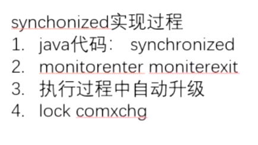
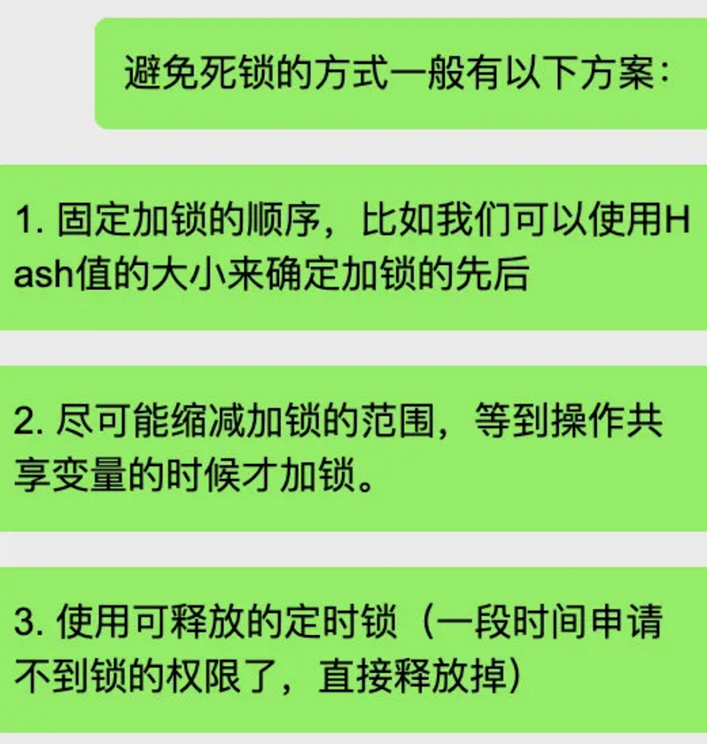

# 1.说说 synchronized

synchronized 是一种互斥的锁，一次只能允许一个线程进入被锁住的代码块

它就是一个关键词 能够把代码块/方法 给锁起来

synchronized ｛普通方法｝同一时刻职能有一个对象访问该方法，其他的 我就不知道了

synchronized ｛修饰代码块｝ ——当用synchronized修饰某个方法A时,可以防止多个线程同时访问这个对象的方法A
synchronized ｛static方法}——同一时间只能被一个方法引用
synchronized ｛run方法｝ ——只能生成一个runnable对象，在内存中运行
synchronized ｛普通方法｝ ——同一时刻只能有一个对象访问该方法

synchronize:只修饰方法和代码块;当用synchronized修饰某个方法A时,可以防止多个线程同时访问这个对象的方法A;如一个对象有多个synchronized方法,只要一个线程方问了其中一个,其它线程就不能同时方问这个对象的任一一个synchronized方法;但一个类可有多个对象,其它线程可以访问别一对象的synronized方法. 当用synchronized修饰代码块时,表时这个区块也是互斥访问,不能有多个线程同时访问.

synchronized关键字不能继承,也就是说在基类中方法:synchronized void f(){};在其继承类中就变成了void f(){};在继承类中要显式指定它的某个方法为synchronized方法式.

# 2.说说 synchronized原理

通过反编译可以发现

当用synchronized  修饰方法的时候 编译器会生成 ACC_SyNCHronized关键字记性标志

当其修饰代码块的时候。

会用到 moniterEnter 和 moniterExit

在执行 moniterEnter的时候，会尝试获取对象的锁，如果是0，表示可以获取，然后获取到 +1

执行Mointorexit的时候，将锁计数器设置为0，释放锁。如果获取对象锁失败，那么相处要被阻塞。

直到另外一个线程释放这个锁。

然后 jdk1.6之后 synchronized做了很多优化

这边核心的就是 没有锁 偏向锁 轻量级锁 还有重量级锁  具体是哪个锁 是对象中的markword指定的

**偏向锁** 顾名思义 是有偏向的  是在没有竞争的时环境下 jvm 认定只有某个线程才会执行这个同步代码

偏向锁 - markword 上记录当前线程指针，下次同一个线程加锁的时候，不需要争用，只需要判断线程指针是否同一个，所以，偏向锁，偏向加锁的第一个线程 。

如果不相等，用CAS尝试修改当前线程id 如果CAS修改成功 那还是获取到锁 

如果CAS失败了，那就是有竞争环境。升级为**轻量级锁** 大家开抢资源

这边就是利用CAS，也就是自旋锁。

你不停读取内存中这个加锁区域的值，如果

这个时候 当前线程会在栈针下创建 lockRcord，并且有个owner执政指向加锁对象

当执行同步代码的时候 CAS试图将markword 指向到线程栈针的lockword 假设cas修改成功 则获得这把锁

如果 cas失败 则再来一次 

然后 如果它自旋了好多次后，还是没有获得资源，则升级为重量级锁。这个依赖于mutex指令，需要用户态和内核态的切换

然后这边有个重要的点 就是cas 这个操作得是原子的 然而在汇编底下 这个cmpxchg 不是原子的 所以 前面有个lock

3.无脑用sychonized会影响性能

4，死锁

java层面：

操作系统：

互斥 不可剥夺 

等待与保持 循环等待

