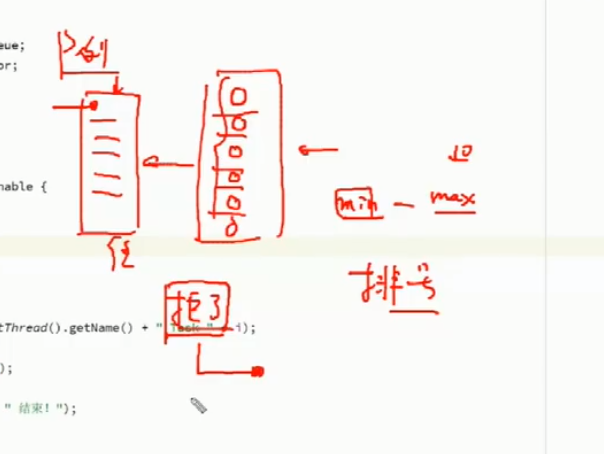
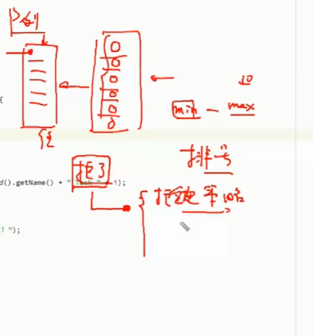
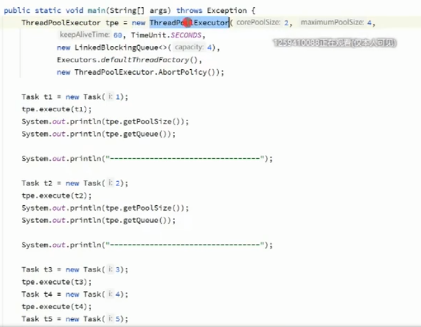
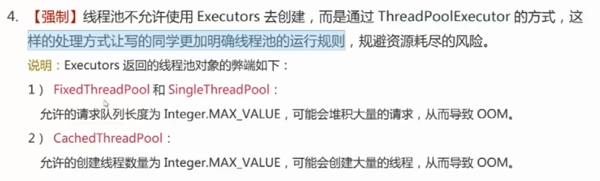
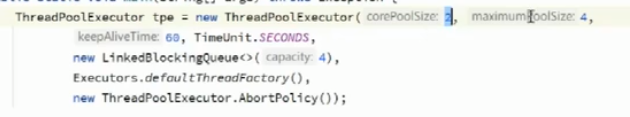
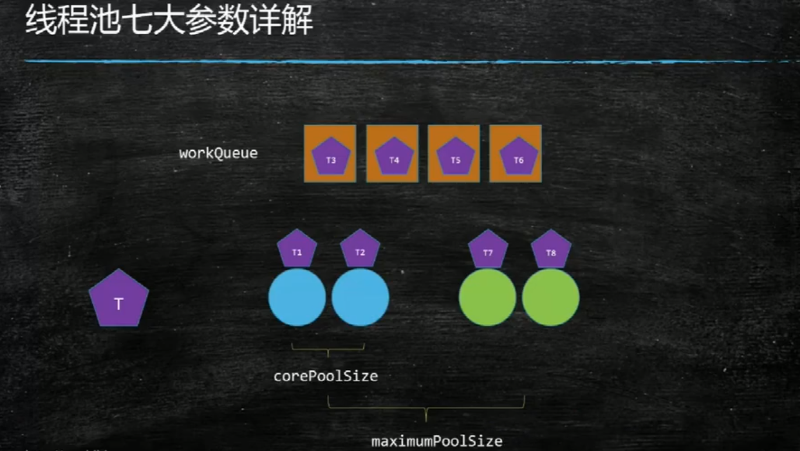
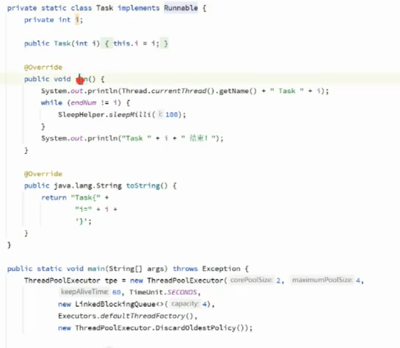
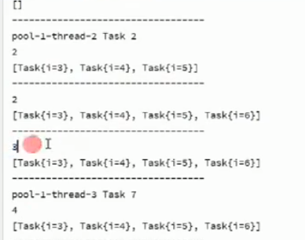
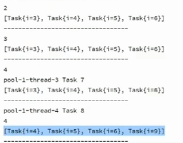

# 1.锁的原理

原子性：我在执行的时候，别的线程不能进来打断

critical section 临界区 具有原子性的理论

其实有各种各样的锁，信号量 互斥锁 门栓 等 不止synchronize一种

悲观锁：所有人都会打断我

乐观锁：能不能先执行？ CAS    cmpxchg

Aotomtic Integer  没有synchronized

ABA问题怎么办？

添加了版本号 Version 

有两种方法： 1.带戳的版本号   2.还有一个markable  就是 变换了我就接受不来哦

### 那CAS操作得是原子性的

unsafe 里面的 cmpAndSwap  然后到c++

lock cmpxchg

CPU有一条汇编指令lock cmpxchg。但是这条指令cmpxchg不是原子的。拿到0往回写的时候，比较的时候，照样会被打断。所以需要lock  所以 我在进行cmp和exchange的过程中 不能被任何人打断，

LockifMp 如果是多cpu 上锁 lock lock的含义：当需要执行上面的操作的时候，锁住总线，独占总线。改完之后才放开，锁定

volatile lock addl 

> **LOCK 用于在多处理器中执行指令时对共享内存的独占使用。
> 它的作用是能够将当前处理器对应缓存的内容刷新到内存，并使其他处理器对应的缓存失效。**
> **另外还提供了有序的指令无法越过这个内存屏障的作用。**

看到lock 先刷到内存 然后使得其他处理器对应的缓存失效，（也就是得重新读了）

然后lock 无法越过这个内存屏障的作用。

所以 lock 加一条空指令 就够了 能实现volatile

换句话说单cpu就不需要lock

# 2.应用级别：多线程

线程池的7大参数

阻塞队列 拒绝策略 生产者消费者模式

1.什么是线程池

一个饭店 复用一些服务员  用一个已经启动好的队伍 来处理  二话不说建立个池子 省了启动和销毁的过程

2.CRUD 

数据库连接池

## 可以进行自定义线程池的操作 

自己来定义这么一个池子，得先知道容量有多大，最小的时候多少个 最大的时候 多少个？

人多了 10个服务员忙不过来了  那就是排号。队列都忙不过来了怎么办？ 拒绝！  你吃不上了

拒绝有不同的策略，晚上来 还是什么来

最小最大 几个线程  定义队列  怎么拒绝你？（丢到数据库 直接mq  直接报异常）

阿里的java的开发手册。

线程是怎么创建出来的 

千万不能用

## 创建线程池 7大参数

1.corePollSize： 开始创建了多少个参数 核心线程 会一直在的

2.max：最大线程池参数数量

3.keepalive：线程的空闲时间 超过60s 直接解雇

4.时间单位

5..阻塞队列  多线程访问的时候 线程安全的一个队列 新来的任务 放在阻塞队列里面

6.ThreadFactory ： 这个线程怎么造出来  用这个线程工厂 来给你创建线程。尽量不要用默认工厂，首先名字没有任何的含义

他是个后台线程   。。 所以我们得继承 这个接口 来重写

7.放弃策略 。 比如 放弃 直接报错   或者 把最老的那个任务给抛弃 把新的给救过来

开发中用线程池：异步请求。

支付例子，接受到了很多的订单，商户的接入请求。不是等支付宝返回结果之后 才返回给商户

是我这边接到请求了，然后 我就往线程池里丢，然后反馈给客户，说我正在处理。

就是异步等结果。

里面的关键：如果有个线程池 来操作这个情况的时候，自定义的策略：处理不完的 丢入 kafuka （一个消息队列） 不能丢

那些可以丢呢？ 在线游戏，移动一下 穿一个数据  那之前的数据就是可以丢的。

拒接策略 ：一般都是用自定义的拒绝策略。

这是个不结束的任务

submit 和 excute的区别 返回值，一个异步 一个同步

第九个丢进去 

9进去 3没了

线程池 要了解 得用中间件

要自己的实现。

公平锁

一个线程持有一把锁 别的线程不能抢   CaS 

非公平锁

新来的人能直接抢

