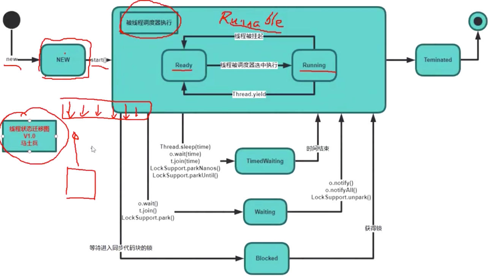
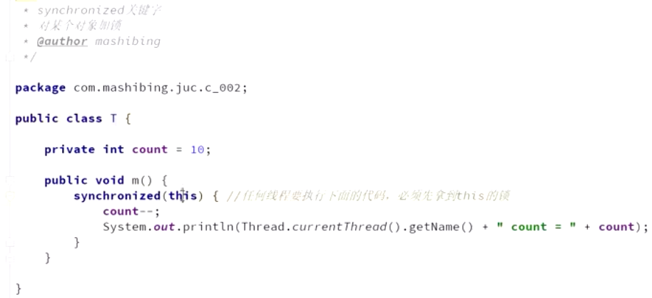
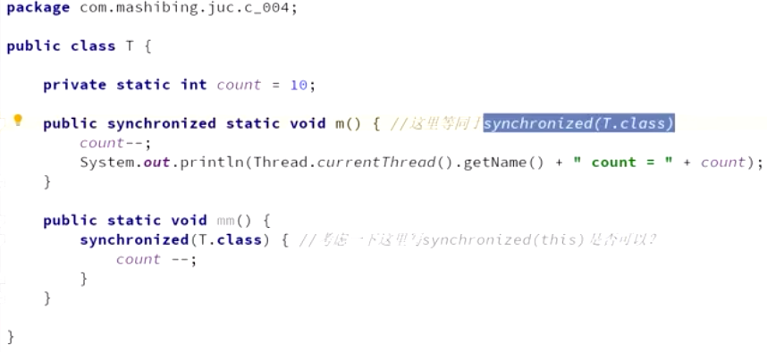

## 1.基本概念

创建线程的两种方式：Thread类基础， 实现Runabel接口，实现callable接口。

## 1.1对每个对象加锁

​	

static 锁的是class 对象

T.class 是不是单例的？一般同一个加载器就是。

加了synchronized 既能保证原子性又能保证可见性，没必要加volatile了

synchronized必须可重入，一个同步方法调了另外一个同步方法，m1能调用m2。就是锁的都是自己

如果不可重入，子父类出现了继承关系就会死锁了。

## 1.2异常的锁。

容易出现程序的乱入。

字符串常量，大家用的都是同一个，用户的线程 又尝试去锁这个，那用到类库的代码，也会被锁定。

因为在JVM中具有String常量池(如果两个String具有相同的值，那么他们的地址是相同的，都保存在这个常量池中)。当以String作为锁的时候，如果值相同则，那么线程持有相同的锁。这样就造成了另外一个线程不能执行

锁的是对象，靠markword。

重量级锁：等待队列。

Lock的实现 基本是CAS操作  占用cpu时间

Synchronized。最后是用个wait队列 不占用CPU时间

如果线程数少 偏向于自旋 。如果线程数多 重量级锁

操作消耗时间长 -用重量级锁

# 2.volatile

# 3.CAS

## 3.1总体描述

Compare And Swap (Compare And Exchange) / 自旋 / 自旋锁 / 无锁 （无重量锁）

因为经常配合循环操作，直到完成为止，所以泛指一类操作

cas(v, a, b) ，变量v，期待值a, 修改值b

ABA问题，你的女朋友在离开你的这段儿时间经历了别的人，自旋就是你空转等待，一直等到她接纳你为止

解决办法（版本号 AtomicStampedReference），基础类型简单值不需要版本号

## 3.2原子类（无锁编程）

### 聊一聊原理（unsafe类 直接操作java虚拟机的内存 c c++的指针）：

V要改的值。E期望这个值是多少。NewValue修改的新的值

## 3.3乐观锁的概念

## 3.4LongAdder（之所以线程多的时候，是因为加了分段锁）

如果有1000个线程，没250个加个锁，然后几个数一加，

# 4.新类型的锁（JUC同步锁）

## 4.1可重入锁（reentrantlock 非公平的）

就是我锁了之后，可以对我这把锁再锁一下。这个时候发现同一个线程已经锁上了，那就继续执行就行了。m1里面可以调用m2

如果不可重入，你父类的方法枷锁了，那子类就拿不到这把锁了。

lock 是手动上锁的。所以必须手动解锁

### 4.1.1可以尝试锁定

### 4.1.2 可以被打断的锁

## 4.2 公平锁(上来会检查队列里面是不是有线程 有 等着 不能去抢)

ReetrantLock默认是非公平锁。

4.3 ReentrantLock vs synchronized（非公平的）

## 4.3 countdownlatch（倒数 门栓）

用来等着一系列线程结束之后，在执行

其实也可以用join。

## 4.4 cyclicbarrier（栅栏 人满了 推倒 继续）

场景：限流（大家伙等这个结束了再继续）

客户端吧来了很多很多访问，设置限流。 把出口给限制住。

## 4.5 ReadWriteLock 读写锁

### 共享锁 readLock

### 排他锁

就是只接受 同类的线程进来 我这边都读 写线程你就别来了

举个例子，秒杀系统的情形：

比如秒杀一个电视，500，最多只能是500台。

前面的线程访问同一个数，进行一个加锁，分布式的必须上分布式锁。

# 5.这些锁都是根据AQS来解决的

1。阿里的一题面试题。

## 5.1读源码

