总结一下：
强引用：最普遍的引用，只要引用在，就不回收。java虚拟机宁可抛出OOM的异常，都不会去回收这个对象。
软引用：可以想象成缓存。如果内存空间⾜够，垃圾回收器 就不会回收它，如果内存空间不⾜了，就会回收这些对象的内存。
弱引用：只具有弱引⽤的对象拥有更短暂的⽣命周期。在垃圾回收器线程扫描它所管辖的内存区域的过程 中，⼀旦发现了只具有弱引⽤的对象，**不管当前内存空间⾜够与否，都会回收它的内存**。这个好像和ThreadLocal相关
虚引用：虚引⽤并不会决定对象的⽣命周 期。如果⼀个对象仅持有虚引⽤，那么它就和没有任何引⽤⼀样，在任何时候都可能被垃圾回 收。和堆外内存有些相关。

# 强引用

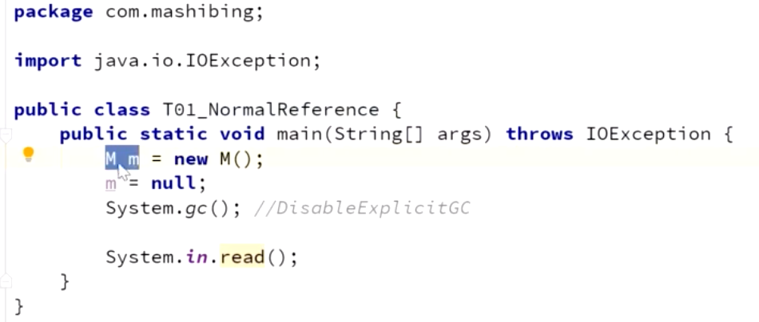

栈里面一个m 指向堆栈中的M，只要引用在，就不回收；没有引用指向对象，就被回收了

如何验证：

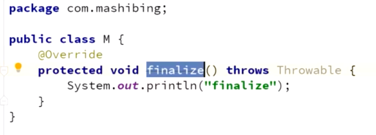

为什么重写了会OOM？

# 软引用

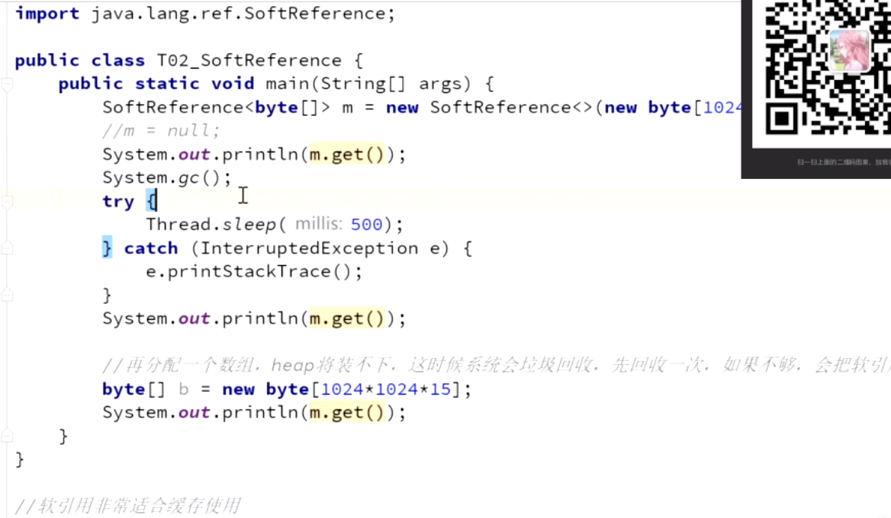

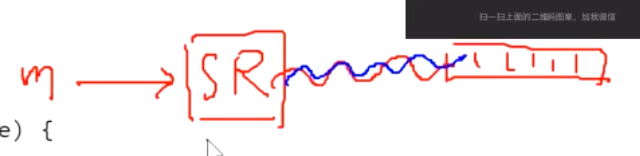

调用回收之后，一开始没有回收。

之后又回收了。

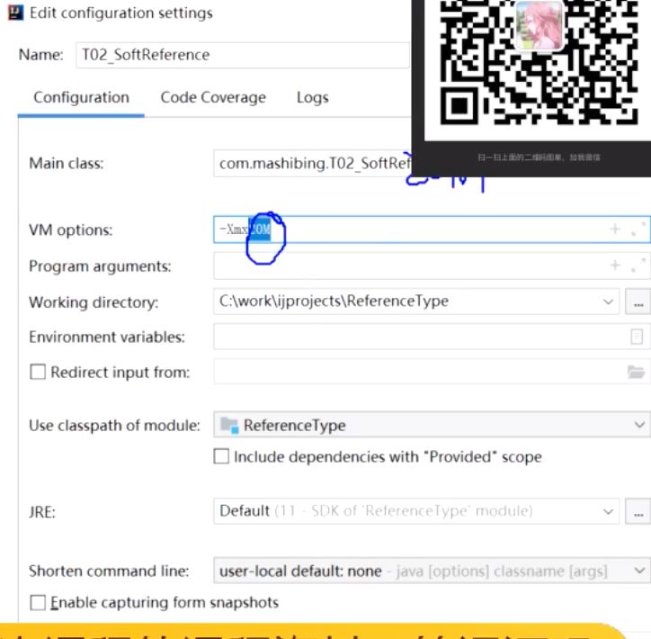

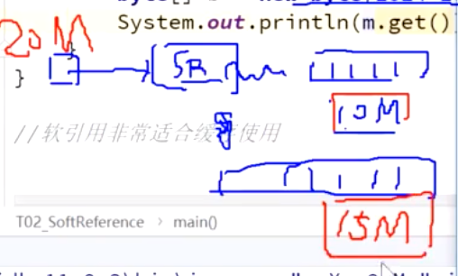

## 软引用，内存不够用了，就收走。

## 软引用，用于缓存的作用。

 比如图片，特别占地，分配不下就丢了，分配的下就留下。

所以，就是内存空间够的时候，有引用，不回收；内存空间不够的时候，有引用也回收了。

# ThreadLocal

线程本地变量

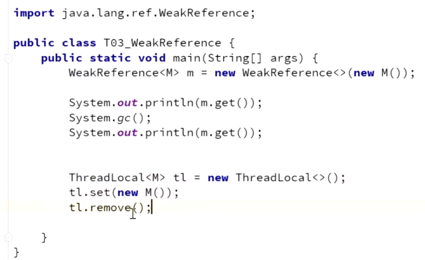

逻辑上的理解（实际上不是这样的）：

每个线程独立拥有，线程存在 threadlocal存在。

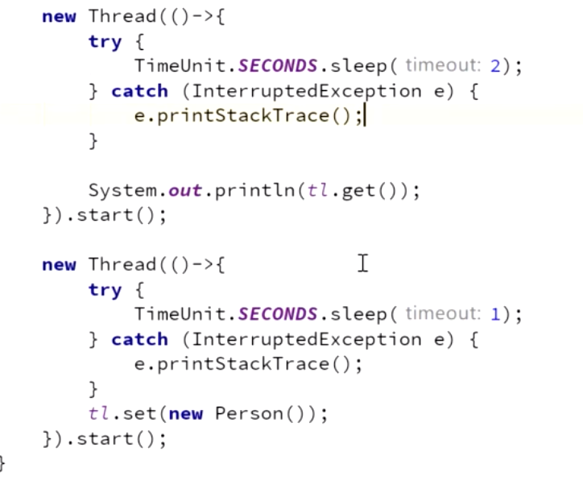

我往里面set东西的时候，只和当前线程有关，别的线程是get不到的。

事务中，有两个操作 m1 和 m2 ，那这两个线程都要操作数据库，我们必须保证他们操作的是同一个 conection，这里就要用ThreadLocal，这个只能自己线程拿，别的线程是拿不到的。

## ThreadLocal底层实现

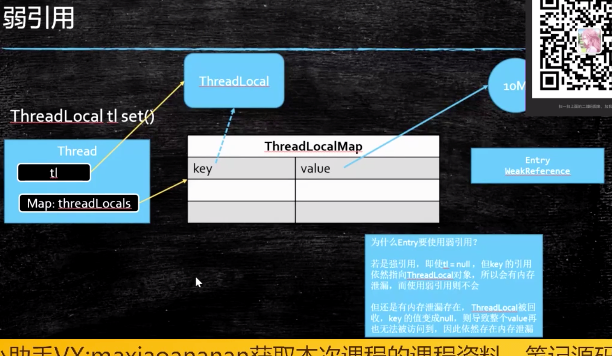

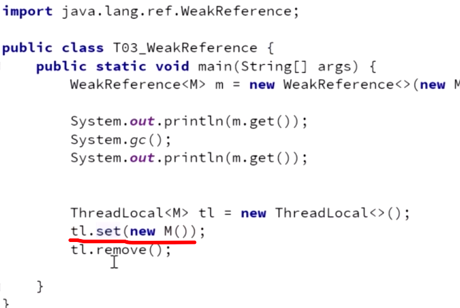

this 是threadlocal对象，不是线程。 吧这个threadlocal 放在了一个map里面

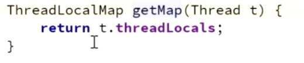

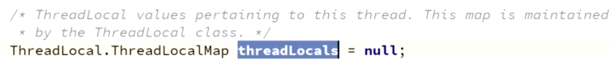

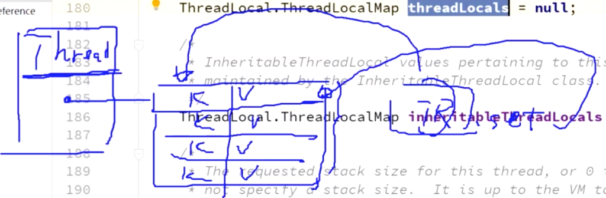

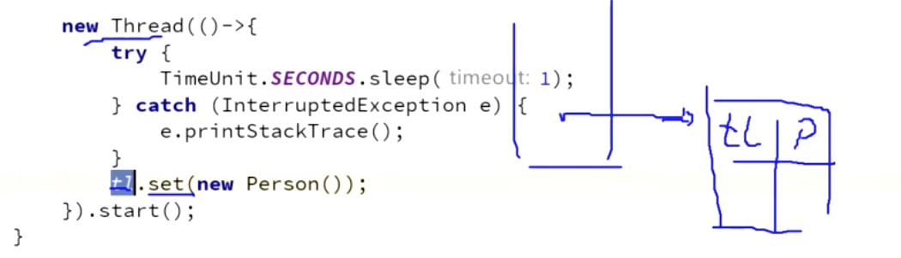

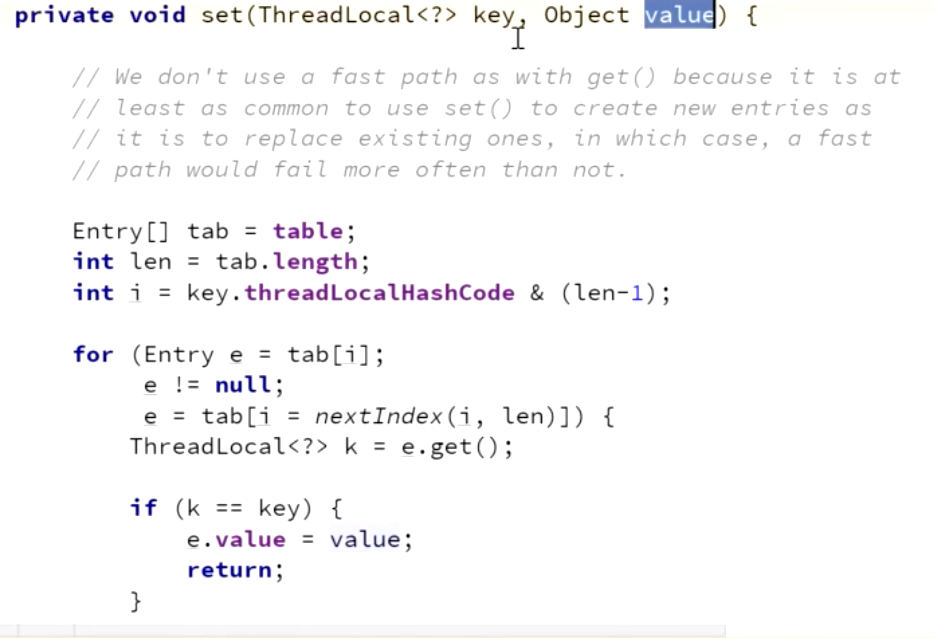

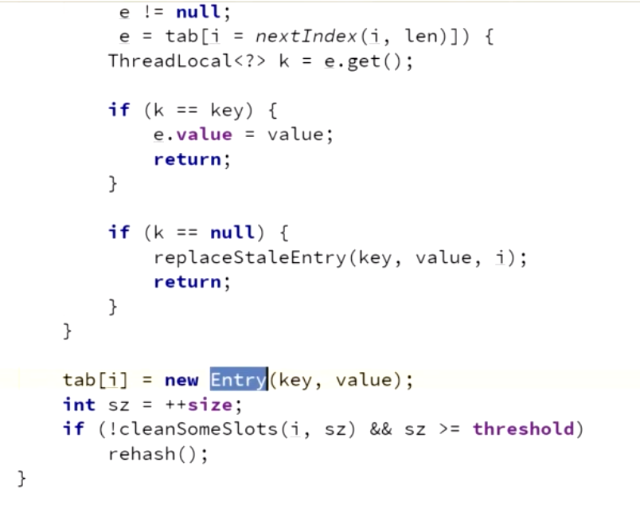

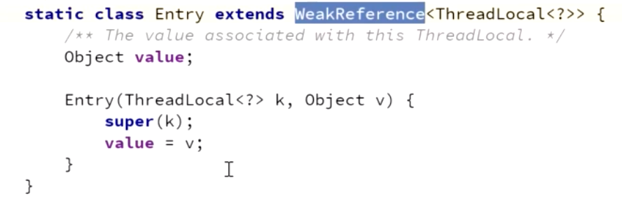

相当于是new WR

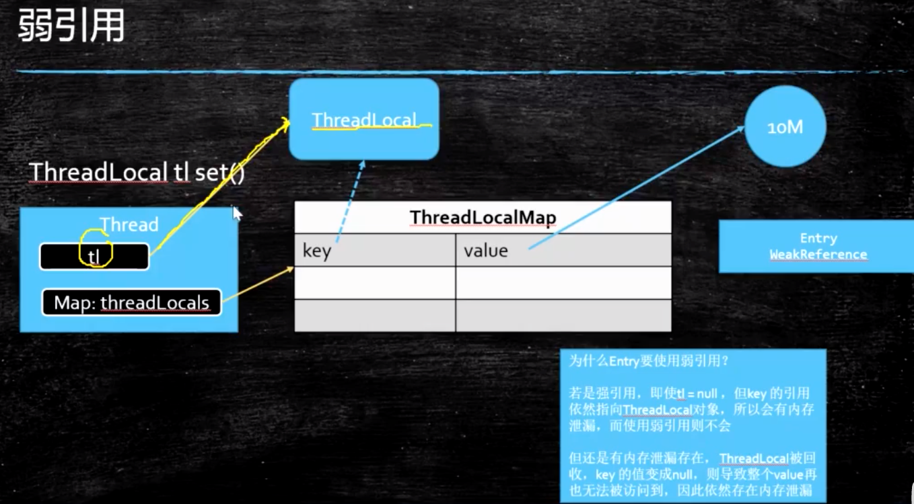

最开始我们new 了个 threadlocal 对象 TL，然后有一个强引用 指向我们的threadLocal，通过set方法set完了之后，key 通过一个**弱引用**指向ThreadLocal。

## 那这边为什么要弱引用？防止内存泄漏

因为如果是强引用的话，我的tl对象没了，我这边还有个key会指向threadlocal，那就没法回收了。 如果是弱引用的话，只要遇到垃圾回收，就能被回收。

## 但是还是会有内存泄漏。

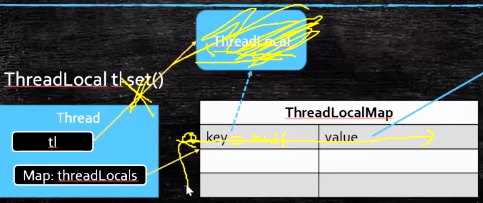

就是当我们的Threadlocal被回收之后，key变成null，那其实这条记录是没法被访问的，但这条记录是没法被删除的，要删掉这条记录，必须手动remove。不然还是会内存泄漏。

总结：
  1.ThreadLocal tl.set并不是说往它里面set，而是把它当作key，set到当前Thread对象里面的一个map里面
2.当我们不用了之后，务必remove，不然value指向的那一大块内存会没法被回收

# 弱引用

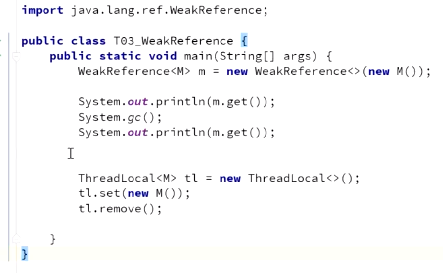

## 一次性作用。哪怕有引用，GC一下就木得了。

ThreadLocal里面有应用。

在JDK里面

# 虚引用

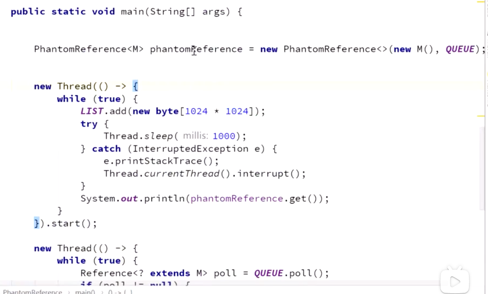

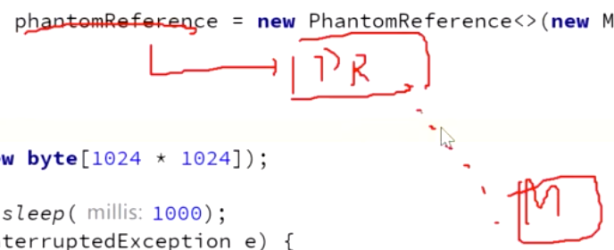

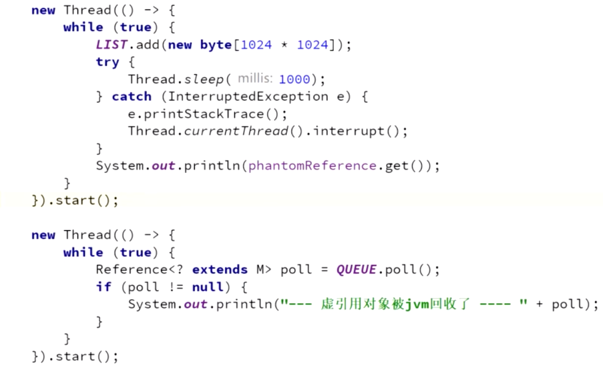

get都get不到，和没有是一样的。

## 作用：管理堆外内存。（Zero copy）

NIO，

网卡-》操作系统》 jvm复制一份 〉在给操作系统》再返回 

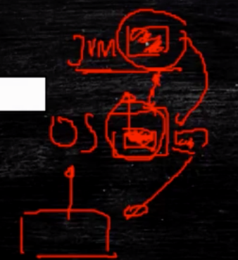

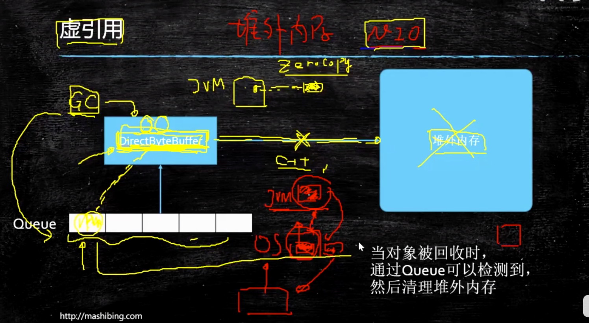

JVM有个对象，管理着堆外的内存，这个对象被回收的时候，堆外内存必须也被回收。

那我们怎么管理呢？ 那凡事这样的对象，挂一个虚引用，这种对象一旦被回收了之后，他们的相关信息会放在某一个队列里面，作为GC线程，只要管理这个队列就行了。如果有哥们进来了，那我拿出来，进行回收。