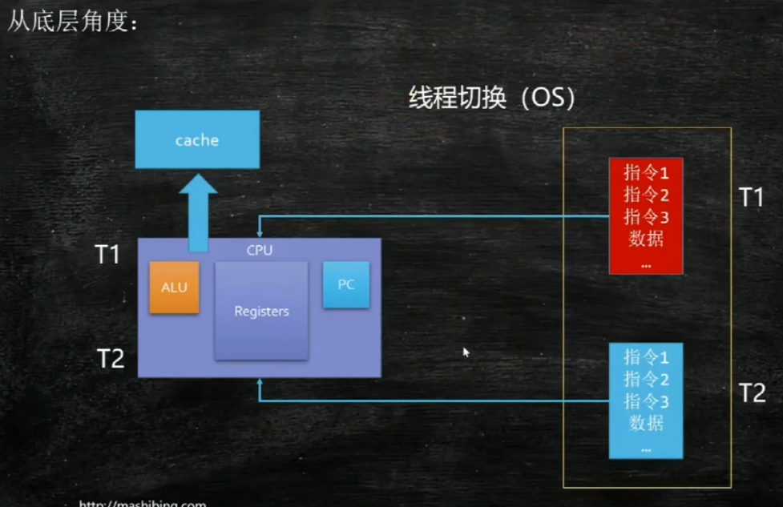
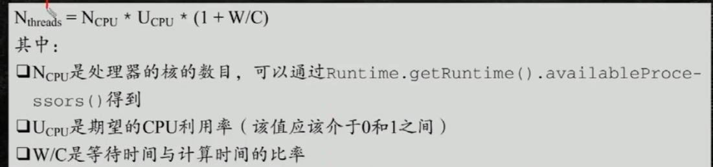
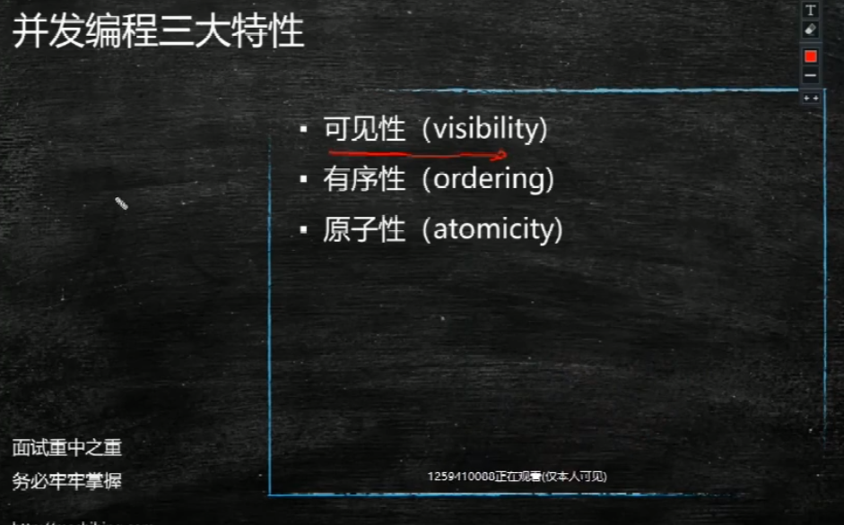

线程调度：

线程切换：轮到谁 之前那个先放到缓存，

1.单核心cpu设计多线程是否有意义？

有意义，因为我的线程大多数时间可能是在IO。这个时候 就不需要cpu 一个线程不是时时刻刻都在占用cpu

2.工作线程数是不是设置的越大越好？

不是 因为是有切换的开销的。

3.线程池设计多少线程合适？

我配服务员 怎么样是最好的呢？ 

一个线程执行完需要1s钟， 0.5s执行 0.5 等待 w/C=1

我期望利用率是50% 

我有8个cpu

那就是线程数 是 8 * 0.5 *2 =8

线程撕裂者

CPU 用线程

如果有一个套 保存空间 和计算单元 

线程撕裂者 一个计算单元  四个内存保存期  节省了线程切换的时间

并发的概念：同时好多个线程再执行

单机和集群

 

单机版的

并发编程：

可见性 有序性 原子性

每一个线程之间都有自己的缓存

cpu每次都是从缓存里面取 不是去内存里面取 读线程本地的数据。

线程改了一个状态，另外一个线程不一定能看见。这就是线程的不可见性。

sout里面有 synchronize的 synchronize 能保证可见性。

