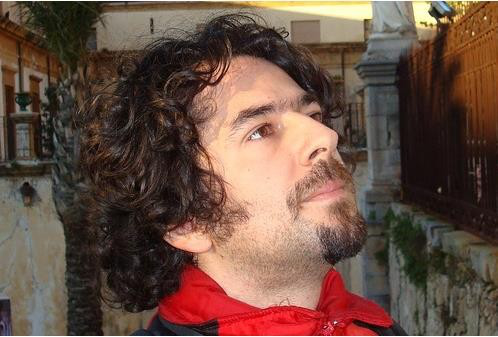

# Redis介绍

Redis 是当今非常流行的

**基于 KV 结构**

的作为 **Cache** 使用的 NoSQL 数据库

redis作缓存的，减轻了数据库的查询压力。

## Redis 介绍

Remote Dictionary Server(Redis) 是一个开源的使用 ANSI C 语言编写、支持网络、可基于内存亦可持久化的 Key-Value 数据库. Key 字符类型，其值（value）可以是 **字符串(String)**, **哈希(Map)**, **列表(list)**, **集合(sets)** 和 **有序集合(sorted sets)**等类型，每种数据类型有自己的专属命令。所以它通常也被称为数据结构服务器。

Redis 的作者是 Salvatore Sanfilippo，来自意大利的西西里岛，现在居住在卡塔尼亚。目前供职于 Pivotal 公司（Pivotal 是 Spring 框架的开发团队），Salvatore Sanfilippo 被称为 Redis之父。

Redis 之父（Salvatore Sanfilippo）

官网：https://redis.io/

中文：http://www.redis.cn/

## Redis的历史：

2008年，意大利的一家创业公司Merzia推出了一款基于MySQL的网站实时统计系统LLOOGG，然而没过多久该公司的创始人Salvatore Sanfilippo便开始对MySQL的性能感到失望，于是他决定亲自为LLOOGG量身定做一个数据库，并于2009年开发完成，这个数据库就是Redis。

不过Salvatore Sanfilippo并不满足只将Redis用于LLOOGG这一款产品，而是希望让更多的人使用它，于是在同一年Salvatore Sanfilippo将Redis开源发布，并开始和Redis的另一名主要的代码贡献者Pieter Noordhuis一起继续着Redis的开发，直到今天。

Salvatore Sanfilippo自己也没有想到，短短的几年时间，Redis就拥有了庞大的用户群体。

2012年数据库的使用情况调查，结果显示有近12%的公司在使用Redis。国内如新浪微博、知  乎，国外如GitHub、Stack Overflow、Flickr、暴雪和Instagram，都是Redis的用户。

VMware公司从2010年开始赞助Redis的开发，Salvatore Sanfilippo和Pieter Noordhuis也分别于同年的3月和5月加入VMware，全职开发Redis。

Redis的代码托管在GitHub上https://github.com/antirez/redis，开发十分活跃，代码量只有3万多行。