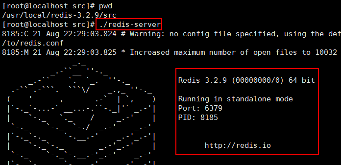
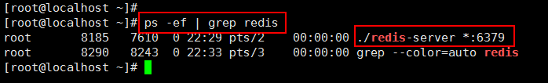
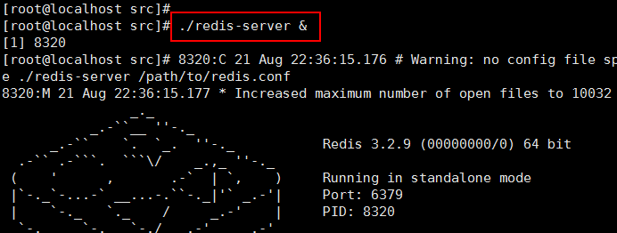
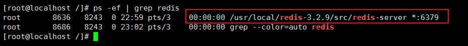
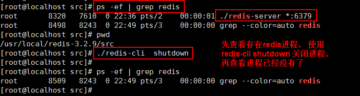
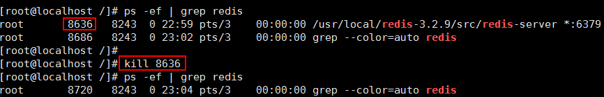
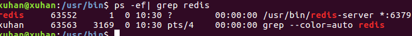
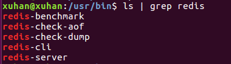
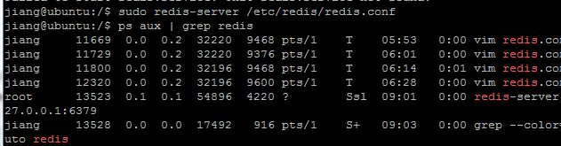
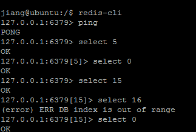

# CentOS版本：

http://www.bjpowernode.com/tutorial_redis/326.html

ps：如果能重来，还是装CentOS吧

## 3、启动 Redis

① 前台启动 ./redis-server

② 后台启动 ./redis-server &

第①种 前台启动

启动 Redis 的服务器端：切换到 src 目录下执行 redis-server 程序



redis 应用以前台的方式启动，不能退出当前窗口， 退出窗口，应用终止。

在其他窗口查看 redis 启动的进程



第②种 后台启动

src目录下执行 ./redis-server & 此时关闭窗口，查看redis进程，依然存在。



查看redis进程



## 4、关闭 Redis

关闭方式：

① 使用 redis 客户端关闭， 向服务器发出关闭命令

切换到 redis-3.2.9/src/ 目录，执行 ./redis-cli shutdown

推荐使用这种方式， redis 先完成数据操作，然后再关闭。

例如：



② kill pid 或者 kill -9 pid

这种不会考虑当前应用是否有数据正在执行操作，直接就关闭应用。

先使用 ps -ef | grep redis 查出进程号， 在使用 kill pid




# Ubuntu版本：

1.安装redis步骤：

https://blog.csdn.net/chenglinlin526/article/details/108733706

https://www.cnblogs.com/wxjnew/p/9189191.html

我觉得第二个更好一些


2.redis的一些小操作（开启、关闭、重启、客户端连接等）：

https://www.cnblogs.com/jum-bolg/p/11300802.html

https://www.cnblogs.com/zongfa/p/7808807.html


**1.启动停止**

　　如果以(sudo apt install redis-server)方式安装

　　　启动：　　　sudo service redis start

　　　停止：  　 sudo service redis stop

　　　重启： 　  sudo service redis restart

​			找到redis的服务项 whereis redis
​			找到redis的安装路径 通过ps -ef| grep redis



​			然后找到对应位置



 　如果以（https://www.cnblogs.com/jum-bolg/p/11300134.html）安装

​				多配置一个protected-mode：no

　　　　启动：　　       　　sudo redis-server /etc/redis/redis.conf(/etc/redis/redis.conf 为配置文件)

　　　　查看redis进程id ：　　ps aux | grep redis

　　　　停止：  　　　　　　 sudo kill -9 pid（pid为redis进程id）

　　　　

 

**2.客户端连接**

　　连接：　　　　redis-cli 

　　测试连接：　　ping （服务端自动回复一个 pong）

　　切换数据库 ： select n (n代表第几号数据库，共有16个（0-15）)

　　　　


卸载redis

sudo apt-get purge --auto-remove redis-server

https://blog.csdn.net/isea533/article/details/84550237


安装redis 全新版本（这个不太行 ）

https://blog.csdn.net/PY0312/article/details/90747409


# 最终使用的安装方式

：下载对应的压缩包 make 然后 按照

https://www.cnblogs.com/jum-bolg/p/11300134.html

多配置一个protected-mode：no

　　　　启动：　　       　　sudo redis-server /etc/redis/redis.conf(/etc/redis/redis.conf 为配置文件)

　　　　查看redis进程id ：　　ps aux | grep redis

　　　　停止：  　　　　　　 sudo kill -9 pid（pid为redis进程id）

​				redis-cli shutdown 也可以停止

https://exp.newsmth.net/topic/article/830ac5e1877cf11722e3059bcde975e7

然后出现了一个问题，然而并没有对应的解决的release版本：

https://github.com/redis/redis/issues/7552

然后对应的安装目录为：

/usr/local/redis

对应的redis.conf文件位置为：


## [怎样查看Redis的版本号](https://www.cnblogs.com/aisowe/p/11578087.html)

Q: 怎样查看Redis版本

A: 下面两条命令都可以查看redis 版本: 

```
redis-server --version
redis-server -v
```


刷题 ：

3.数学 逻辑

数学 摆在最后写  数量关系最后写

常识 资料分析  图形 类比推理  必须拿到

逻辑 判断 数量关系 放到最后写

2.公文格式 

3.行测 申论 把对应的文章去背诵一下

去年考的是 演讲稿
