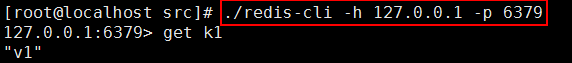
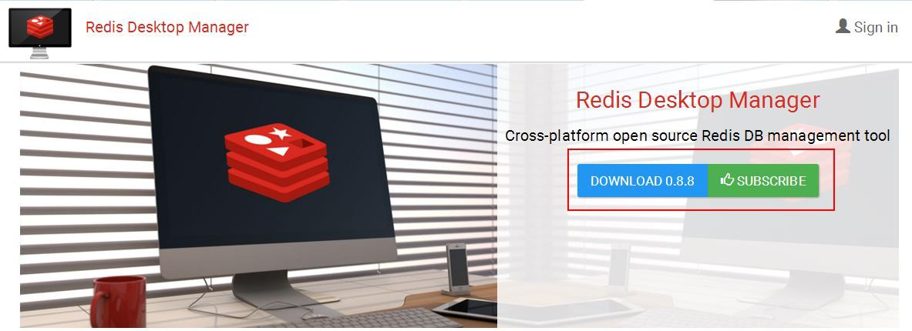
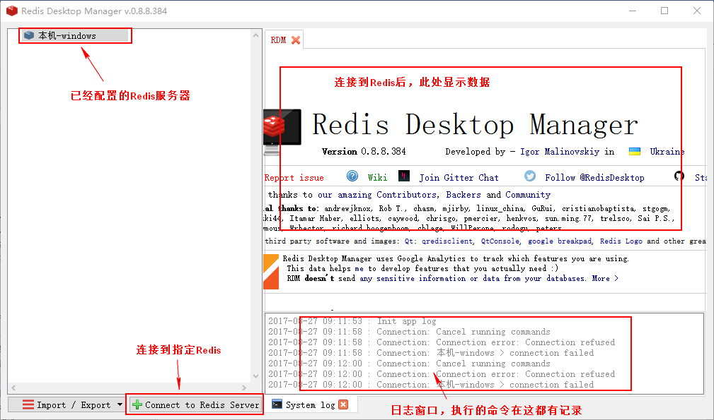
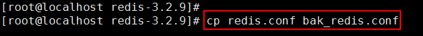
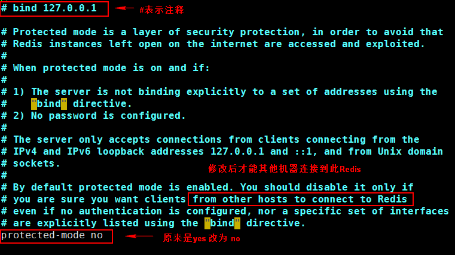
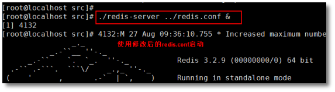
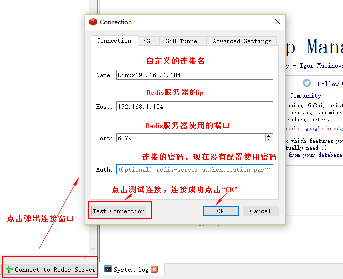
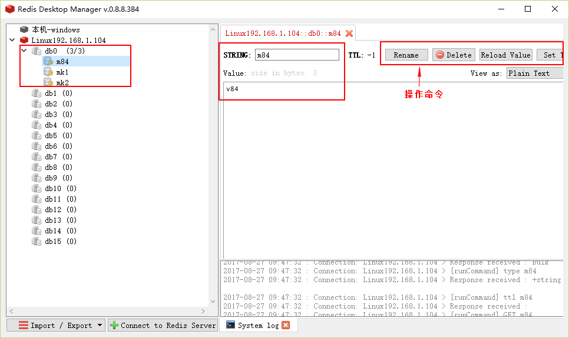

# Redis客户端

Redis 客户端是一个程序，通过网络连接到 Redis 服务器， 在客户端软件中使用 Redis 可以识别的命令，向 Redis 服务器发送命令， 告诉 Redis 想要做什么。Redis 把处理结果显示在客户端界面上。 通过 Redis 客户端和 Redis 服务器交互。

Redis 客户端发送命令，同时显示 Redis 服务器的处理结果在

## Redis命令行客户端

redis-cli （Redis Command Line Interface）是 Redis 自带的基于命令行的 Redis 客户端， 用于与服务端交互，我们可以使用该客户端来执行 redis 的各种命令。

**两种常用的连接方式：**

A、直接连接 redis (默认 ip127.0.0.1，端口 6379)：./redis-cli

在 redis 安装目录\src, 执行 ./redis-cli

此命令是连接本机 127.0.0.1 ，端口 6379 的 redis

B、 指定 IP 和端口连接 redis：./redis-cli -h 127.0.0.1 -p 6379

-h redis 主机 IP（可以指定任意的 redis 服务器）

-p 端口号（不同的端口表示不同的 redis 应用）

在 redis 安装目录\src, 执行 ./redis-cli -h 127.0.0.1 -p 6379

例 1：

redis远程客户端

Redis Desktop Manager：C++ 编写，响应迅速，性能好。官网地址： https://redisdesktop.com/

github: https://github.com/uglide/RedisDesktopManager

使用文档：http://docs.redisdesktop.com/en/latest/

点击“DOWNLOAD”

**A、安装客户端软件**

在 Windows 系统使用此工具，连接 Linux 上或 Windows 上的 Redis , 双击此 exe 文件执行安装

安装后启动界面：

**B、 使用客户端连接 Linux 的 Redis**

连接Linux的Reids之前需要修改Redis服务器的配置信息。 Redis服务器有安全保护措施， 默认只有本机（安装Redis的那台机器）能够访问。配置信息存放在Redis安装目录下的redis.conf文件。修改此文件的两个设置。

远程连接redis需要修改redis主目录下的redis.conf配置文件：

①、bind ip 绑定ip此行注释

②、protected-mode yes 保护模式改为 no

使用 vim 命令修改 redis.conf 文件， 修改文件前备份此文件，执行 cp 命令

执 行 vim

**C、 使用 redis.conf 启动 Redis**

修改配置文件后，需要使用配置文件重新启动 Reids，默认不加载配置文件。先关闭已经启动的 Redis ，使用以下命令启动 Redis 在 Redis 安装目录执行：

./redis-server ../redis.conf &

**D、配置 Redis Desktop Manamager(RDM)，连接 Redis**

在 RDM 的主窗口，点击左下的“Connect to Redis Server”

连接成功后：

## redis 编程客户端

**A、Jedis**

redis 的 Java 编程客户端，Redis 官方首选推荐使用 Jedis，jedis 是一个很小但很健全的

redis 的 java 客户端。通过 Jedis 可以像使用 Redis 命令行一样使用 Redis。

jedis 完全兼容 redis 2.8.x and 3.x.x

Jedis 源码：https://github.com/xetorthio/jedis

api 文档：http://xetorthio.github.io/jedis/

**B、 redis 的其他编程语言客户端:**

C 、C++ 、C# 、Erlang、Lua 、Objective-C 、Perl 、PHP 、Python 、Ruby 、Scala 、Go 等 40 多种语言都有连接 redis 的编程客户端。