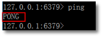
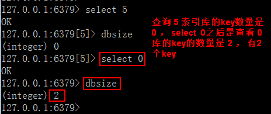
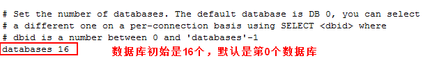
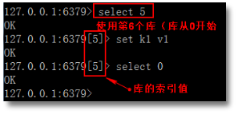
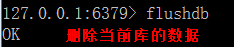
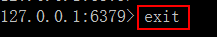

# Redis操作命令

redis 默认为 16 个库 (在 redis.conf 文件可配置，该文件很重要，后续很多操作都是这个配置文件) redis 默认自动使用 0 号库

**沟通命令，查看状态**

redis >ping 返回 PONG

解释：输入 ping，redis 给我们返回 PONG，表示 redis 服务运行正常

**查看当前数据库中 key 的数目：dbsize**

语法：dbsize

作用：返回当前数据库的 key 的数量。返回值：数字，key 的数量

例：先查索引 5 的 key 个数， 再查 0 库的 key 个数

**redis 默认使用 16 个库**

Redis 默认使用 16 个库，从 0 到 15。 对数据库个数的修改，在 redis.conf 文件中databases 16

**切换库命令：select db**

使用其他数据库，命令是 select index

例 1： select 5

**删除当前库的数据：flushdb**

***\*\****

**redis 自带的客户端退出当前 redis 连接: exit 或 quit**

***\*\****