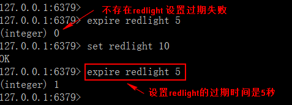
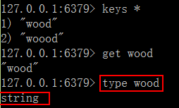

# Redis Key命令

**keys**

语法：keys pattern

作用：查找所有符合模式 pattern 的 key. pattern 可以使用通配符。通配符：

● * ：表示 0-多个字符 ，例如：keys * 查询所有的 key。

● ？：表示单个字符，例如：wo?d , 匹配 word , wood

例 1：显示所有的 key

例 2：使用 * 表示 0 或多个字符

例 3：使用 ？ 表示单个字符

## exists

语法：exists key [key…]

作用：判断 key 是否存在

返回值：整数，存在 key 返回 1，其他返回 0. 使用多个 key，返回存在的 key 的数量。

例 1：检查指定 key 是否存在

例 2：检查多个 key

## expire

语法：expire key seconds

作用：设置 key 的生存时间，超过时间，key 自动删除。单位是秒。返回值：设置成功返回数字 1， 其他情况是 0 

例 1： 设置红灯的倒计时是 5 秒

## ttl

语法：ttl key

作用：以秒为单位，返回 key 的剩余生存时间（ttl: time to live） 返回值：

● -1 ：没有设置 key 的生存时间， key 永不过期

● -2 ：key 不存在

● 数字：key 的剩余时间，秒为单位

例 1：设置 redlight 的过期时间是 10， 查看剩余时间

## type

语法：type key

作用：查看 key 所存储值的数据类型返回值：字符串表示的数据类型

● none (key 不存在)

● string (字符串)

● list (列表)

● set (集合)

● zset (有序集)

● hash (哈希表)

例 1：查看存储字符串的 key ：wood

例 2：查看不存在的 key

## del

语法：del key [key…]

作用：删除存在的 key ，不存在的 key 忽略。返回值：数字，删除的 key 的数量。

例 1：删除指定的 key

