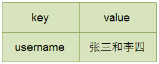
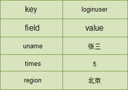
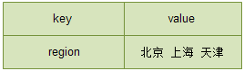
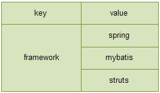
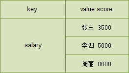

# Redis数据类型

字符串类型 string

字符串类型是 Redis 中最基本的数据类型，它能存储任何形式的字符串，包括二进制数据，序列化后的数据，JSON 化的对象甚至是一张图片。最大 512M。

## 哈希类型 hash

Redis hash 是一个 string 类型的 field 和 value 的映射表，hash 特别适合用于存储对象。

Map<String,String> data

​                    **field**             **value**

data.put("userName","zhangsan")

data.put("times","5")

data.put("region","beijing")

​           **key**

Map<String,Map<String,String>> map

map.put("loginUser",data)

## 列表类型 list

Redis 列表是简单的字符串列表，按照插入顺序排序。你可以添加一个元素到列表的头部（左边）或者尾部（右边）

## 集合类型 set

Redis 的 Set 是 string 类型的无序集合，集合成员是唯一的，即集合中不能出现重复的数据.

## 有序集合类型 zset （sorted set）

Redis 有序集合 zset 和集合 set 一样也是 string 类型元素的集合，且不允许重复的成员。不同的是 zset 的每个元素都会关联一个分数（分数可以重复），redis 通过分数来为集合中的成员进行从小到大的排序。

