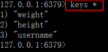
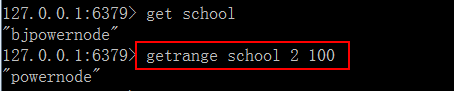

# Redis字符串类型

字符串类型是 Redis 中最基本的数据类型，它能存储任何形式的字符串，包括二进制数据，序列化后的数据，JSON 化的对象甚至是一张图片。

## 基本命令

先测试能连接到 redis 服务器

**A、set**

将字符串值 value 设置到 key（所有的key都是string类型的） 中

语法：set key value

查看已经插入的 key

向已经存在的 key 设置新的 value，会覆盖原来的值

**B、 get**

获取 key 中设置的字符串值语法： get key

例如：获取 username 这个 key 对应的 value

**C、 incr**

将 key 中储存的数字值加 1，如果 key 不存在，则 key 的值先被初始化为 0 再执行incr 操作（只能对数字类型的数据操作） 语法：incr key

例 1：操作key,值增加 1

例 2：对非数字的值操作是不行的

**D、 decr**

将 key 中储存的数字值减1，如果 key 不存在，则么 key 的值先被初始化为 0 再执行 decr 操作（只能对数字类型的数据操作）

语法：decr key

例1：不存在的key，初值为0，再减 1 

例2：对存在的数字值的 key ，减 1 。先执行 incr index ,增加到 3

incr ，decr 在实现关注人数上，文章的点击数上。

**E 、key**

语法：append key value

说明：如果 key 存在， 则将 value 追加到 key 原来旧值的末尾如果 key 不存在， 则将 key 设置值为 value

返回值：追加字符串之后的总长度

例 1：追加内容到存在的 key

例 2：追加到不存在的 key，同 set key value

## 常用命令

**A 、 strlen**

语法：strlen key

说明：返回 key 所储存的字符串值的长度返回值： 

 ①：如果key存在，返回字符串值的长度

 ②：key不存在，返回0 

例 1：计算存在 key 的字符串长度

设置中文 set k4 中文长度 ， 按字符个数计算

**B、 getrange**

语法：getrange key start end

作用：获取 key 中字符串值从 start 开始 到 end 结束 的子字符串,包括 start 和 end, 负数表示从字符串的末尾开始， -1 表示最后一个字符

返回值：截取的子字符串

使用的字符串 key: school, value: bjpowernode

例 1: 截取从 2 到 5 的字符

例 2：从字符串尾部截取，start ,end 是负数，最后一位是 -1

例 3：超出字符串范围的截取 ，获取合理的子串

**C、 setrange**

语法：setrange key offset value

说明：用 value 覆盖（替换）key 的存储的值从 offset 开始,不存在的 key 做空白字符串。

返回值：修改后的字符串的长度

例 1：替换给定的字符串

例 2：设置不存在的 key

**D、mset**

语法：mset key value [key value…]

说明：同时设置一个或多个 key-value 对返回值： OK

例 1：一次设置多个 key， value

**E、 mget**

语法：mget key [key …]

作用：获取所有(一个或多个)给定 key 的值返回值：包含所有 key 的列表

例 1：返回多个 key 的存储值

例 2：返回不存在的

应用场景：

##### 商品编号、订单号采用INCR命令生成。【INCR数值增减】

##### 对1号产品点赞+1

微信公众号的点赞

