# Redis哈希(hash)

redis hash 是一个 string 类型的 field 和 value 的映射表，hash 特别适合用于存储对象。

## 基本命令

**A、hset**

语法：hset hash 表的 key field value

作用：将哈希表 key 中的域 field 的值设为 value ，如果 key 不存在，则新建 hash 表，执行赋值，如果有 field ,则覆盖值。

返回值：

①如果 field 是 hash 表中新 field，且设置值成功，返回 1

②如果 field 已经存在，旧值覆盖新值，返回 0

例 1：新的 field

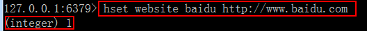

例 2：覆盖旧的的

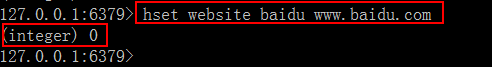

**B、 hget**

语法：hget key field

作用：获取哈希表 key 中给定域 field 的值

返回值：field 域的值，如果 key 不存在或者 field 不存在返回 nil

例 1：获取存在 key 值的某个域的值

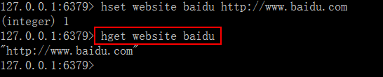

例 2：获取不存在的 field

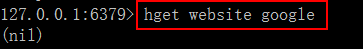

**C、 hmset**

语法：hmset key field value [field value…]

说明：同时将多个 field-value (域-值)设置到哈希表 key 中，此命令会覆盖已经存在的 field，hash 表 key 不存在，创建空的 hash 表，执行 hmset.

返回值：设置成功返回 ok， 如果失败返回一个错误

例 1：同时设置多个 field-value

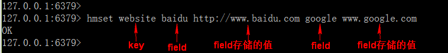

使用 redis-desktop-manager 工具查看 hash 表 website 的数据结构

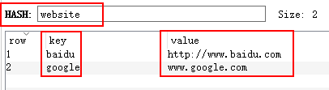

例 2：key 类型不是 hash,产生错误

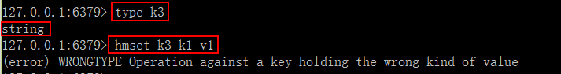

**D、hmget**

语法：hmget key field [field…]

作用:获取哈希表 key  中一个或多个给定域的值

返回值：返回和 field 顺序对应的值，如果 field 不存在，返回 nil

例 1：获取多个 field 的值

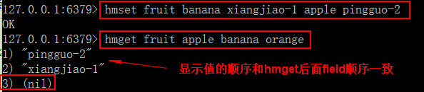

**E、 hgetall**

语法：hgetall key

作用：获取哈希表 key  中所有的域和值

返回值：以列表形式返回 hash 中域和域的值 ，key 不存在，返回空 hash

例 1：返回 key 对应的所有域和值

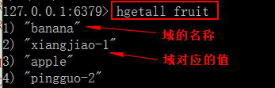

例 2：不存在的 key，返回空列表

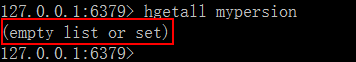

**F、 hdel**

语法：hdel key field [field…]

作用：删除哈希表 key 中的一个或多个指定域 field，不存在 field 直接忽略返回值：成功删除的 field 的数量

例 1：删除指定的 field

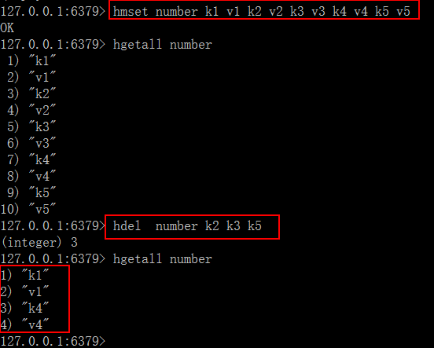

## 常用命令

**A、hkeys**

语法：hkeys key

作用：查看哈希表 key 中的所有 field 域

返回值：包含所有 field 的列表，key 不存在返回空列表

例 1：查看 website 所有的域名称

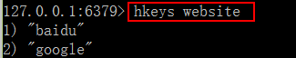

**B、 hvals**

语法：hvals key

作用：返回哈希表 中所有域的值

返回值：包含哈希表所有域值的列表，key 不存在返回空列表

例 1：显示 website 哈希表所有域的值

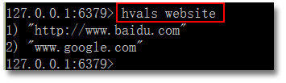

**C、 hexists**

语法：hexists key field

作用：查看哈希表 key 中，给定域 field 是否存在返回值：如果 field 存在，返回 1， 其他返回 0

例 1：查看存在 key 中 field 域是否存在

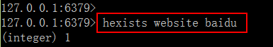


## 应用场景：


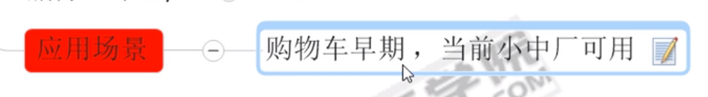

```
 新增商品：hset shopcar:uid 1024 334488 1
 新增商品：hset shopcar:uid 1024 334477 1
 增加商品数量：hincrby shopcar:uid 1024 334477 1
 商品总数：hlen shopcar:uid 1024
 全部选择：hgetall shopcar:uid 1024

```

