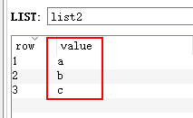

# Redis列表(list)

Redis 列表是简单的字符串列表，按照插入顺序排序。你可以添加一个元素导列表的头部（左边）或者尾部（右边）

## 基本命令

**A、lpush**

语法：lpush key value [value…]

作用：将一个或多个值 value 插入到列表 key 的表头（最左边），从左边开始加入值，从左到右的顺序依次插入到表头

返回值：数字，新列表的长度

例 1：将 a,b,c 插入到 mylist 列表类型

在 redis-desktop-manager 显 示

插入图示：

例 2：插入重复值到 list 列表类型

在 redis-desktop-manager 显

**B、 rpush**

语法：rpush key value [value…]

作用：将一个或多个值 value 插入到列表 key 的表尾（最右边），各个 value 值按从左到右的顺序依次插入到表尾

返回值：数字，新列表的长度

例 1：插入多个值到列表

在 redis-desktop-manager 显示：

**C、 lrange**

语法：lrange key start stop

作用：获取列表 key 中指定区间内的元素，0 表示列表的第一个元素，以 1 表示列表的第二个元素；start , stop 是列表的下标值，也可以负数的下标， -1 表示列表的最后一个元素， -2 表示列表的倒数第二个元素，以此类推。 start ，stop 超出列表的范围不会出现错误。

返回值：指定区间的列表

例 1：返回列表的全部内容

例 2：显示列表中第 2 个元素，下标从 0 开始

**D、lindex**

语法：lindex key index

作用：获取列表 key 中下标为指定 index 的元素，列表元素不删除，只是查询。0 表示列表的第一个元素，以 1 表示列表的第二个元素；start , stop 是列表的下标值，也可以负数的下标， -1 表示列表的最后一个元素， -2 表示列表的倒数第二个元素，以此类推。

返回值：指定下标的元素；index 不在列表范围，返回 nil

例 1：返回下标是 1 的元素

例 2：不存在的下标

**E、 llen**

语法：llen key

作用：获取列表 key 的长度

返回值：数值，列表的长度； key 不存在返回 0

例 1：显示存在 key 的列表元素的个数

## 常用命令

**A、lrem**

语法：lrem key count value

作用：根据参数 count 的值，移除列表中与参数 value 相等的元素， count >0 ，从列表的左侧向右开始移除； count < 0 从列表的尾部开始移除；count = 0 移除表中所有与 value 相等的值。

返回值：数值，移除的元素个数

例 1：删除 2 个相同的列表元素

例 2：删除列表中所有的指定元素，删除所有的 java

**B、 lset**

语法：lset key index value

作用：将列表 key 下标为 index 的元素的值设置为 value。

返回值：设置成功返回 ok ; key 不存在或者 index 超出范围返回错误信息

例 1：设置下标 2 的 value 为“c”

**C、 linsert**

语法：linsert key BEFORE|ALFTER pivot value

作用：将值 value 插入到列表 key 当中位于值 pivot 之前或之后的位置。key 不存在，pivot 不在列表中，不执行任何操作。

返回值：命令执行成功，返回新列表的长度。没有找到 pivot 返回 -1， key 不存在返回 0

例 1：修改列表 arch，在值 dao 之前加入 service

例 2：操作不存在的 pivot

 

## 应用场景

#### 微信订阅公众号文章

