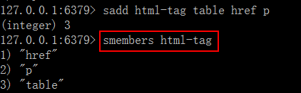

# Redis集合(Set)

redis 的 Set 是 string 类型的无序集合，集合成员是唯一的，即集合中不能出现重复的数据

## 基本命令

**A、sadd**

语法：sadd key member [member…]

作用：将一个或多个 member 元素加入到集合 key 当中，已经存在于集合的 member 元素将被忽略，不会再加入。

返回值：加入到集合的新元素的个数。不包括被忽略的元素

例 1：添加单个元素


例 2：添加多个元素


**B、 smembers**

语法：smembers key

作用：获取集合 key 中的所有成员元素，不存在的 key 视为空集合

例 1：查看集合的所有元素



例 2：查看不存在的集合


**C、 sismember**

语法：sismember key member

作用：判断 member 元素是否是集合 key 的成员返回值：member 是集合成员返回 1，其他返回 0 

例 1：检查元素是否存在集合中


**D、scard**

语法：scard key

作用：获取集合里面的元素个数

返回值：数字，key 的元素个数。 其他情况返回 0 

例 1：统计集合的大小


例 2：统计不存在的 key


**E、 srem**

语法：srem key member [member…

作用：删除集合 key 中的一个或多个 member 元素，不存在的元素被忽略。返回值：数字，成功删除的元素个数，不包括被忽略的元素。

例 1：删除存在的一个元素，返回数字 1


例 2：删除不存在的元素


## 常用命令

**A、srandmember**

语法：srandmember key [count]

作用：只提供 key，随机返回集合中一个元素，元素不删除，依然在集合中；提供了 count 时，count 正数, 返回包含 count 个数元素的集合， 集合元素各不相同。count 是负数，返回一个 count 绝对值的长度的集合， 集合中元素可能会重复多次。

返回值：一个元素；多个元素的集合

例 1：随机显示集合的一个元素


例 2：使用 count 参数， count 是正数


例 3：使用 count 参数，count 是负数


**B、 spop**

语法：spop key [count]

作用：随机从集合中删除一个元素, count 是删除的元素个数。返回值：被删除的元素，key 不存在或空集合返回 nil

例如 1：随机从集合删除一个元素


例 2：随机删除指定个数的元素


## 应用场景

#### 微信抽奖小程序。【Set】


```
# 微信抽奖
# 3个用户点击立即参与choujiang
127.0.0.1:6379>sadd shoujiang:1010  1 2 3 
# 查看多少人参与抽奖
127.0.0.1:6379>scard choujiang:1010
# 选出中奖的人 并删除
127.0.0.1:6379>smembers set1 
127.0.0.1:6379>spop set1 3  # 弹出3个作为中奖

```


#### 微信朋友圈点赞


```redis
# 朋友圈点赞就加到set集合里
127.0.0.1:6379>sadd pub:msgID 点赞用户ID1 点赞用户ID2
# 取消点赞
127.0.0.1:6379>srem pub:msgID 点赞用户ID
# 展现所有点赞的ID
127.0.0.1:6379>smembers pub:msgID
# 点赞数统计
127.0.0.1:6379>scard pub:msgID
# 判断某个朋友是否点赞过
127.0.0.1:6379>sismember pub：msgID 用户ID

```


#### 微博好友关注社交关系（集合运算）


#### QQ内推可能认识的人(差集)

```
# QQ可能认识的人【电商直播推荐，带货 比较合适也】
127.0.0.1:6379>sadd s1 1 2 3 4 5 
127.0.0.1:6379>sadd s1 1 2 3 4 5 6 7 8 9 
# 取差集
127.0.0.1:6379>sdiff s1 s2

```


