# Redis有序集合(sorted set)

redis 有序集合zset和集合set一样也是string类型元素的集合，且不允许重复的成员。

不同的是 zset 的每个元素都会关联一个分数（分数可以重复），redis 通过分数来为集合中的成员进行从小到大的排序。

## 基本命令

**A、zadd**

语法：zadd key score member [score member…]

作用：将一个或多个 member 元素及其 score 值加入到有序集合 key 中，如果 member

存在集合中，则更新值；score 可以是整数或浮点数

返回值：数字，新添加的元素个数

例 1：创建保存学生成绩的集合

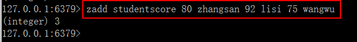

例 2：使用浮点数作为 score

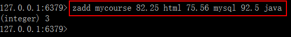

**B、 zrange**

语法：zrange key start stop [WITHSCORES]

作用：查询有序集合，指定区间的内的元素。集合成员按 score 值从小到大来排序。 start，

stop 都是从 0 开始。0 是第一个元素，1 是第二个元素，依次类推。以 -1 表示最后一个成员，-2 表示倒数第二个成员。WITHSCORES 选项让 score 和 value 一同返回。

返回值：自定区间的成员集合

例 1：显示集合的全部元素，不显示 score，不使用 WITHSCORES

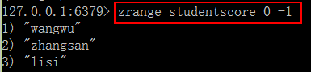

例 2：显示集合全部元素，并使用 WITHSCORES

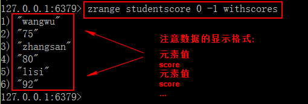

例 3：显示第 0,1 二个成员

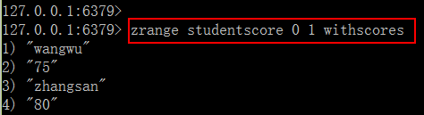

例 4：排序显示浮点数的 score

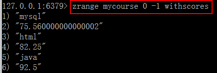

**C、 zrevrange**

语法：zrevrange key start stop [WITHSCORES]

作用：返回有序集 key 中，指定区间内的成员。其中成员的位置按 score 值递减(从大到小) 来排列。其它同 zrange 命令。

返回值：自定区间的成员集合

例 1：成绩榜

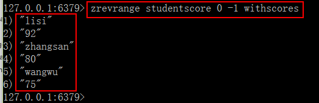

**D、zrem**

语法：zrem key member [member…]

作用：删除有序集合 key 中的一个或多个成员，不存在的成员被忽略

返回值：被成功删除的成员数量，不包括被忽略的成员。

例 1：删除指定一个成员 wangwu

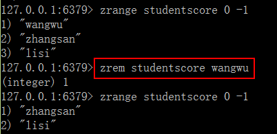

**E、 zcard**

语法：zcard key

作用：获取有序集 key 的元素成员的个数

返回值：key 存在返回集合元素的个数， key 不存在，返回 0

例 1：查询集合的元素个数

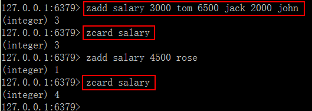

## 常用命令

**A、zrangebyscore**

语法：zrangebyscore key min max [WITHSCORES ] [LIMIT offset count]

作用：获取有序集 key 中，所有 score 值介于 min 和 max 之间（包括 min 和 max）的成员，有序成员是按递增（从小到大）排序。

min ,max 是包括在内 ， 使用符号 ( 表示不包括。 min ， max 可以使用 -inf 

+inf 表示最小和最大

limit 用来限制返回结果的数量和区间。

withscores 显 示 score 和 value

返回值：指定区间的集合数据

使用的准备数据

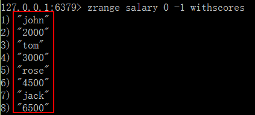

例 1：显示指定具体区间的数据

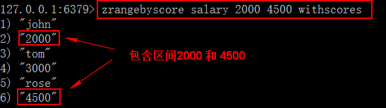

例 2：显示指定具体区间的集合数据，开区间（不包括 min，max）

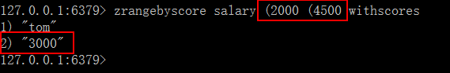

例 3：显示整个集合的所有数据

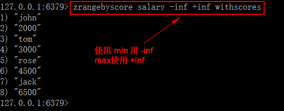

例 4：使用 limit

增加新的数据：

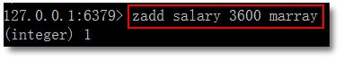

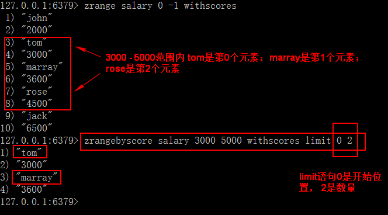

显示从第一个位置开始，取一个元素。

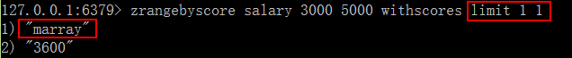

**B、 zrevrangebyscore**

语法：zrevrangebyscore key max min [WITHSCORES ] [LIMIT offset count]

作用：返回有序集 key 中， score 值介于 max 和 min 之间(默认包括等于 max 或 min )的所有的成员。有序集成员按 score 值递减(从大到小)的次序排列。其他同 zrangebyscore

例 1：查询工资最高到 3000 之间的员工

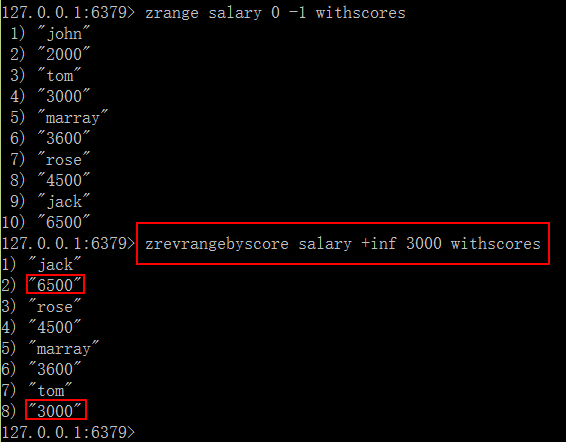

**C、 zcount**

语法：zcount key min max

作用：返回有序集 key 中， score 值在 min 和 max 之间(默认包括 score 值等于 min 或 max )的成员的数量

例 1：求工资在 3000-5000 的员工数量

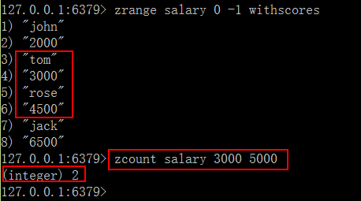

# 应用场景

#### 销售排行

```
商品销售排行。【Sort Zset】
抖音热搜。
例：key 为goods:sellsort，分数为销售数量
```

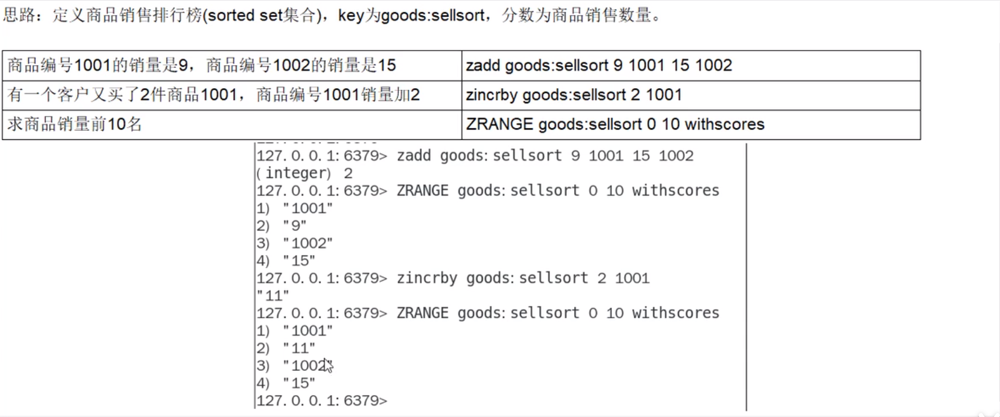

#### 抖音热搜

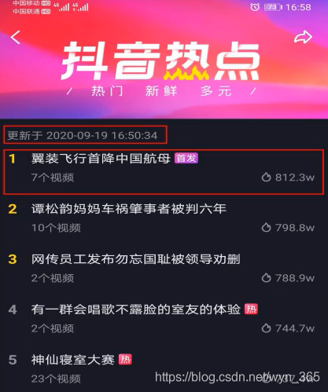

```
# 点击视频
127.0.0.1:6379>zincrby hotvcr:20200919 1 八佰
127.0.0.1:6379>zincrby hotvcr:20200919 1 八佰 2 花木兰
# 展示当日排行前10
127.0.0.1:6379>zrange hotvrc:20200919 0 9 withscores

```

