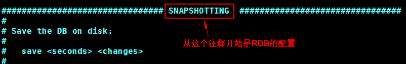

# Redis持久化

持久化概述

持久化可以理解为存储，就是将数据存储到一个不会丢失的地方，如果把数据放在内存中，电脑关闭或重启数据就会丢失，所以放在内存中的数据不是持久化的，而放在磁盘就算是一种持久化。

Redis 的数据存储在内存中，内存是瞬时的，如果 linux 宕机或重启，又或者 Redis 崩溃或重启，所有的内存数据都会丢失，为解决这个问题，Redis 提供两种机制对数据进行持久化存储，便于发生故障后能迅速恢复数据。

## 持久化方式

**● RDB 方式**

A、什么是 RDB 方式?

Redis Database（RDB），就是在指定的时间间隔内将内存中的数据集快照写入磁盘，数据恢复时将快照文件直接再读到内存。

RDB 保存了在某个时间点的数据集（全部数据）。存储在一个二进制文件中，只有一个文件。默认是 dump.rdb。RDB 技术非常适合做备份，可以保存最近一个小时，一天，一个月的全部数据。保存数据是在单独的进程中写文件，不影响 Redis 的正常使用。RDB 恢复数据时比其他 AOF 速度快。

B、 如何实现?

RDB 方式的数据持久化，仅需在 redis.conf 文件中配置即可，默认配置是启用的。

在配置文件 redis.conf 中搜索 SNAPSHOTTING， 查找在注释开始和结束之间的关于 RDB的配置说明。配 SNAPSHOTTING 置地方有三处。

①：配置执行 RDB 生成快照文件的时间策略。

对 Redis 进行设置， 让它在“ N 秒内数据集至少有 M 个 key 改动”这一条件被满足时， 自动保存一次数据集。

配置格式：save <seconds> <changes> save 900 1

save 300 10

save 60 10000

②：dbfilename：设置 RDB 的文件名，默认文件名为 dump.rdb

③：dir：指定 RDB 文件的存储位置，默认是 ./ 当前目录

配置步骤：

①：查看 ps -ef | grep redis ，如果 redis 服务启动，先停止。

②：修改 redis.conf 文件， 修改前先备份，执行 cp redis.conf bak_redis.conf

查看默认启用的 RDB 文件

③：编辑 redis.conf 增加 save 配置， 修改文件名等。vim redis.conf

修改的内容：

把原来的默认的 dump.rdb 删除，修改 redis.conf 后，重新启动 redis

④：在 20 秒内容，修改三个 key 的值

⑤：查看生成的 rdb 文件

C、 总结

优点：由于存储的是数据快照文件，恢复数据很方便，也比较快缺点：

1）会丢失最后一次快照以后更改的数据。如果你的应用能容忍一定数据的丢失，那么使用 rdb 是不错的选择；如果你不能容忍一定数据的丢失，使用 rdb 就不是一个很好的选择。

2）由于需要经常操作磁盘，RDB 会分出一个子进程。如果你的 redis 数据库很大的话， 子进程占用比较多的时间，并且可能会影响 Redis 暂停服务一段时间（millisecond 级别），如果你的数据库超级大并且你的服务器 CPU 比较弱，有可能是会达到一秒。

**● AOF 方式**

A、什么是 AOF 方式

Append-only File（AOF），Redis 每次接收到一条改变数据的命令时，它将把该命令写到一个 AOF 文件中（只记录写操作，读操作不记录），当 Redis 重启时，它通过执行 AOF 文件中所有的命令来恢复数据。

B、 如何实现

AOF 方式的数据持久化，仅需在 redis.conf 文件中配置即可配置项：

①：appendonly：默认是 no，改成 yes 即开启了 aof 持久化

②：appendfilename：指定 AOF 文件名，默认文件名为 appendonly.aof

③：dir : 指定 RDB 和 AOF 文件存放的目录，默认是 ./

④：appendfsync：配置向 aof 文件写命令数据的策略：

no：不主动进行同步操作，而是完全交由操作系统来做（即每 30 秒一次），比较快但不是很安全。

always：每次执行写入都会执行同步，慢一些但是比较安全。

everysec：每秒执行一次同步操作，比较平衡，介于速度和安全之间。这是默认项。

⑤：auto-aof-rewrite-min-size：允许重写的最小 AOF 文件大小，默认是 64M 。当 aof 文件大于 64M 时，开始整理 aop 文件， 去掉无用的操作命令。缩小 aop 文件。

例 1：

①：停止运行的 redis ， 备份要修改的 redis.conf

②：查看 redis 安装目录/src 下有无 .aof 文件。 默认是在 redis 的当前目录

③：编辑 redis.conf

设置 appendonly 为 yes 即可。

查看 appendfsync 的当前策略。

查看 appendfilname 的文件名称

④：在 redis 客户端执行 写入命令

⑤ 查看 aof 文件

 

**● 总结**

append-only 文件是另一个可以提供完全数据保障的方案；

2.AOF 文件会在操作过程中变得越来越大。比如，如果你做一百次加法计算，最后你只会在数据库里面得到最终的数值，但是在你的 AOF 里面会存在 100 次记录，其中 99 条记录对最终的结果是无用的；但 Redis 支持在不影响服务的前提下在后台重构 AOF 文件，让文件得以整理变小 

3.可以同时使用这两种方式，redis 默认优先加载 aof 文件（aof 数据最完整）；