# Redis主从复制读写分离

通过持久化功能，Redis 保证了即使在服务器重启的情况下也不会丢失（或少量丢失）数据，但是由于数据是存储在一台服务器上的，如果这台服务器出现故障，比如硬盘坏了， 也会导致数据丢失。

为了避免单点故障，我们需要将数据复制多份部署在多台不同的服务器上，即使有一台服务器出现故障其他服务器依然可以继续提供服务。

这就要求当一台服务器上的数据更新后，自动将更新的数据同步到其他服务器上，那该怎么实现呢？ Redis 的主从复制。

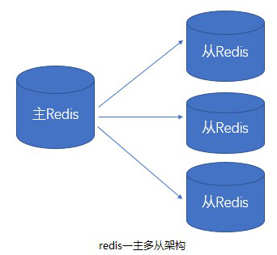

Redis 提供了复制（replication）功能来自动实现多台 redis 服务器的数据同步（每天19 点 新闻联播，基本从 cctv1-8,各大卫视都会播放）

我们可以通过部署多台 redis，并在配置文件中指定这几台 redis 之间的主从关系，主负责写入数据， 同时把写入的数据实时同步到从机器， 这种模式叫做主从复制， 即master/slave，并且 redis 默认 master 用于写，slave 用于读，向 slave 写数据会导致错误

## Redis 主从复制实现（master/salve）

方式 1：修改配置文件，启动时，服务器读取配置文件，并自动成为指定服务器的从服务器，从而构成主从复制的关系

方式 2： ./redis-server --slaveof <master-ip> <master-port>，在启动 redis 时指定当前服务成为某个主 Redis 服务的从 Slave

**方式 1 的实现步骤：**

模拟多 Reids 服务器， 在一台已经安装 Redis 的机器上，运行多个 Redis 应用模拟多个 Reids 服务器。一个 Master，两个 Slave.

A、新建三个 Redis 的配置文件

如果 Redis 启动，先停止。

作为 Master 的 Redis 端口是 6380

作为 Slaver 的 Redis 端口分别是 6382 , 6384

从原有的 redis.conf 拷贝三份，分别命名为 redis6380.conf, redis6382.conf , redis6384.conf

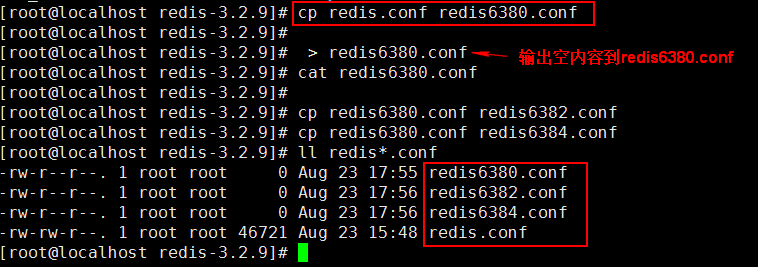

B、 编辑 Master 配置文件

编辑 Master 的配置文件 redis6380.conf : 在空文件加入如下内容

include /etc/redis/redis.conf

daemonize yes 

port 6380

pidfile /var/run/redis_6380.pid 

logfile 6380.log

dbfilename dump6380.rdb

配置项说明：

include ： 包含原来的配置文件内容。/etc/redis/redis.conf 按照自己的目录设置。

daemonize：yes 后台启动应用，相当于 ./redis-server & , &的作用。

port : 自定义的端口号

pidfile : 自定义的文件，表示当前程序的 pid ,进程 id。

logfile：日志文件名

dbfilename：持久化的 rdb 文件名

C、 编辑 Slave 配置文件

编辑 Slave 的配置文件 redis6382.conf 和 redis6384.conf: 在空文件加入如下内容

①：redis6382.conf：

include /etc/redis/redis.conf

daemonize yes

port 6382

pidfile /var/run/redis_6382.pid 

logfile 6382.log

dbfilename dump6382.rdb 

slaveof 127.0.0.1 6380

配置项说明：

slaveof ： 表示当前 Redis 是谁的从。当前是 127.0.0.0 端口 6380 这个 Master 的从。

②：redis6384.conf：

include /etc/redis/redis.conf

daemonize yes

port 6384

pidfile /var/run/redis_6384.pid 

logfile 6384.log

dbfilename dump6384.rdb

slaveof 127.0.0.1 6380

D、启动服务器 Master/Slave 都启动

启动方式 ./redis-server 配置文件

启动 Redis,并查看启动进程

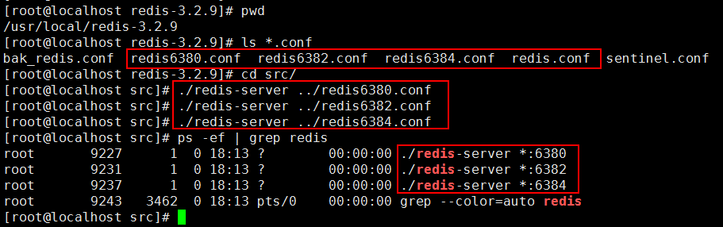

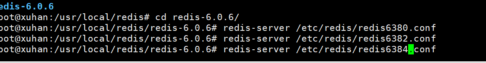

E、 查看配置后的服务信息

命令：

①： Redis 客户端使用指定端口连接 Redis 服务器

./redis-cli -p 端口

②：查看服务器信息

info replication

登录到 Master：6380

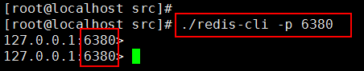

查看当前服务信息

在客户端的 Redis 内执行命令 info replication

Master 服务的查看结果:

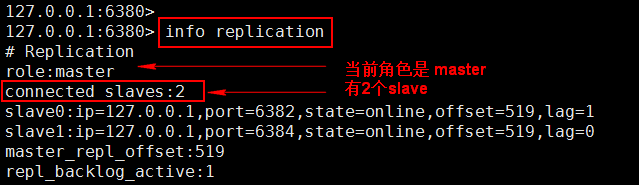

在新的 Xshell 窗口分别登录到 6382 ，6384 查看信息

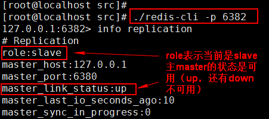

6384 也登录内容同 6382

F、 向 Master 写入数据

在 6380 执行 flushall 清除数据，避免干扰的测试数据。 生产环境避免使用。

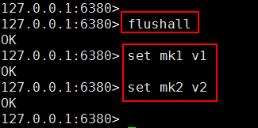

G、在从 Slave 读数据

6382,6384 都可以读主 Master 的数据，不能写

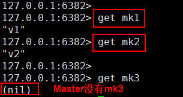

Slave 写数据失败

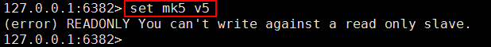

## 容灾处理

master 上（冷处理：机器挂掉了，再处理）当 Master 服务出现故障，需手动将 slave 中的一个提升为 master， 剩下的 slave 挂至新的

命令：

①：slaveof no one，将一台 slave 服务器提升为 Master （提升某 slave 为 master）

②：slaveof 127.0.0.1 6381 （将 slave 挂至新的 master 上）

**执行步骤：**

A、将 Master:6380 停止（模拟挂掉）

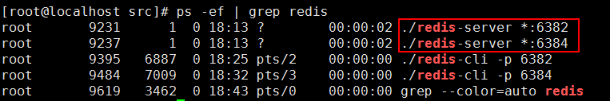

B、 选择一个 Slave 升到 Master，其它的 Slave 挂到新提升的 Master

***\*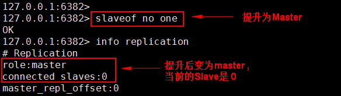\****

C、 将其他 Slave 挂到新的 Master

在 Slave 6384 上执行

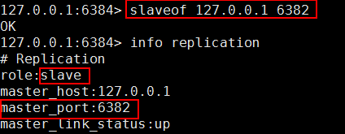

现在的主从（Master/Slave）关系：Master 是 6382 ， Slave 是 6384

查看 6382：

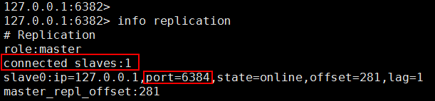

D、原来的服务器重新添加到主从结构中

6380 的服务器修改后，从新工作，需要把它添加到现有的Master/Slave 中

先启动 6380 的 Redis 服务

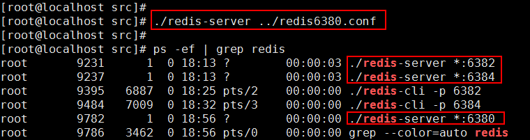

连接到 6380 端口

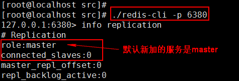

当前服务挂到 Master 上

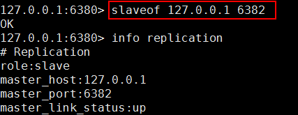

E、 查看新的 Master 信息

在 6382 执行：

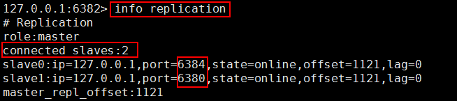

现在的 Master/Slaver 关系是：

Master: 6382

Slave: 6380

6384

## 操作命令

进入客户端需指定端口：./redis-cli -p 6380

不配置启动默认都是主 master

info replication 查看 redis 服务器所处角色

## 总结

A、一个 master 可以有多个 slave

B、slave 下线，读请求的处理性能下降

C、master 下线，写请求无法执行

D、当 master 发生故障，需手动将其中一台 slave 使用 slaveof no one 命令提升为 master，其它 slave 执行 slaveof 命令指向这个新的master，从新的master处同步数据。

E、主从复制模式的故障转移需要手动操作，要实现自动化处理，这就需要 Sentinel 哨兵，实现故障自动转移。