# Redis Sentinel高可用

Sentinel 哨兵是 redis 官方提供的高可用方案，可以用它来监控多个 Redis 服务实例的运行情况。Redis Sentinel 是一个运行在特殊模式下的 Redis 服务器。Redis Sentinel 是在多个Sentinel 进程环境下互相协作工作的。

**Sentinel 系统有三个主要任务：**

● 监控：Sentinel 不断的检查主服务和从服务器是否按照预期正常工作。

● 提醒：被监控的 Redis 出现问题时，Sentinel 会通知管理员或其他应用程序。

● 自动故障转移：监控的主 Redis 不能正常工作，Sentinel 会开始进行故障迁移操作。将一个从服务器升级新的主服务器。 让其他从服务器挂到新的主服务器。同时向客户端提供新的主服务器地址。

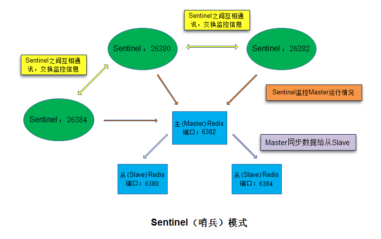

## **1、Sentinel 配置**

Sentinel 配置文件

复制三份sentinel.conf文

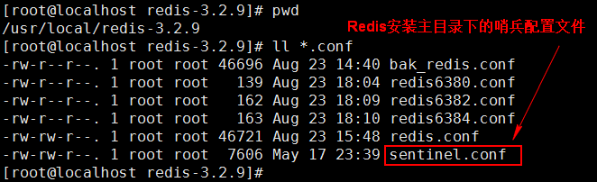

**三个文件分别命名：**

● sentinel26380.conf

● sentinel26382.conf

● sentinel26384.conf

● 执行复制命令 cp sentinel.conf xxx.conf

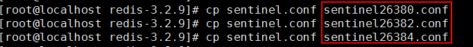

## **2、三份 sentinel 配置文件修改**

● 修改 port 26380、 port 26382、 port 26384

● 修改 sentinel monitor mymaster 127.0.0.1 6380 2

格式：sentinel monitor <name> <masterIP> <masterPort> <Quorum 投票数>

Sentinel监控主(Master)Redis, Sentinel根据Master的配置自动发现Master的Slave,Sentinel默认端口号为26379 。

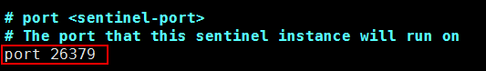

sentinel26380.conf

（1） 修改 port

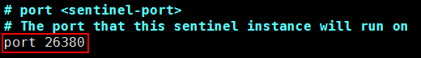

（2）修改监控的 master 地址

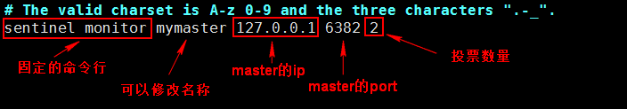

sentinel26382.conf 修改port 26382 , master的port 6382

sentinel26384.conf 修改port 26384 , master的port 6382

## **3、启动主从（Master/Slave）Redis**

启动 Reids

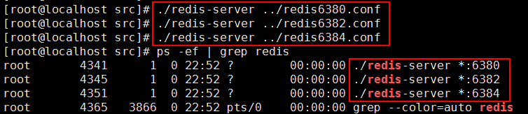

查看 Master 的配置信息

连接到 6382 端口

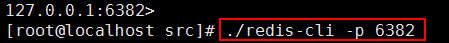

使用 info 命令查看 Master/Slave

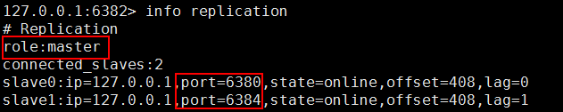

## **4、启动 Sentinel**

redis安装时make编译后就产生了redis-sentinel程序文件，可以在一个redis中运行多个sentinel进程。

启动一个运行在Sentinel模式下的Redis服务实例

./redis-sentinel sentinel 配置文件

执行以下三条命令，将创建三个监视主服务器的Sentinel实例：

./redis-sentinel ../sentinel26380.conf

./redis-sentinel ../sentinel26382.conf

./redis-sentinel ../sentinel26384.conf

在 XShell 开启三个窗口分别执行：

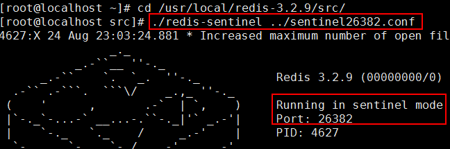

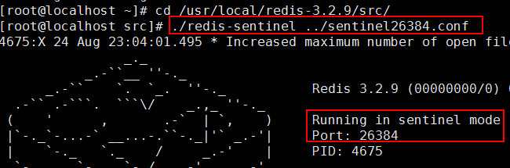

## **5、主 Redis 不能工作**

让 Master 的 Redis 停止服务， 执行 shutdown

先执行 info replication 确认 Master 的 Redis ，再执行 shutdown

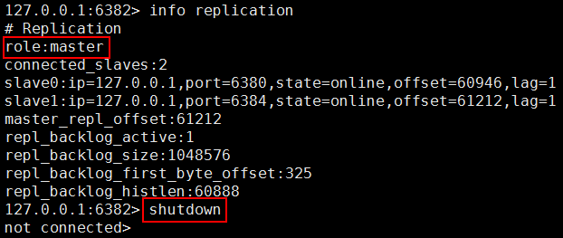

查看当前 Redis 的进程情况

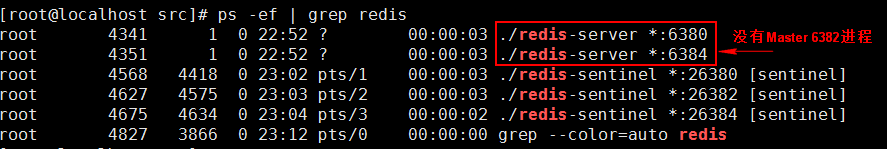

## **6、Sentinel 的起作用**

在 Master 执行 shutdown 后， 稍微等一会 Sentinel 要进行投票计算，从可用的 Slave选举新的 Master。

查看 Sentinel 日志，三个 Sentinel 窗口的日志是一样的。

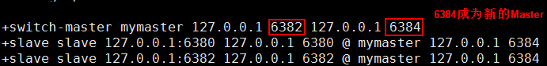

查看新的 Master

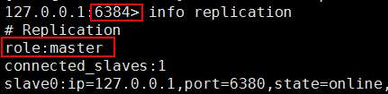

查看原 Slave 的变化

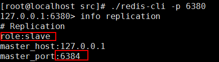

## **7、新的 Redis 加入 Sentinel 系统，自动加入 Master**

重新启动 6382

查看 6384 的信息

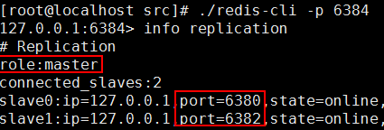

测试数据：在 Master 写入数据

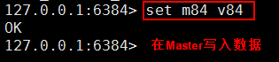

在 6382 上读取数据，不能写入

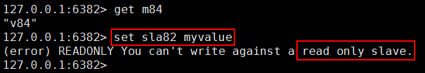

## **8、监控**

● Sentinel 会不断检查 Master 和 Slave 是否正常

● 如果 Sentinel 挂了，就无法监控，所以需要多个哨兵，组成 Sentinel 网络，一个健康的Sentinel 至少有 3 个 Sentinel 应用。 彼此在独立的物理机器或虚拟机。

● 监控同一个 Master 的 Sentinel 会自动连接，组成一个分布式的 Sentinel 网络，互相通信并交换彼此关于被监控服务器的信息

● 当一个 Sentinel 认为被监控的服务器已经下线时，它会向网络中的其它 Sentinel 进行确认，判断该服务器是否真的已经下线

● 如果下线的服务器为主服务器，那么 Sentinel 网络将对下线主服务器进行自动故障转移， 通过将下线主服务器的某个从服务器提升为新的主服务器，并让其从服务器转移到新的主服务器下，以此来让系统重新回到正常状态

● 下线的旧主服务器重新上线，Sentinel 会让它成为从，挂到新的主服务器下

## **9、总结**

主从复制，解决了读请求的分担，从节点下线，会使得读请求能力有所下降，Master 下线，写请求无法执行

Sentinel 会在 Master 下线后自动执行故障转移操作，提升一台 Slave 为 Master，并让其它Slave 成为新 Master 的 Slave。