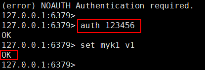

# Redis安全设置

设置密码

访问 Redis 默认是没有密码的，这样不安全，任意用户都可以访问。可以启用使用密码才能访问 Redis。 设置 Redis 的访问密码，修改 redis.conf 中这行 requirepass 密码。密码要比较复杂，不容易破解，而且需要定期修改。因为 redis 速度相当快，所以在一台比较好的服务器下，一个外部的用户可以在一秒钟进行 150K 次的密码尝试，需要指定非常非常强大的密码来防止暴力破解。

**● 开启访问密码设置**

修改 redis.conf , 使用 vim 命令。 找到 requirepass 行去掉注释，requirepass 空格后就是密码。

例 1：设置访问密码是 123456 ,这是练习使用，生产环境要设置复杂密码修改 redis.conf，文件 480 行左右。原始内容：

修改后：

查看修改结果：

**● 访问有密码的 Redis**

如果 Redis 已经启动，关闭后，重新启动。

访问有密码的 Redis 两种方式：

①：在连接到客户端后，使用命令 auth 密码 ， 命令执行成功后，可以正常使用 Redis

②：在连接客户端时使用 -a 密码。例如 ./redis-cli -h ip -p port -a password

启动 Redis

使用 ① 访问

输入命令 auth 密码

使用 ② 方式

## 绑定 ip

修改 redis.conf 文件，把# bind 127.0.0.1 前面的注释#号去掉，然后把 127.0.0.1 改成允

许访问你 redis 服务器的 ip 地址，表示只允许该 ip 进行访问。多个 ip 使用空格分隔。

例如 bind 192.168.1.100 192.168.2.10

## 修改默认端口

修改 redis 的端口，这一点很重要，使用默认的端口很危险，redis.conf 中修改 port 6379

将其修改为自己指定的端口（可随意），端口 1024 是保留给操作系统使用的。用户可以使用的范围是 1024-65535

使用 -p 参数指定端口，例如：./redis-cli -p 新设置端口