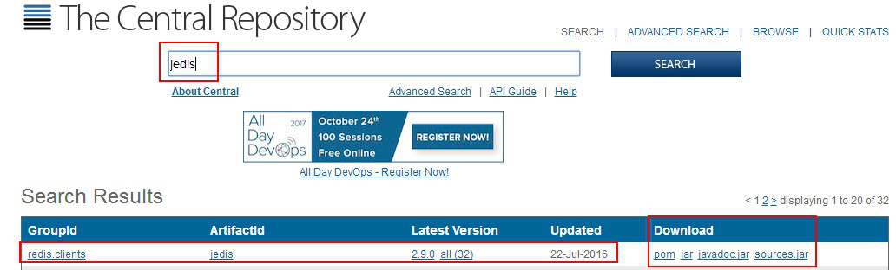
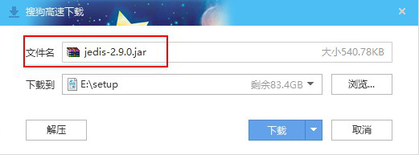
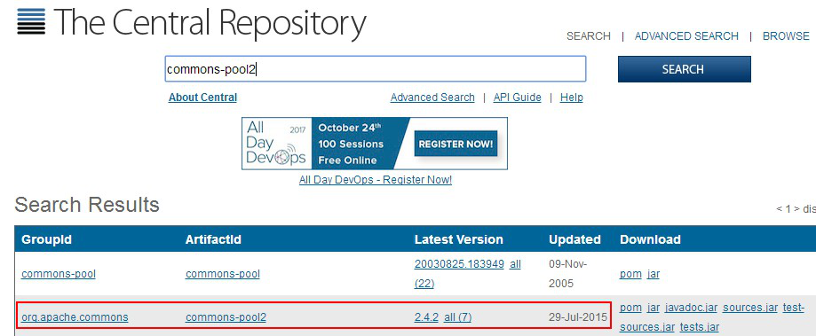
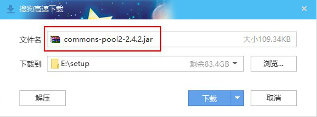

# Jedis下载与Commons-Pool下载

使用 Redis 官方推荐的 Jedis，在 java 应用中操作 Redis。Jedis 几乎涵盖了 Redis 的所有命令。操作 Redis 的命令在 Jedis 中以方法的形式出现。jedis 完全兼容 redis 2.8.x and 3.x.x

● Jedis 源码：https://github.com/xetorthio/jedis

● api 文档：http://xetorthio.github.io/jedis/

● 下载：http://search.maven.org/ ，搜索 jedis

## 下载 Jedis

浏览器打开：http://search.maven.org/ ，搜索 jedis。在 Download 处，点击 jar

最新的版本 jedis-2.9.0

## 下载 Commons-Pool

Jedis 对象并不是线程安全的，在多线程下使用同一个 Jedis 对象会出现并发问题。为了避免每次使用 Jedis 对象时都需要重新构建，Jedis 提供了 JedisPool。JedisPool 是基于Commons Pool 2 实现的一个线程安全的连接池

浏览器打开：http://search.maven.org/ ，搜索 commons-pool2。在 Download 处，点击 jar

点击

