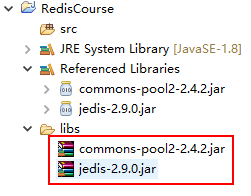
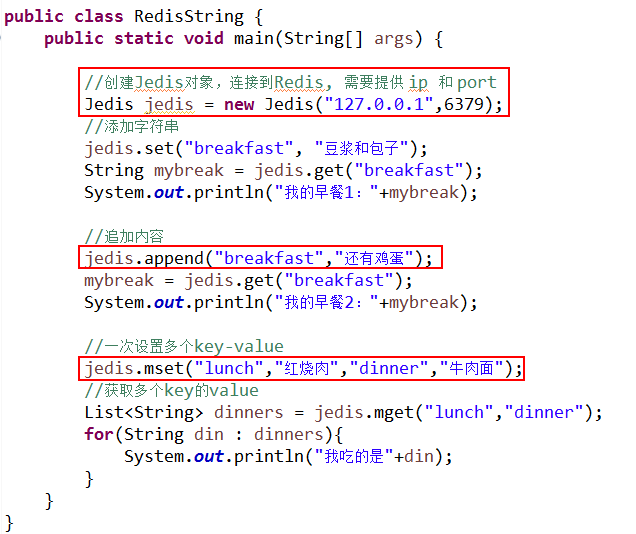
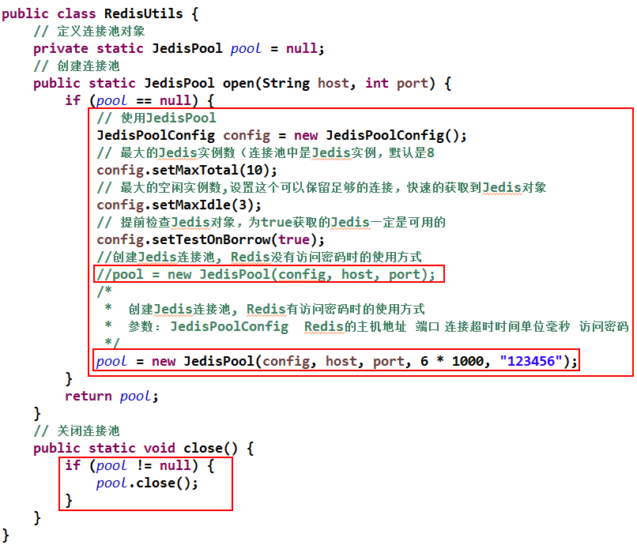
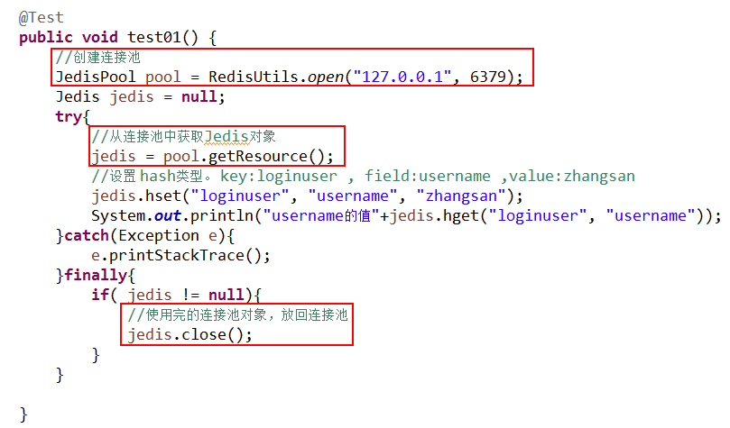
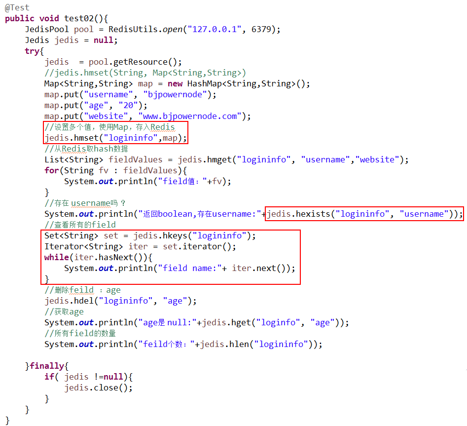
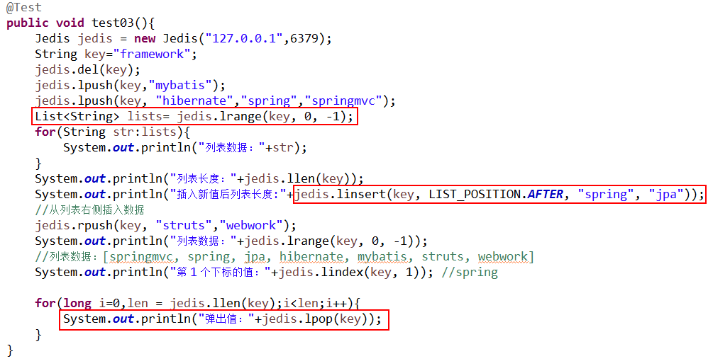
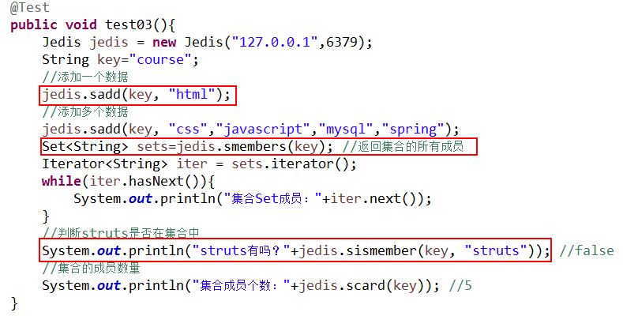
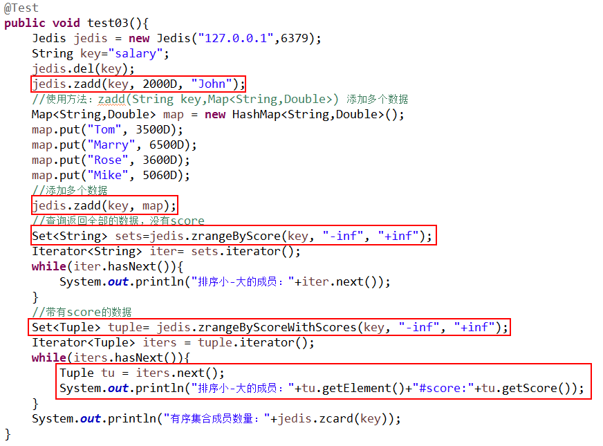
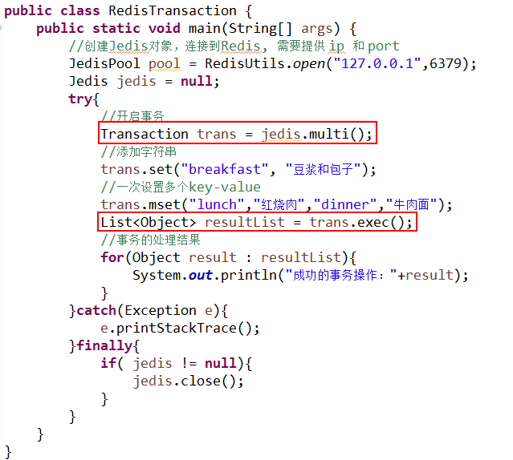

# Java Jedis操作Redis

项目中加入 jar：

● jedis-2.9.0.jar

● commons-pool2-2.4.2.jar

加入项目后如图：

## 字符串(string)

## 哈希（hash）

● 使用 Jedis 连接实例池。

● 使用连接池操作 hash 数据类型

 

## 列表 list

## 集合 Set

## 有序集合 Sorted Set

## 事务（Transaction）

# Java Jedis操作Redis

项目中加入 jar：

● jedis-2.9.0.jar

● commons-pool2-2.4.2.jar

加入项目后如图：

## 字符串(string)

## 哈希（hash）

● 使用 Jedis 连接实例池。

● 使用连接池操作 hash 数据类型

 

## 列表 list

## 集合 Set

## 有序集合 Sorted Set

## 事务（Transaction）

支持部分事务操作支持部分事务操作