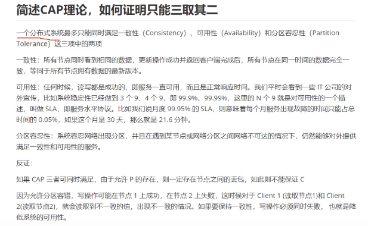
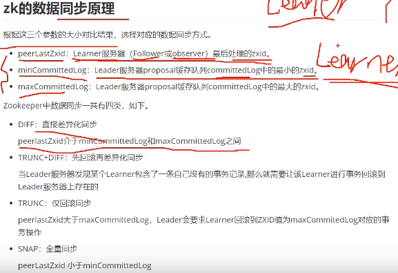
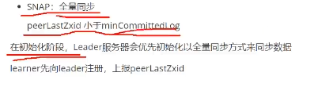
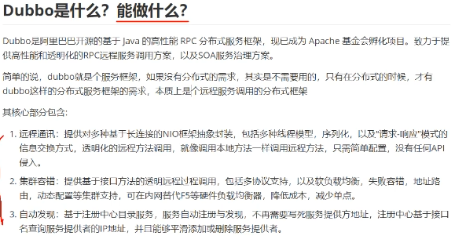
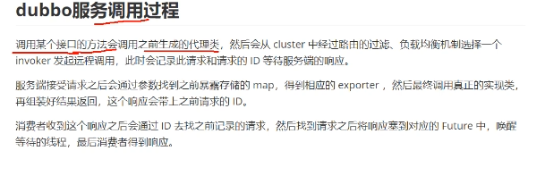
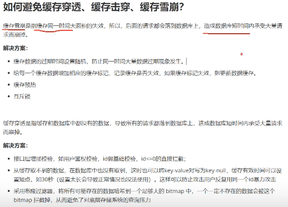

分布式分为分布式缓存(Redis)、分布式锁(Redis或Zookeeper)、分布式服务(Dubbo或SpringCloud)、分布式服务协调(Zookeeper)、分布式消息队列(Kafka、RabbitMq)、分布式Session、分布式事务、分布式搜索(elastaticSearch)等。
不可能所有分布式内容都熟悉，一定要在某个领域有所专长。

补充一个别人整理的链接：**https://www.cnblogs.com/expiator/p/10201004.html**

# 分布式理论

### **Q:分布式有哪些理论？**

CAP、BASE。
分布式CAP理论，任何一个分布式系统都无法同时满足Consistency(一致性)、Availability(可用性)、Partition tolerance(分区容错性) 这三个基本需求。最多只能满足其中两项。
而Partition tolerance(分区容错性) 是必须的，因此一般是CP，或者AP。

### **Q:你怎么理解分布式一致性？**

数据一致性通常指关联数据之间的逻辑关系是否正确和完整。
在分布式系统中，数据一致性往往指的是由于数据的复制，不同数据节点中的数据内容是否完整并且相同。
一致性还分为强一致性，弱一致性，还有最终一致性。
强一致性就是马上就保持一致。
最终一致性是指经过一段时间后，可以保持一致。

### Q：简述CAP理论，如何证明只能三取二

C：一致性。数据一致性往往指的是由于数据的复制，不同数据节点中的数据内容是否完整并且相同。

A：可用性。提供服务的时候，读写操作一定要是成功的。读写，一定要提供数据出去，不能是超时。

P：分区容错性。 如果出现了网络不可达，也就是网络分区。也能提供一致性和可用性服务。

为什么是悖论？

如果出现了网络分区，A里面有个value，根本写不进B，这就保证不了一致。

这个时候，就只能写请求，等B恢复正常了，才行。但是这个网络是不可用的。

这个时候，一定要可用。那就是A一定要提供服务，不能等B返回。但这个时候，数据又是不一致的。

### Q：简述Base理论

### Q：数据一致性理论

因果：500  +500 -1000 这种顺序必须是要保证的

会话一致性：在一个会话中，必须保证数据的一致。

### Q：quorum、waro机制

WARO：写操作的时候，所有的副本跟新成功之后，写操作才算成功。一个节点没有成功，那就是失败的。优先保证读服务，只要有一个节点活着，就能提供读服务。（Kafuka 只有全部写完了才算写完）

Quorum：10个副本，一共成功跟新了三个，那就有七个旧的，我至少要读8个副本的数据，才能保证一定能读到新的。在跟新的时候，加一个版本号。然后找到版本号最大的，就是最新的。

也就是读10-n+1 保证读到最新的数据。

（大多数，也就是要更新n个节点）

​	

### Q：简述paxos算法（暂定）

​	解决，多个场景的强一致。是个思想，是个协议。不是具体的实现。为什么不能用于生产，因为没有对于工程的细节判断。

### Q：负载均衡策略有哪些？

### Q：集群、分布式、SOA、微服务的概念：

		

### Q：分布式系统的设计目标

### Q：分布式事务有哪些解决方案

### Q：两阶段和三阶段

#### 二阶段

第一个阶段发送prepare消息（完成sql语句操作），但未提交事务

第二阶段：如果阶段一所有的prepare操作成功/失败、则通知所有的库提交事务/回滚事务。

#### 三阶段

就多了个1.确认环境正常2.引入了参与者的一个超时机制，防止阻塞资源不释放。

### Q：简述TCC事务模型

去业务层面做这个事情。对业务侵入性会比较强。

​	

### Q：如何理解RPC

# ZK相关

### Q：zk的初始化选举和崩溃选举过程

​	

### Q：zk的数据模型和节点模型

​	**数据模型：树形结构**
​		zk维护的数据主要有：客户端的会话（session）状态及数据节点（dataNode）信息。
​		zk在内存中构造了个DataTree的数据结构，维护着path到dataNode的映射以及dataNode间的树状层级关系。为了提高读取性能，集群中每个服务节点都是将数据全量存储在内存中。所以，zk最适于读多写少且轻量级数据的应用场景。
数据仅存储在内存是很不安全的，zk采用事务日志文件及快照文件的方案来落盘数据，保障数据在不丢失的情况下能快速恢复。
​		**树中的每个节点被称为— Znode**
​	Znode 兼具**文件和目录**两种特点（和win和linux不一样）。可以做路径标识，也可以存储数据，并可以具有子 Znode。具有增、删、改、查等操作。
​	Znode 具有原子性操作，读操作将获取与节点相关的所有数据，写操作也将 替换掉节点的所有数据。另外，每一个节点都拥有自己的 ACL(访问控制列 表)，这个列表规定了用户的权限，即限定了特定用户对目标节点可以执行的操作
​	Znode 存储数据大小有限制。每个 Znode 的数据大小至多 1M，常规使用中应该远小于此值。
​	Znode 通过路径引用，如同 Unix 中的文件路径。路径必须是绝对的，因此他们必须由斜杠字符来开头。除此以外，他们必须是唯一的，也就是说每一个路径只有一个表示，因此这些路径不能改变。在
​	ZooKeeper 中，路径由 Unicode 字符串组成，并且有一些限制。字串"/zookeeper"用以保存管理信息，比如关键配额信息。

​	**持久节点**：一旦创建、该数据节点会一直存储在zk服务器上、即使创建该节点的客户端与服务端的会话关闭了、该节点也不会被删除
​	**临时节点**：当创建该节点的客户端会话因超时或发生异常而关闭时、该节点也相应的在zk上被删除 。
​	**有序节点**：不是一种单独种类的节点、而是在持久节点和临时节点的基础上、增加了一个节点有序的性质 。

### Q：zk的数据同步原理

### Q:zk的watch机制类型

​	客户端，可以通过在znode上设置watch，实现实时监听znode的变化。Watch事件是一个一次性的触发器，当被设置了Watch的数据发生了改变的时候，则服务器将这个改变
​	发送给设置了Watch的客户端
​		父节点的创建，修改，删除都会触发Watcher事件。
​		子节点的创建，删除会触发Watcher事件。

一次性：一旦被触发就会移除，再次使用需要重新注册，因为每次变动都需要通知所有客户端，一次性可以减轻压力，3.6.0默认持久递归，可以触发多次

轻量：只通知发生了事件，不会告知事件内容，减轻服务器和带宽压力

Watcher 机制包括三个角色：客户端线程、客户端的 WatchManager 以及 ZooKeeper 服务器

1. 客户端向 ZooKeeper 服务器注册一个 Watcher 监听，
2. 把这个监听信息存储到客户端的 WatchManager 中
3. 当 ZooKeeper 中的节点发生变化时，会通知客户端，客户端会调用相应 Watcher 对象中的回调方法。watch回调是串行同步的

### Q：zk的分布式锁

zk通过临时节点，解决了死锁的问题，一旦客户端获取到锁之后突然挂掉（Session连接断开），那么这个临时节点就会自动删除掉，其他客户端自动获取锁。临时顺序节点解决惊群效应（现在是一个个唤醒，不是一起都唤醒）。

### Q：zk的典型应用场景

ZooKeeper是一个开源的分布式协调器，是一个典型的分布式数据一致性解决方案。设计目的是将那些复杂且容易出错的分布式一致性服务封装起来，构成一个高效可靠的系统，并以一系列简单易用的原子操作提供给用户使用。

### Q：如果一个客户端修改了某个节点的数据，其它客户端能马上获取到这个最新的数据嘛？

​	能读到，需要sync。

### Q：zk的事务支持

​	

### Q：zk中的观察者机制（observer）

区别于follower角色。

我们加的节点越来越多的话，过半的机制数目会多，这样leader提交的行效率就变低了。

### Q：ZK的会话管理

# Dubbo相关

### 1.Dubbo是什么能做什么?

​	

### 2.Dubbo的工作流程

### 3.简述dubbo的SPI（服务提供接口）机制

​	jdk中的spi，自动的根据接口的名字去找到接口的实现，是个服务发现机制。

​	比如jdbc，要在mateInf里面整个service 定一个文件，里面要把文件的全路径放在里面。JDK的spi会去找这个文件，然后通过反射去加载文件里面的字符串。

### 4.Dubbo为什么不用java的spi

如果里面有版本的不同，那得把所有驱动都放在一个文件里，那就造成资源的浪费了。有些驱动我不用了，但是我还得向下兼容。

### 5.简述dubbo的服务暴露过程

​	provider只有把服务注册到服务中心上，我们消费者才能去注册中心把服务给拉下来，然后去调用。

### 6。dubbo服务的引入过程

### 7.dubbo的调用过程

### 8.dubbo中的zk集群挂掉，发布者和订阅者还能通信嘛？

### 9.dubbo支持的注册中心

### 10.dubbo集群容错

### 11.dubbo的分层设计

### 12.dubbo和Springcloud之间的区别

​	

# 缓存相关知识

### 1.如何避免缓存传统、击穿、雪崩

缓存雪崩、穿透：

缓存击穿，是因为过期了：

2.分布式系统中的缓存方案