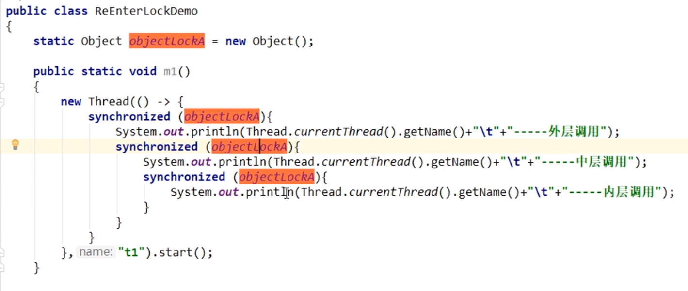
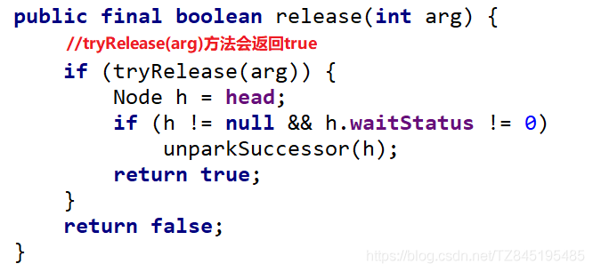

# 1.题目（核心AQS）？


# 1.可重入锁

## 1.1定义

指的是同一线程外层函数获得锁后,再进入该线程的内层方法会自动获取锁 **(`前提,锁对象是同一个对象`)**


我们家最外面有个防盗门，我们的客厅也有门，那我们其实只需要对防盗门上个锁就行了。


自己用自己的钱，不会和自己打借条


## 1.2种类

原文链接：https://blog.csdn.net/TZ845195485/article/details/109210263


Java中ReentranLock(显示锁)和synchronized(隐式锁)都是可重入锁,可重入锁的一个优点是可在一定程度避免死锁


### 1.隐式锁：

可重入锁：外中内（只要是一个对象），如入无人之境 




同步代码块

```java
//1.同步块
public class SychronizedDemo {
    Object object=new Object();

    public void sychronizedMethod(){
       new Thread(()->{
           synchronized (object){
               System.out.println(Thread.currentThread().getName()+"\t"+"外层....");
               synchronized (object){
                   System.out.println(Thread.currentThread().getName()+"\t"+"中层....");
                   synchronized (object){
                       System.out.println(Thread.currentThread().getName()+"\t"+"内层....");
                   }
               }
           }
       },"A").start();
    }
    public static void main(String[] args) {
        new SychronizedDemo().sychronizedMethod();
        /*
        输出结果：
            A	外层....
            A	中层....
            A	内层....
        * */
    }
}

```

同步方法：


## **`隐式锁:`(即synchronized关键字使用的锁)默认是可重入锁(同步块、同步方法)

原理如下：`掌握`**

1.每个锁对象拥有一个锁计数器和一个指向持有该锁的线程的指针
2.当执行monitorenter时,如果目标锁对象的计数器为零,那么说明它没有被其他线程持有,Java虚拟机会将该锁对象的持有线程设置为当前线程,并且将其计数器加1,否则需要等待,直至持有线程释放该锁
3.当执行monitorexit时,Java虚拟机则锁对象的计数器减1。计数器为零代表锁已经被释放


### 2.显式锁

## **`显示锁:`(即lock)也有ReentrantLock这样的可重入锁**

(注意：有多少个lock,就有多少个unlock,他们是配对使用的；如果多一个或者少一个会使得其他线程处于等待状态)


```java
class Phone2{
   static ReentrantLock reentrantLock=new ReentrantLock();

    public static void sendSms(){
        reentrantLock.lock();
        /*
        //reentrantLock.lock();
        注意有多少个lock,就有多少个unlock,他们是配对使用的
        如果多了一个lock(),那么会出现线程B一直处于等待状态
        * */
        reentrantLock.lock();
        try {
            System.out.println(Thread.currentThread().getName()+"\t"+"sendSms");
            sendEmails();
        }catch (Exception e){
            e.printStackTrace();
        }finally {
            reentrantLock.unlock();
        }
    }

    private static void sendEmails() {
        reentrantLock.lock();
        try {
            System.out.println(Thread.currentThread().getName()+"\t"+"sendEmails...");
        }catch (Exception e){
            e.printStackTrace();
        }finally {
            reentrantLock.unlock();
        }
    }
}
public class ReentrantLockDemo {
    public static void main(String[] args) {
        Phone2 phone2=new Phone2();
        new Thread(()->{phone2.sendSms();},"A").start();
        new Thread(()->{phone2.sendSms();},"B").start();
    }
}

```


如果少了一个unlock 另外一个线程就不匹配了。


# 2.lockSupport

## 2.1LockSupport定义


相当于是wait和notify


## 2.2线程的等待唤醒机制


1. 使用Object中的wait()方法让线程等待,使用Object中的notify方法唤醒线程
2. 使用JUC包中Condition的await()方法让线程等待,使用signal()方法唤醒线程
3. LockSupport类可以阻塞当前线程以及唤醒指定被阻塞的线程

### 1.wait和notify


两个细节：

#### 1、wait 和 notify 能不能脱离synchronized？


不行 ，铁三角不能被破坏。

#### 2.先暂停 先notify 再waiti


A线程一直被阻塞 因为唤醒的 已经走了 ，A线程一直在阻塞

结论：


1.wait和notify方法必须要在同步块或同步方法里且成对出现使用。 wait和notify方法两个都去掉同步代码块后看运行效果出现异常情况:
Exception in thread “A” Exception in thread “B”
java.lang.IllegalMonitorStateException
2.先wait后notify才可以(如果先notify后wait会出现另一个线程一直处于等待状态)
3.synchronized是关键字属于JVM层面。monitorenter(底层是通过monitor对象来完成,其实wait/notify等方法也依赖monitor对象只能在同步块或方法中才能调用wait/notify等方法)

```java
public class SynchronizedDemo {
    //等待线程
    public void waitThread(){
//      1.如果将synchronized (this){}注释,会抛出异常,因为wait和notify一定要在同步块或同步方法中
        synchronized (this){
            try {
                System.out.println(Thread.currentThread().getName()+"\t"+"coming....");
                wait();
            } catch (InterruptedException e) {
                e.printStackTrace();
            }
            System.out.println(Thread.currentThread().getName()+"\t"+"end....");
        }
    }
    //唤醒线程
    public void notifyThread(){
        synchronized (this){
            System.out.println("唤醒A线程....");
            notify();
        }
    }
    public static void main(String[] args) {
        SynchronizedDemo synchronizedDemo = new SynchronizedDemo();
        new Thread(()->{

//            2.如果把下行这句代码打开,先notify后wait,会出现A线程一直处于等待状态
//            try { TimeUnit.SECONDS.sleep(3);  } catch (InterruptedException e) {e.printStackTrace();}
            synchronizedDemo.waitThread();
        },"A").start();
        new Thread(()->{
            synchronizedDemo.notifyThread();
        },"B").start();
    }
}

```

### 2.await和signal

Condition接口中的await和signal方法实现线程等待和唤醒
(出现的问题和object中wait和notify一样)

```java
public class LockDemo {
    static Object object=new Object();
    public static void main(String[] args) {
        Lock lock=new ReentrantLock();
        Condition condition = lock.newCondition();

        new Thread(()->{
            //如果把下行这句代码打开,先signal后await,会出现A线程一直处于等待状态
            //try { TimeUnit.SECONDS.sleep(3);  } catch (InterruptedException e) {e.printStackTrace();}
            lock.lock();
            try {
                System.out.println(Thread.currentThread().getName()+"\t"+"coming....");
                condition.await();
            }catch (Exception e){
                e.printStackTrace();
            }finally {
                lock.unlock();
            }
            System.out.println(Thread.currentThread().getName()+"\t"+"END....");
        },"A").start();

        new Thread(()->{
            lock.lock();
            try {
                System.out.println(Thread.currentThread().getName()+"\t"+"唤醒A线程****");
                condition.signal();
            }catch (Exception e){
                e.printStackTrace();
            }finally {
                lock.unlock();
            }
        },"B").start();
    }
}

```


## 2.3LockSupport


通知可以 再阻塞前面执行，先通知了 阻塞没有任何作用。


unpack 发放许可证 最多一张 

park消费许可证


### 面试题


# 3.AQS（abstract queued Synchronizer）

抽象的队列同步器


是个抽象类，符合模版模式，作为核心父类给大家继承；  队列 抢不到锁的线程管理，进行排队 ； 同步器 去队列中再次抢占锁。


state 就是决定一个抢占的状态，持有锁的状态。


## 3.1 AQS为什么是基石？

## 1.和AQS相关的类


## 2.理解锁和同步器的关系


## 3.AQS能干嘛？


## 4.AQS初步


### 1.官网解释

是用来构建锁或者其它同步器组件的重量级基础框架及整个JUC体系的基石，通过内置的CLH(FIFO)队列的变种来完成资源获取线程的排队工作,将每条将要去抢占资源的线程封装成一个Node节点来实现锁的分配，有一个int类变量表示持有锁的状态,通过CAS完成对status值的修改(0表示没有,1表示阻塞)


#### 1.2排队的管理模式


原文链接：https://blog.csdn.net/TZ845195485/article/details/109210263


一个个Node 装进队列  状态是state 

线程先封装成一个node，然后再放到队列里面，不是直接把线程放进队列中。


## 5.AQS内部体系架构


## 详解AQS内部代码有什么？


### 内部结构(Node此类的讲解)


总结一下：

###  AQS同步队列的基本结构


# 4.AQS底层原码解读


## 写在最前面：

(1). 本次讲解我们走最常用的，lock/unlock作为案例突破口
(2). 我相信你应该看过源码了，那么AQS里面有个变量叫State，它的值有几种？3个状态：没占用是0，占用了是1，大于1是可重入锁
(3). 如果AB两个线程进来了以后，请问这个总共有多少个Node节点？答案是3个,其中队列的第一个是傀儡节点(哨兵节点)


```java
public class AQSDemo {
    public static void main(String[] args) {
        ReentrantLock lock = new ReentrantLock();
        //带入一个银行办理业务的案例来模拟我们的AQS如何进行线程的管理和通知唤醒机制
        //3个线程模拟3个来银行网点，受理窗口办理业务的顾客
        //A顾客就是第一个顾客，此时受理窗口没有任何人，A可以直接去办理
        new Thread(() -> {
                lock.lock();
                try{
                    System.out.println("-----A thread come in");

                    try { TimeUnit.MINUTES.sleep(20); }catch (Exception e) {e.printStackTrace();}
                }finally {
                    lock.unlock();
                }
        },"A").start();

        //第二个顾客，第二个线程---》由于受理业务的窗口只有一个(只能一个线程持有锁)，此时B只能等待，
        //进入候客区
        new Thread(() -> {
            lock.lock();
            try{
                System.out.println("-----B thread come in");
            }finally {
                lock.unlock();
            }
        },"B").start();

        //第三个顾客，第三个线程---》由于受理业务的窗口只有一个(只能一个线程持有锁)，此时C只能等待，
        //进入候客区
        new Thread(() -> {
            lock.lock();
            try{
                System.out.println("-----C thread come in");
            }finally {
                lock.unlock();
            }
        },"C").start();
    }
}

```

## 2.从最简单的lock方法开始看看公平和非公平(默认非公平)

通过ReentrantLock的源码来讲解公平锁和非公平锁


###    可以明显看出公平锁与非公平锁的lock()方法唯一的区别就在于公平锁在获取同步状态时多了一个限制条件:**hasQueuedPredecessors()**

hasQueuedPredecessors是公平锁加锁时判断等待队列中是否存在有效节点的方法


## 3.LOCK原码

### 3.1lock.lock( ) 源码


### 3.2 acquire( )：源码和3大流程走向


#### 3.2.1tryAcquire(arg)

本次走非公平锁方向


nonfairTryAcquire(acquires)
return false(继续推进条件，走下一步方法addWaiter)
return true(结束)


#### 3.2.2 addWaiter(Node.EXCLUSIVE)

双向链表中，第一个节点为虚节点(也叫哨兵节点)，其实并不存储任何信息，只是占位。 真正的第一个有数据的节点，是从第二个节点开始的

假如3号ThreadC线程进来
(1). prev
(2).compareAndSetTail
(3).next

①. addWaiter(Node mode )
双向链表中，第一个节点为虚节点(也叫哨兵节点)，其实并不存储任何信息，只是占位。 真正的第一个有数据的节点，是从第二个节点开始的


②. enq(node);


③. B、C线程都排好队了效果图如下：


#### 3.2.3 acquireQueued(addWaiter(Node.EXCLUSIVE), arg)

- ①. acquireQueued
  (会调用如下方法：shouldParkAterFailedAcquire和parkAndCheckInterrupt | setHead(node) )
- ②. shouldParkAfterFailedAcquire
- 


③. parkAndCheckInterrupt


第二个顾客再这边被阻塞。之后c也会这样被lock 


④. 当我们执行下图中的③表示线程B或者C已经获取了permit了   B节点变成了新的哨兵节点。哨兵节点慢慢被GC回收。


⑤. setHead( )方法
代码执行完毕后,会出现如下图所示


### 3.3UNlock

①. release | tryRelease | unparkSuccessor(h);



②. tryRelease()


- ③. unparkSuccessor( )

