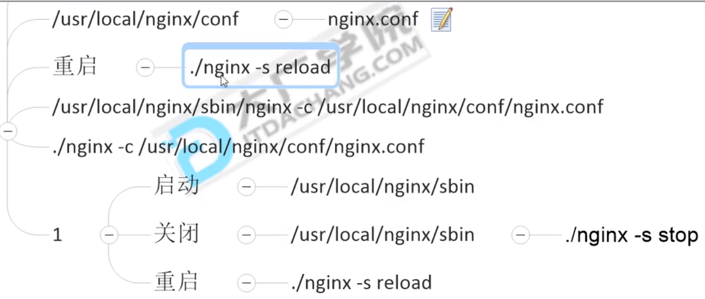
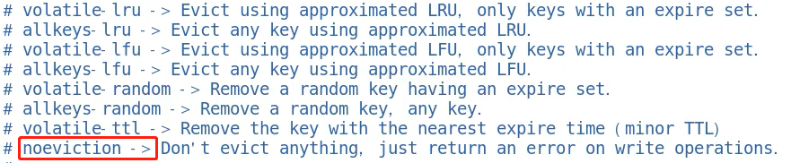

## 一、redis面试复盘

1.redis6.0.8【linux】
2.redis的5大数据类型的落地应用
3.你知道分布式锁吗？有哪些实现方案？删除key又什么问题？
4.谈谈你对redis缓存国企淘汰策略？
5.redis的LRU算法简介？
6.生产上redis内存配置多大？快满了怎么办？

# 一、redis数据结构以及落地应用

### 1.1 查看redis版本，8大数据类型

1.redis-server -V
2.redis客户端info
String list hash set zset
bitmap
HyperLogLog
GEO
Stream


### 1.1.1 Redis-String


EX:key在多少秒之后过期
PX:key在多少毫秒之后过期
NX:当key不存在的时候，才创建爱你key，效果等同于setnx
XX：当key存在的时候，覆盖key


##### 商品编号、订单号采用INCR命令生成。【INCR数值增减】

##### 对1号产品点赞+1

然后 get  item：1 


### 1.1.2 Redis-Hash类型


对应java中的数据结构为Map<String,map<k,v>>

##### 购物车


```
 新增商品：hset shopcar:uid 1024 334488 1
 新增商品：hset shopcar:uid 1024 334477 1
 增加商品数量：hincrby shopcar:uid 1024 334477 1
 商品总数：hlen shopcar:uid 1024
 全部选择：hgetall shopcar:uid 1024

```


### 1.1.3 Redis-List类型


```
127.0.0.1:6379>lpush list01 1 2 3 4 5 6 
127.0.0.1:6379>lrange list01 0 -1

```


#### 微信订阅公众号文章


### 1.1.4 Redis-Set类型


```
127.0.0.1:6379>sadd set  1 1 1 2 3 4 5
127.0.0.1:6379>smembers set1 
127.0.0.1:6379>spop set1 3  # 弹出3个

```


#### 微信抽奖小程序。【Set】


```
# 微信抽奖
# 3个用户点击立即参与choujiang
127.0.0.1:6379>sadd shoujiang:1010  1 2 3 
# 查看多少人参与抽奖
127.0.0.1:6379>scard choujiang:1010
# 选出中奖的人 并删除
127.0.0.1:6379>smembers set1 
127.0.0.1:6379>spop set1 3  # 弹出3个作为中奖

```


#### 微信朋友圈点赞


```redis
# 朋友圈点赞就加到set集合里
127.0.0.1:6379>sadd pub:msgID 点赞用户ID1 点赞用户ID2
# 取消点赞
127.0.0.1:6379>srem pub:msgID 点赞用户ID
# 展现所有点赞的ID
127.0.0.1:6379>smembers pub:msgID
# 点赞数统计
127.0.0.1:6379>scard pub:msgID
# 判断某个朋友是否点赞过
127.0.0.1:6379>sismember pub：msgID 用户ID

```


#### 微博好友关注社交关系（集合运算）


#### QQ内推可能认识的人(差集)

```
# QQ可能认识的人【电商直播推荐，带货 比较合适也】
127.0.0.1:6379>sadd s1 1 2 3 4 5 
127.0.0.1:6379>sadd s1 1 2 3 4 5 6 7 8 9 
# 取差集
127.0.0.1:6379>sdiff s1 s2

```


### 1.1.5 Redis-Zset


```
zadd zset1 100 movie1 20 movie2

```

#### 销售排行

```
商品销售排行。【Sort Zset】
抖音热搜。
例：key 为goods:sellsort，分数为销售数量
```


#### 抖音热搜


```
# 点击视频
127.0.0.1:6379>zincrby hotvcr:20200919 1 八佰
127.0.0.1:6379>zincrby hotvcr:20200919 1 八佰 2 花木兰
# 展示当日排行前10
127.0.0.1:6379>zrange hotvrc:20200919 0 9 withscores

```


# 2.redis分布式锁

## 2.0 前情概要

#### 什么是分布式锁：


#### 怎么实现？   mysql redis zookeeper

#### 一般都习惯用redis作为分布式锁。


#### 反馈的题目


#### 复习微服务架构

访问过来了 ，先有Nginx做负载均衡，两个微服务会出现数据冲突

会出现超卖，所以要有队列，再redis这边加个锁。


工作中都是用redisson的。


## 2.1、分布式锁：超卖程序采坑案例【Springboot2+Redis5/6】


### 使用场景：多个服务之间，同一时刻，同一个用户只能有一个请求，防止关键业务数据冲突和并发错误。


### 1  建立Module

- boot_redis01
- boot_redis02
- boot_redis_test

### 2 修改pom

```java
<dependency>
	<groupId>org.springframework.boot</groupId>
	<artifactId>spring-boot-starter-data-redis</artifactId>
</dependency>
<dependency>
	<groupId>org.apache.commons</groupId>
	<artifactId>commons-pools</artifactId>
</dependency>
<dependency>
	<groupId>redis.clients</groupId>
	<artifactId>jedis</artifactId>
	<version>3.1.0</version>
</dependency>

```

### 3.3 修改yaml

```java
# 第一个模块的配置，第二个修改端口号就好2222
server.port=1111
spring.redis.database=0
spring.redis.host=127.0.0.1
spring.redis.port=6379
spring.redis.password=
spring.redis.lettuce.pool.max-active=8
spring.redis.lettuce.pool.max-wait=-1
spring.redis.lettuce.pool.max-idle=8
spring.redis.lettuce.pool.min-idle=0

```

### 3.4 RedisConfig配置类（业务）

```
@Configuration
public class RedisConfig{

	@Bean
	public RedisTemplate<String,Serializable> redisTemplate(lettuceConnectionFactory connectionFactory){
		new RedisTemplate<String,Serializable> redisTemplate = new RedisTemplate<>();
		redisTemplate.setConnectionFactory(connectionFactory);
		redisTemplate.setKeySerializer(new StringRedisSerializer());
		redisTemplate.setValueSerializer(new GenericJackson2JsonRedisSerializer());
		
		return redisTemplate;
	}
}

```

### 3.5 GoodController（业务类）

```java
@RestController
public class GoodController{
	
	@Autowired
	private StringRedisTemplate stringRedisTemplate;

	@Value("${server.port}")
	private String serverPort;

	@GetMapping("/buy_Goods")
	public String buy_Goods(){
		// 1.查看库存数量
		String result = stringRedisTemplate.opsForValue().get("goods:001");
		int goodsNumber = result == null ? 0 : Interger.parseInt(result);
		
		// 2.卖商品
		if(goodsNumber > 0){
			int realNumber = goodsNumber - 1;
			// 3.成功买入，库存减少一件
			stringRedisTemplate.opsForValue().set("goods:001",String.valueOf(realNumber));
			return "成功买入商品，库存还剩下："+realNumber+"服务端口："+serverPort;
		}else{
			System.out.println("商品卖完"+"服务端口："+serverPort);
		}
		return "商品卖完！"+"服务端口："+serverPort;
	}

}

```

### 3.6 Redis数据

```
# 放入001库存100个
set goods:001 100
```

### 3.7 测试


## 4、找上面程序Bug

### 4.1 高并发下，又什么问题？

单机版没有枷锁100%故障的，没有原子性，多线程下没有枷锁是不可以的。

#### 4.1.1 单机版加synchronized锁（JVM层面的锁 是关键字）

关键字,拿不到商品不走，容易造成线程积压，卡在外面，时间比较久。

```java
@GetMapping("/buy_Goods")
	public String buy_Goods(){
	
	// 加锁
	synchronized(this){
		// 1.查看库存数量
		String result = stringRedisTemplate.opsForValue().get("goods:001");
		int goodsNumber = result == null ? 0 : Interger.parseInt(result);
		
		// 2.卖商品
		if(goodsNumber > 0){
			int realNumber = goodsNumber - 1;
			// 3.成功买入，库存减少一件
			stringRedisTemplate.opsForValue().set("goods:001",String.valueOf(realNumber));
			return "成功买入商品，库存还剩下："+realNumber+"服务端口："+serverPort;
		}else{
			System.out.println("商品卖完"+"服务端口："+serverPort);
		}
		return "商品卖完！"+"服务端口："+serverPort;
	}
}

```

#### 4.1.1 单机版加ReentrantLock锁（是个类）

类 ，try lock,时间内抢的到就去抢，抢不到就走人 返回false 也就是没抢到。

```

private final Lock lock = new ReentrantLock();

@GetMapping("/buy_Goods")
	public String buy_Goods(){
	
	// 加锁,抢锁3S小规模等待
	try(lock.tryLock(3L,TimUnit.SECONDS)){
		lock.lock();
		...
	}finally{
		lock.unlock();
	}else{
	}
}

```


加锁的两种方式：

不见不散（死等，会有一大堆的线程卡再外面 synchronized）；

还有个是过时不候（reentrantlock（tryLock）），我等的时间太长了，直接不等了；或者到了一定时间，我直接放弃走人了。


### 4.2 架构变为Nginx分布式微服务，单机锁会不会有问题？


#### 问题：





被买了两次。

#### 出现超买现象 需要分布式锁 setnx


#### 4.2.1 引入反向代理Nginx

```
# 权重一半一半
vi nginx.conf
```


测试访问nginx

```
192.168.11.147/buy_goods
```

似乎轮询策略没有发现神魔问题。

#### 4.2.2 Jmeter性能压测会不会有问题？

压测：1S中100个线程进行并发访问


结果：发现了严重的超卖现象，单机版的锁是控制不住问题的。


#### 4.2.3 加入分布式锁

```java
public static final String REDIS_LOCK = "atguiguLock";//搞个锁 门栓是一个门栓

@GetMapping("/buy_Goods")
	public String buy_Goods(){
		String value = UUID.randomUUID().toString()+Thread.currentThread().getName();//这边的人得要有个唯一的标识	
		
		Boolean flag = stringRedisTemplate.opsForValue().setIfAbsent(REDIS_LOCK,value);//自己再这边写set
        //这条就是相当于是 setNx
		
		// 加锁不成功
		if(!flag){
			return "抢锁失败，请再次尝试";
		}
		
		String result = stringRedisTemplate.opsForValue().get("goods:001");
		int goodsNumber = result == null ? 0 : Interger.parseInt(result);
		
		// 2.卖商品
		if(goodsNumber > 0){
			int realNumber = goodsNumber - 1;
			// 3.成功买入，库存减少一件
			stringRedisTemplate.opsForValue().set("goods:001",String.valueOf(realNumber));

			// 4.解锁
			stringRedisTemplate.delete(REDIS_LOCK);//这边finally最后一定要解锁
			
			return "成功买入商品，库存还剩下："+realNumber+"服务端口："+serverPort;
		}else{
			System.out.println("商品卖完"+"服务端口："+serverPort);
		}
		return "商品卖完！"+"服务端口："+serverPort;
}

```


### 4.3 程序异常，没有执行解锁命令怎么办？


出异常可能没有办法释放锁，必须要加入一个finally代码块，用来释放锁。


### 4.4 部署了微服务的jar包机器挂了，代码没有执行finally怎么办？（程序宕机了）


key没有被删除，麻烦了，redis中一直有这把锁，需要加入一个过期删除。

```java
Boolean flag = stringRedisTemplate.opsForValue().setIfAbsent(REDIS_LOCK,value);
// 保证释放锁【过期时间的限定】
stringRedisTemplate.expire(REDIS_LOCK,10L,TimeUnit.SECONDS);//假设10s过了，这届删除这个锁

```

### 4.5 加锁和设置KEY分开了，没有保证原子性？

```
Boolean flag = stringRedisTemplate.opsForValue().setIfAbsent(REDIS_LOCK,value，10L,TimeUnit.SECONDS);

```


### 4.6 时间过期了，第一个线程业务还没完成怎么办？

程序不严谨带来隐患，第一个线程超过了过期删除的时间限制，删除了别人的锁。


T5的时候，redis把a的锁释放了

但是a还在继续

这个时候b拿到锁 

然后a继续下去 最后把b的锁给弄没了。 然后b找不到我的锁了。


只能删除自己的锁，不能删除别人的锁。


### 4.7 finally块的判断+del删除操作不是原子性的？


redis官网的解决办法（lua脚本）


#### 4.7.1 如果不可以使用lua脚本，你还有其他办法吗？ 【RedisTemplate版本】

提示，redis自身的事务来解决。


#### watch k1 希望我在用的时候 加个哨兵


#### 4.7.2 lua脚本来解决【Jedis+lua】


### 4.8 Redis分布式锁如何进行缓存续命？


续命时间，确保你的业务逻辑时间 > 过期时间。用一个线程一直监视你的任务是不是完成了，如果没完成。给个时间续命。

类似juc里面的feature task


#### 集群+CAP（分区容错和高可用）对比Zookeeper


还没来得及同步，master死了


redis是主节点收到了消息，直接就回复了，不管小弟有没有同步。先保证高可用。

zookeeper是先不着急回复，然后先给小弟通知。先保证一致性

### 4.9 说明我们自己写的还是不行的。得用redisson（理念redlock）


## 五、 Redisson的实现

### 5.1 RedisConfig

```
@Bean
public Redisson redisson(){
	Config config = new Config();
	config.useSingleServer().setAddress("redis://127.0.0.1:6379").setDatabase(0);
	return (Redisson)Redisson.create(config);
}

```

原始版本


这边删掉 变成这样：


### 5.2 GoodsController

```java
@Autowired
private Redisson redisson;

@GetMapping("/buy_Goods")
	public String buy_Goods(){
		String value = UUID.randomUUID().toString()+Thread.currentThread().getName();	
		
		RLock redissonLock = redisson.getLock(REDIS_LOCK);
		redissonLock.lock();
		
		...
		finally{
			redisson.unlock();
		}

```

### 5.3 nginx+jmeter+redisson性能压测


通过查询1号机与2号机，并没有查到问题。基本解决了超卖问题。


细节弥补，为了解决解锁时候不是解决的自己的锁问题。 做一个判断。


# 总结


## 分布式的，单击版本的锁不行了（会线程阻塞）


## setnx 主要是为了加个过期时间


就是这两个必须是原子操作


# 三、redis内存设置

1.1 生产上你们的redis内存设置多大？
1.2 如何配置redis并修改内存的大小？
1.3 如果内存你满了你怎么办？
1.4 redis清内存的方式？
1.5 定期删除、惰性删除了解吗？
1.6 redis缓存淘汰策略？
1.7 redis的LRU了解过吗？会不会手写LRU？

## 二、Redis内存设置

### 2.1 查看内存

如果不设置最大内存大小，或者设置最大内存大小为0，在64位操作系统下不限制内存的大小，在32位操作系统下最多使用3GB大小的内存。**一般推荐为最大物理内存的3/4**（生产上的配置）。

```
# 1.查看内存大小
127.0.0.1:6379> vi redis.conf
一般为没有配置，为机器的最大内存。
打开设置maxmemory参数，为字节类型bytes，请注意转换。
一般推荐为最大物理内存的3/4。
# 2.设置内存大小100M
maxmemory 104857600
# 3.命令行配置 查询
127.0.0.1:6379> config get maxmemory   
127.0.0.1:6379> config set maxmemory  104857600
# 4.查看内存信息
127.0.0.1:6379> info memory

```


info memary

### 2.2 内存打满了出现OOM怎么办？

故意修改配置，把最大只设置为1字节。

```
# 1.故意修改配置，把最大只设置为1字节。  
127.0.0.1:6379> config set maxmemory 1
# 2.存储
127.0.0.1:6379> set k1 v1
# 答案：出现以下OOM
（error）OOM command not allowed when use memory > 'maxmemory'
```


### 2.3 redis内存淘汰策略？



默认为不释放内存直到内存满，直到爆出OOM错误。


#### 2.3.1 如果一个键过期了，会不会马上从内存中删除？

不是的
定时删除：**立即删除是对CPU不友好的**，因为删除操作会占用CPU的时间，如果刚刚碰上了CPU很忙的时候，比如正在排序或者计算的时候，就会给CPu造成压力。
缺点：Redis不可能时时刻刻检测所有的key的过期时间。

惰性删除：数据到达了过期时间，不做处理，等到下次访问数据时候，如果发现未过期则返回数据，如果发现过期了，则进行删除。 缺点是堆内存不友好的，大量的无用数据占用空间。


#### 定期删除：

每个一段时间执行一次删除操作，并通过限制删除操作执行的时长和频率来减少操作对CPU使劲的影响。 周期性的轮询redis的时效性数据，采取随机抽取的策略，利用过期数据占比的方式控制删除频率。


还是会有问题：


#### 2.3.2 redis6.0.8内存淘汰策略【兜底方案】（Least Recently Used的缩写，即最近最少使用）


## 三、LRU 算法【哈希链表】

### 3.1 简介

redis的缓存淘汰策略已经提及过了
Least Recently Used 最近最少使用，是一种常见的页面置换算法。
选择最近最久未被使用的数据进行淘汰。

3.2 Leetcode算法题
运用你所掌握的数据结构，设计和实现一个LRU缓存机制，他应该支持：
获取数据get 如果关键字存在于缓存中，则获取，否则返回-1
写入数据put 如果关键字已经存在，变更数据，如果不存在，则插入。在缓存容量达到>上限时候，删除最近最久未被使用的数据进行删除后在进行插入。


想一想，查找快，插入块，删除快，而且还需要后排序-------？神魔数据结构满足?
你是否可以在O(1)时间复杂度内完成？
LRU【哈希+链表】本质就是HashMap+DoubleLinkedList

#### 3.2.1 参考LinkedHahMap

```
public class LRUCacheDemo<K,V> extends LinkedHashMap<K,V> {

    // 缓存大小
    private int capacity;

    // 构造方法
    public LRUCacheDemo(int capacity) {
        super(capacity,0.75F,true);
        this.capacity = capacity;
    }

    //
    @Override
    protected boolean removeEldestEntry(Map.Entry<K, V> eldest) {
        return super.size() > capacity;
    }

    public static void main(String[] args) {
        LRUCacheDemo lruCacheDemo = new LRUCacheDemo(3);
        lruCacheDemo.put(1,"a");
        lruCacheDemo.put(2,"b");
        lruCacheDemo.put(3,"c");
        System.out.println(lruCacheDemo.keySet());

        lruCacheDemo.put(4,"d");
        System.out.println(lruCacheDemo.keySet());
        lruCacheDemo.put(3,"d");
        System.out.println(lruCacheDemo.keySet());
        lruCacheDemo.put(3,"d");
        System.out.println(lruCacheDemo.keySet());
        lruCacheDemo.put(3,"d");
        System.out.println(lruCacheDemo.keySet());
        lruCacheDemo.put(5,"d");
        System.out.println(lruCacheDemo.keySet());

    }
}

```


