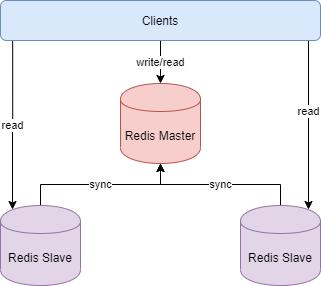
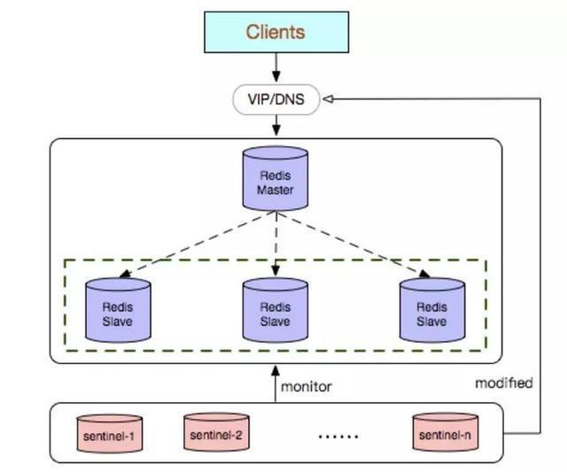
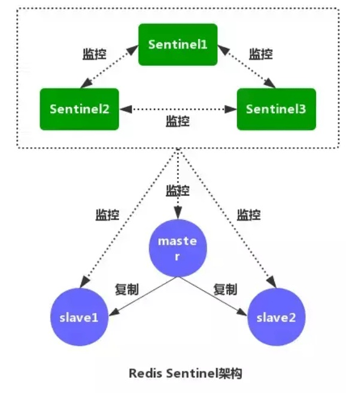
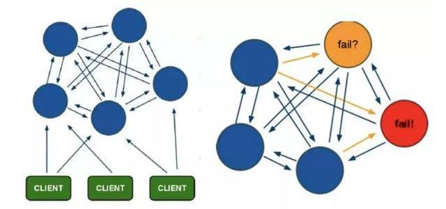

Redis支持三种集群方案

- 主从复制模式
- Sentinel（哨兵）模式
- Cluster模式

# 1.主从复制模式

## **1. 基本原理**

主从复制模式中包含一个主数据库实例（master）与一个或多个从数据库实例（slave）

客户端可对主数据库进行读写操作，对从数据库进行读操作，主数据库写入的数据会实时自动同步给从数据库。

具体工作机制为：

1.slave启动后，向master发送SYNC命令，master接收到SYNC命令后通过bgsave保存快照（即上文所介绍的RDB持久化），并使用缓冲区记录保存快照这段时间内执行的写命令

2.master将保存的快照文件发送给slave，并继续记录执行的写命令

3.slave接收到快照文件后，加载快照文件，载入数据

4.master快照发送完后开始向slave发送缓冲区的写命令，slave接收命令并执行，完成复制初始化

5.此后master每次执行一个写命令都会同步发送给slave，保持master与slave之间数据的一致性

## **3. 主从复制的优缺点**

优点：

- master能自动将数据同步到slave，可以进行读写分离，分担master的读压力
- master、slave之间的同步是以非阻塞的方式进行的，同步期间，客户端仍然可以提交查询或更新请求

缺点：

不具备自动容错与恢复功能，master或slave的宕机都可能导致客户端请求失败，需要等待机器重启或手动切换客户端IP才能恢复

master宕机，如果宕机前数据没有同步完，则切换IP后会存在数据不一致的问题

难以支持在线扩容，Redis的容量受限于单机配置

# Sentinel（哨兵）模式

## **1. 基本原理**

哨兵模式基于主从复制模式，只是引入了哨兵来监控与自动处理故障。如图

哨兵顾名思义，就是来为Redis集群站哨的，一旦发现问题能做出相应的应对处理。其功能包括：

1.监控master、slave是否正常运行

2.当master出现故障时，能自动将一个slave转换为master（大哥挂了，选一个小弟上位）

3.多个哨兵可以监控同一个Redis，哨兵之间也会自动监控

## 2.工作机制

在配置文件中通过`sentinel monitor <master-name> <ip> <redis-port> <quorum>`来定位master的IP、端口，一个哨兵可以监控多个master数据库，只需要提供多个该配置项即可。

#### 哨兵启动后，会与要监控的master建立两条连接：

- 一条连接用来订阅master的*sentinel*:hello频道与获取其他监控该master的哨兵节点信息
- 另一条连接定期向master发送INFO等命令获取master本身的信息

#### 与master建立连接后，哨兵会执行三个操作：

定期（一般10s一次，当master被标记为主观下线时，改为1s一次）向master和slave发送INFO命令

定期向master和slave的*sentinel*:hello频道发送自己的信息

定期（1s一次）向master、slave和其他哨兵发送PING命令

发送INFO命令可以获取当前数据库的相关信息从而**实现新节点的自动发现**。所以说哨兵只需要配置master数据库信息就可以自动发现其slave信息。获取到slave信息后，哨兵也会与slave建立两条连接执行监控。**通过INFO命令，哨兵可以获取主从数据库的最新信息，并进行相应的操作，比如角色变更等**。

接下来哨兵向主从数据库的*sentinel*:hello频道发送信息与同样监控这些数据库的哨兵共享自己的信息，发送内容为哨兵的ip端口、运行id、配置版本、master名字、master的ip端口还有master的配置版本。这些信息有以下用处：

其他哨兵可以通过该信息判断发送者是否是新发现的哨兵，如果是的话会创建一个到该哨兵的连接用于发送PING命令。

其他哨兵通过该信息可以判断master的版本，如果该版本高于直接记录的版本，将会更新

当实现了自动发现slave和其他哨兵节点后，哨兵就可以通过定期发送PING命令定时监控这些数据库和节点有没有停止服务。

#### 如果被PING的数据库或者节点超时

如果被PING的数据库或者节点超时（通过 sentinel down-after-milliseconds master-name milliseconds 配置）未回复，哨兵认为其主观下线（sdown，s就是Subjectively —— 主观地）。

如果下线的是master，哨兵会向其它哨兵发送命令询问它们是否也认为该master主观下线，如果达到一定数目（即配置文件中的quorum）投票，哨兵会认为该master已经客观下线（odown，o就是Objectively —— 客观地），并选举领头的哨兵节点对主从系统发起故障恢复。

若没有足够的sentinel进程同意master下线，master的客观下线状态会被移除，若master重新向sentinel进程发送的PING命令返回有效回复，master的主观下线状态就会被移除。

哨兵认为master客观下线后，故障恢复的操作需要由选举的领头哨兵来执行，选举采用**Raft算法**：

1.发现master下线的哨兵节点（我们称他为A）向每个哨兵发送命令，要求对方选自己为领头哨兵

2.如果目标哨兵节点没有选过其他人，则会同意选举A为领头哨兵

3.如果有超过一半的哨兵同意选举A为领头，则A当选

4.如果有多个哨兵节点同时参选领头，此时有可能存在一轮投票无竞选者胜出，此时每个参选的节点等待一个随机时间后再次发起参选请求，进行下一轮投票竞选，直至选举出领头哨兵

选出领头哨兵后，领头者开始对系统进行故障恢复，从出现故障的master的从数据库中挑选一个来当**选新的maste**r,选择规则如下：

- 所有在线的slave中选择优先级最高的，优先级可以通过slave-priority配置
- 如果有多个最高优先级的slave，则选取复制偏移量最大（即复制越完整）的当选
- 如果以上条件都一样，选取id最小的slave

挑选出需要继任的slave后，领头哨兵向该数据库发送命令使其升格为master，然后再向其他slave发送命令接受新的master，最后更新数据。将已经停止的旧的master更新为新的master的从数据库，使其恢复服务后以slave的身份继续运行。

**3. 哨兵模式的优缺点**

优点：

- 哨兵模式基于主从复制模式，所以主从复制模式有的优点，哨兵模式也有
- 哨兵模式下，master挂掉可以自动进行切换，系统可用性更高

缺点：

- 同样也继承了主从模式难以在线扩容的缺点，Redis的容量受限于单机配置
- 需要额外的资源来启动sentinel进程，实现相对复杂一点，同时slave节点作为备份节点不提供服务

# Cluster模式

## **1. 基本原理**

哨兵模式解决了主从复制不能自动故障转移，达不到高可用的问题，但还是存在难以在线扩容，Redis容量受限于单机配置的问题。Cluster模式实现了Redis的分布式存储，即每台节点存储不同的内容，来解决在线扩容的问题。如图

Cluster采用无中心结构,它的特点如下：

所有的redis节点彼此互联(PING-PONG机制),内部使用二进制协议优化传输速度和带宽

节点的fail是通过集群中超过半数的节点检测失效时才生效

客户端与redis节点直连,不需要中间代理层.客户端不需要连接集群所有节点,连接集群中任何一个可用节点即可

Cluster模式的具体工作机制：

在Redis的每个节点上，都有一个插槽（slot），取值范围为0-16383

当我们存取key的时候，Redis会根据CRC16的算法得出一个结果，然后把结果对16384求余数，这样每个key都会对应一个编号在0-16383之间的哈希槽，通过这个值，去找到对应的插槽所对应的节点，然后直接自动跳转到这个对应的节点上进行存取操作

为了保证高可用，Cluster模式也引入主从复制模式，一个主节点对应一个或者多个从节点，当主节点宕机的时候，就会启用从节点

当其它主节点ping一个主节点A时，如果半数以上的主节点与A通信超时，那么认为主节点A宕机了。如果主节点A和它的从节点都宕机了，那么该集群就无法再提供服务了

Cluster模式集群节点最小配置6个节点(3主3从，因为需要半数以上)，其中主节点提供读写操作，从节点作为备用节点，不提供请求，只作为故障转移使用。