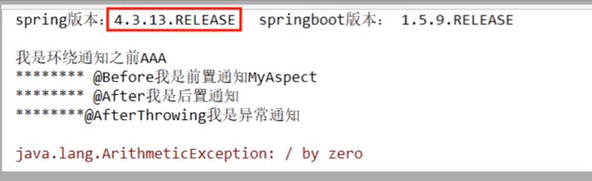
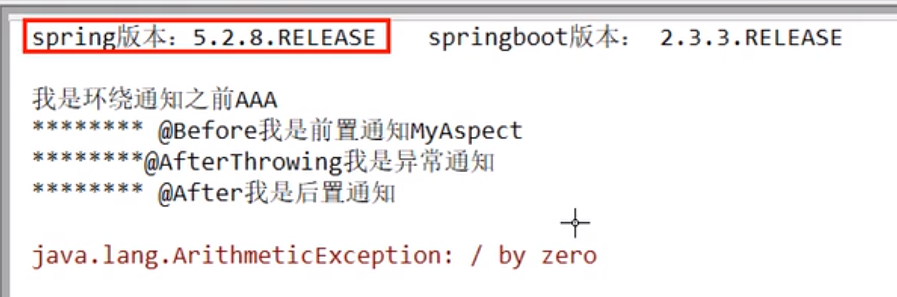
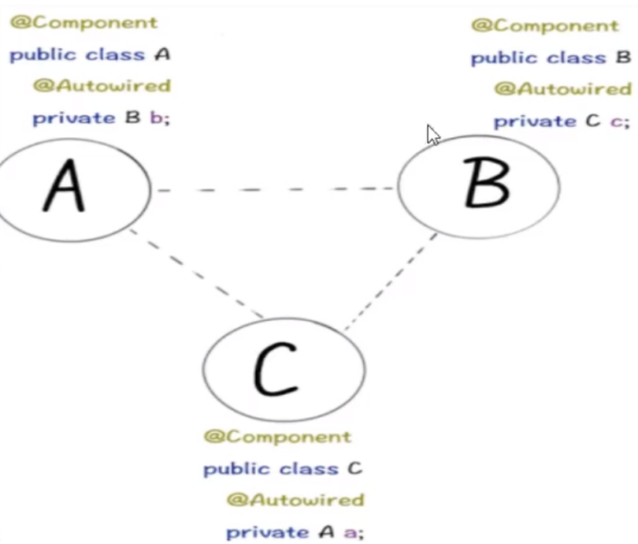
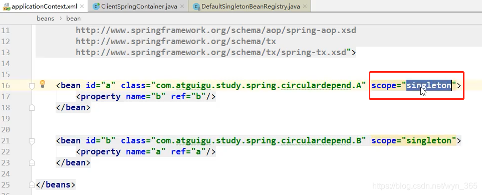
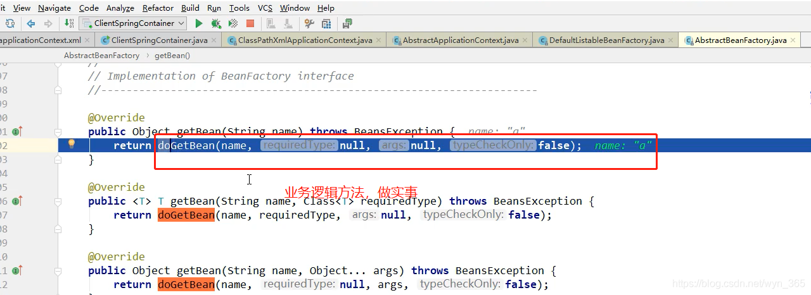

# 1.Spring AOP顺序

https://blog.csdn.net/wyn_365/article/details/113545148

## 1.1AOP常用注解：

## 1.2面试题

## 1.3业务类

## 1.5Spring4

## 1.6 Spring5（最后的都是after）

正常：

异常：

before afterreturning  after

# 2.Spring的循环依赖

## 2.1 大厂面试复盘

你解释下spring中的三级缓存？三个Map又什么不同？
什么是循环依赖？IOC容器是神魔？
如何检测是否存在循环依赖？循环依赖的异常见过吗？
多例情况下，循环依赖为神魔无法解决？
spring源码看过没？

## 2.2 什么是循环依赖？

#### 就是多个bean之间相互依赖，形成了一个闭环。

#### 一般默认在单例模式中，属性相互影响的场景。

## 2.3 依赖注入的两种方式？

### 1.构造方法注入【不适合解决循环依赖】

构造方法错误测试：

构造器循环依赖是无法解决的，如果想让构造器支持循环依赖，是不可能的。

### 2.set方法注入

set方法解决循环依赖测试：

作为属性进行注入，解决问题，验证了官网的set方法解决循环依赖的问题。

## 2.4 容器内部 使用Spring 3级缓存 解决循环依赖的三个map

所谓的3级缓存其实就是spring内部3个用来解决spring循环依赖的3个Map。

一级缓存：存放已经经历了完整的生命周期的Bean对象。（成品）
二级缓存：存放早期暴露出来的Bean对象，生命周期还没有结束。（半成品 实例化了 没装修）
三计缓存：存放可以生成Bean的工厂 。（还没有实例化）
注意：只有单利的Bean会通过三计缓存来解决循环依赖的问题，不是单利的，每次容器中都会从容器中获取到一个新的对象，重新创建，所以不史丹利的bean时没有的缓存的，不会将其放到三计缓存中去。

### 3.5 Spring循环依赖Debug

知识准备：
实例化：申请内存空间
初始化：属性的赋值

AB两个对象在三级缓存中的迁移说明
1.A的创建过程需要B，于是A将自己放到三级缓存里面（我先要有a），去实例化B（我a里面要有个b）。
2.B实例化时候发现需要A，于是B先查一级缓存，没有，再查二级缓存，还是没有，再查三级缓存，找到了A。然后把三级缓存里面的这个A放到二级缓存里面，并删除三级缓存里面的A。
3.B顺利初始化完毕，将自己放到一级缓存里面（此时B里面的A依然是创建状态中）然后回来接着创建A，此时B已经创建结束，直接从一级缓存理念拿到B，然后创建完成，并将自己A放到一级缓存里面去。

#### 3.5.1 开始debug断点调试

reflash ：加载容器初始化

## 2.6 总结spring如何解决循环依赖的?

Spring创建bean主要分为两个步骤，创建原始bean对象，接着去填充对象的属性和初始化
每次创建bean之前，我们都会从缓存中查看有没有该bean，单例只有一个
当我们创建beanA对象之后，并把它放到三级缓存中，接下来就是填充对象属性了，这个时候发现了依赖于B，接着有去创建beanB。
不同的是：
这时候可以在三级缓存总查到刚放进去的beanA，所以不需要继续创建，用它继续注入beanB，完成B的创建，继而继续完成A的属性填充和剩余逻辑。

