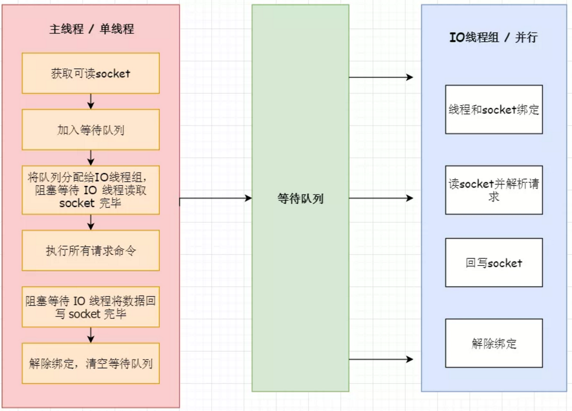
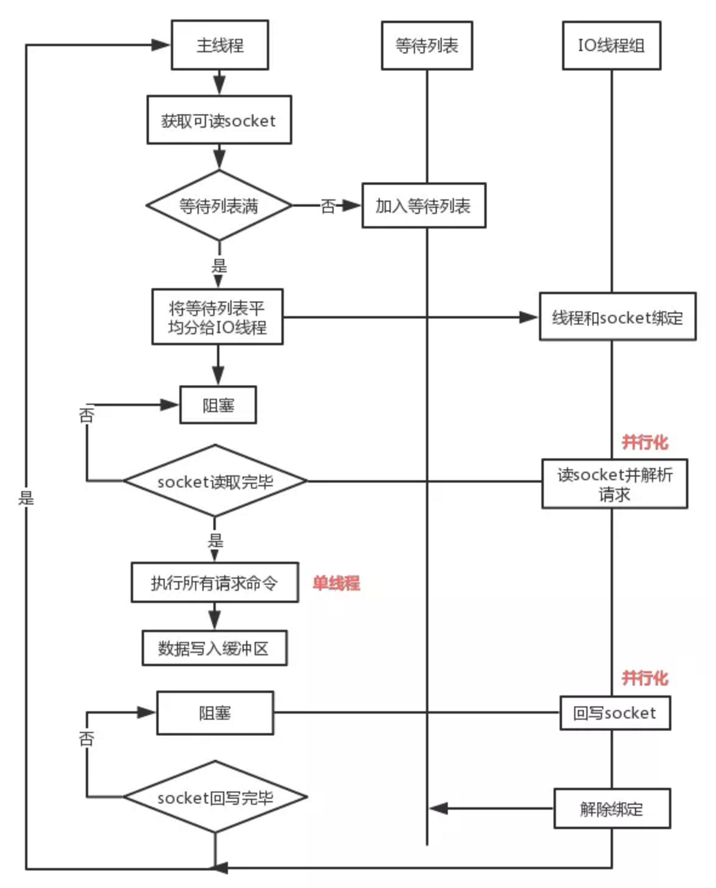
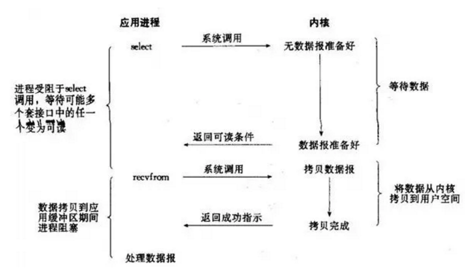

## **1.Redis6.0之前的版本真的是单线程吗？**

   Redis在处理客户端的请求时，包括获取 (socket 读)、解析、执行、内容返回 (socket 写) 等都由一个顺序串行的主线程处理，这就是所谓的“单线程”。但如果严格来讲从Redis4.0之后并不是单线程，除了主线程外，它也有后台线程在处理一些较为缓慢的操作，例如清理脏数据、无用连接的释放、大 key 的删除等等。

## **2.Redis6.0之前为什么一直不使用多线程？**

官方曾做过类似问题的回复：使用Redis时，几乎不存在CPU成为瓶颈的情况， **Redis主要受限于内存和网络**。例如在一个普通的Linux系统上，Redis通过使用pipelining每秒可以处理100万个请求，所以如果应用程序主要使用O(N)或O(log(N))的命令，它几乎不会占用太多CPU。

**使用了单线程后，可维护性高。**多线程模型虽然在某些方面表现优异，但是它却引入了程序执行顺序的不确定性，带来了并发读写的一系列问题，增加了系统复杂度、同时可能存在线程切换、甚至加锁解锁、死锁造成的性能损耗。Redis通过AE事件模型以及IO多路复用等技术，处理性能非常高，因此没有必要使用多线程。单线程机制使得 Redis 内部实现的复杂度大大降低，Hash 的惰性 Rehash、Lpush 等等 “线程不安全” 的命令都可以无锁进行。

## **3.Redis6.0为什么要引入多线程呢？**

 Redis将所有数据放在内存中，内存的响应时长大约为100纳秒，对于小数据包，Redis服务器可以处理80,000到100,000 QPS，这也是Redis处理的极限了，对于80%的公司来说，单线程的Redis已经足够使用了。

  但随着越来越复杂的业务场景，有些公司动不动就上亿的交易量，因此需要更大的QPS。常见的解决方案是在分布式架构中对数据进行分区并采用多个服务器，但该方案有非常大的缺点，例如要管理的Redis服务器太多，维护代价大；某些适用于单个Redis服务器的命令不适用于数据分区；数据分区无法解决热点读/写问题；数据偏斜，重新分配和放大/缩小变得更加复杂等等。

  从Redis自身角度来说，因为读写网络的read/write系统调用占用了Redis执行期间大部分CPU时间，瓶颈主要在于网络的 IO 消耗, 优化主要有两个方向:

  • 提高网络 IO 性能，典型的实现比如使用 DPDK 来替代内核网络栈的方式

  • 使用多线程充分利用多核，典型的实现比如 Memcached。

 协议栈优化的这种方式跟 Redis 关系不大，支持多线程是一种最有效最便捷的操作方式。所以总结起来，redis支持多线程主要就是两个原因：

  • 可以充分利用服务器 CPU 资源，目前主线程只能利用一个核

  • 多线程任务可以分摊 Redis 同步 IO 读写负荷

## **4.Redis6.0默认是否开启了多线程？** 

 Redis6.0的多线程默认是禁用的，只使用主线程。如需开启需要修改redis.conf配置文件：io-threads-do-reads yes

 

## **5.Redis6.0多线程开启时，线程数如何设置？**

  开启多线程后，还需要设置线程数，否则是不生效的。同样修改redis.conf配置文件

## **6.Redis6.0采用多线程后，性能的提升效果如何？**

 Redis 作者 antirez 在 RedisConf 2019分享时曾提到：Redis 6 引入的多线程 IO 特性对性能提升至少是一倍以上。国内也有大牛曾使用unstable版本在阿里云esc进行过测试，GET/SET 命令在4线程 IO时性能相比单线程是几乎是翻倍了。

## **7.Redis6.0多线程的实现机制？** 

**流程简述如下：**

1、主线程负责接收建立连接请求，获取 socket 放入全局等待读处理队列

2、主线程处理完读事件之后，通过 RR(Round Robin) 将这些连接分配给这些 IO 线程

3、主线程阻塞等待 IO 线程读取 socket 完毕

4、主线程通过单线程的方式执行请求命令，请求数据读取并解析完成，但并不执行

5、主线程阻塞等待 IO 线程将数据回写 socket 完毕

6、解除绑定，清空等待队列

## **8.开启多线程后，是否会存在线程并发安全问题？** 

从上面的实现机制可以看出，Redis的多线程部分只是用来处理网络数据的读写和协议解析，执行命令仍然是单线程顺序执行。所以我们不需要去考虑控制 key、lua、事务，LPUSH/LPOP 等等的并发及线程安全问题。

## **12.Redis线程中经常提到IO多路复用，如何理解？**

这是IO模型的一种，即经典的Reactor设计模式，有时也称为异步阻塞IO。

多路指的是多个socket连接，复用指的是复用一个线程。

多路复用主要有三种技术：select，poll，epoll。epoll是最新的也是目前最好的多路复用技术。

采用多路 I/O 复用技术可以让

1.单个线程高效的处理多个连接请求（尽量减少网络IO的时间消耗），
2.

且Redis在内存中操作数据的速度非常快（内存内的操作不会成为这里的性能瓶颈），主要以上两点造就了Redis具有很高的吞吐量。

