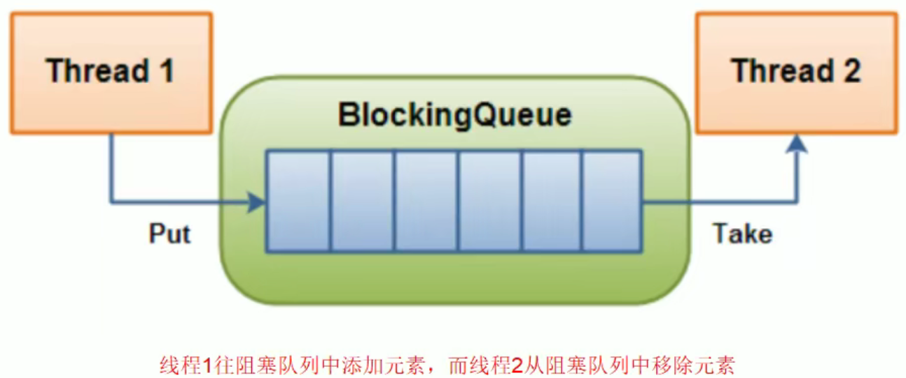
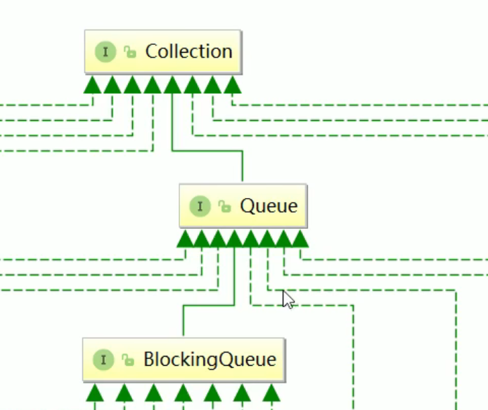
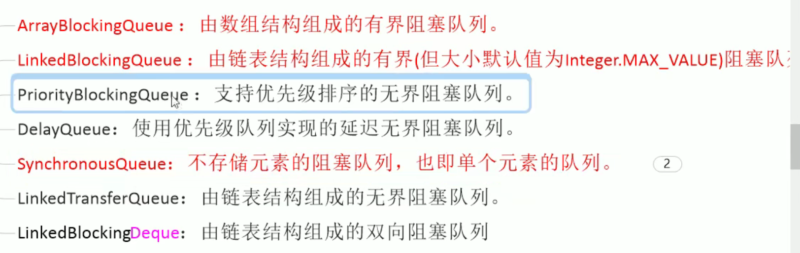
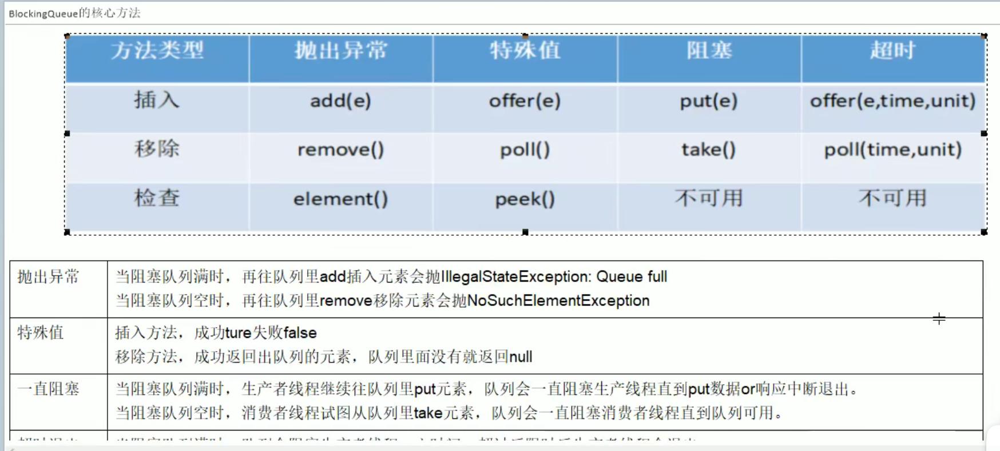
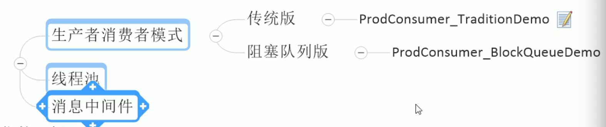
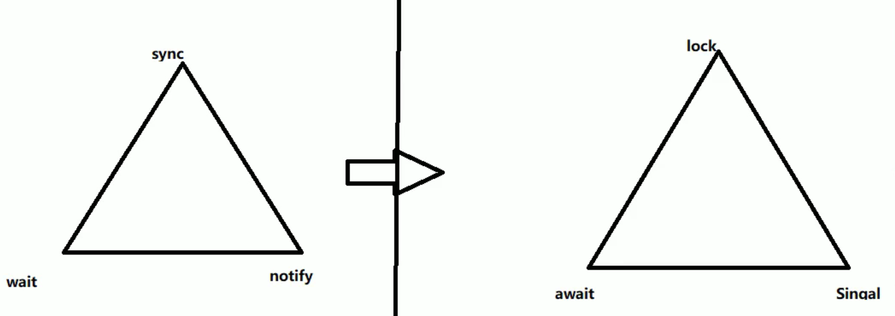

# 阻塞队列

## 1.定义（消息中间件的核心组成）

阻塞队列，顾名思义，首先它是一个队列，而一个阻塞队列在数据结构中所起的作用大致如下图所示：

当阻塞队列是空时，从队列中获取元素的操作将会被阻塞。

当阻塞队列是满时，往队列里添加元素的操作将会被阻塞。

这个阻塞队列，就是食堂的柜台，如果柜台是空的，那就会被阻塞。

空了，消费者阻塞，满了生产者阻塞。

试图从空的阻塞队列中获取元素的线程将会被阻塞，直到其他的线程往空的队列插入新的元素。

同样

试图往己满的阻塞队列中添加新元素的线程同样也会被阻塞，直到其他的线程从列中移除一个或多个元素或者完全清空队列后使队列重新变得空闲起来并后续新增

## 2.为什么要有阻塞队列？

在多线程领域：所谓阻塞，在某些情況下会挂起线程（即阻塞），一旦条件满足，被挂起的线程又会自动被唤醒

为什么需要 Blocking Queue

好处是我们不需要关心什么时候需要阻塞什么时候需要唤醒线程，因为这一切 Blocking Queue 都给你一手包办了。线程自己去看，不用wait，notify

在 concurrent包发布以前，在多线程环境下，我们每个程序员都必须去自己控制这些细节，尤其还要兼顾效率和线程安全，而这会给我们的程序带来不小的复杂度。

## 3.架构

## 4.种类

**Array Blockingqueue**：由数组结构组成的有界阻塞队列。
**Linked Blockingqueue：**由链表结构组成的有界（但大小默认值为 Integer. MAX VALUE）阻塞队列(接近21亿了，几乎就是无界了)
Priorityblockingquewe：支持优先级排序的无界阻塞队列。Delayqueue：使用优先级队列实现的延迟无界阻塞队列。 **Synchronousqueue**：不存储元素的阻塞队列，也即单个元素的队列。 （订单不来不开工）
Linkedtransferqueue：由链表结构组成的无界阻塞队列。 
Linked Blockingdeque：由链表结构组成的双向阻塞队列

线程池就由上面三个加粗的接口组成的。

## 5.阻塞队列核心方法

## 6.用在哪里？

