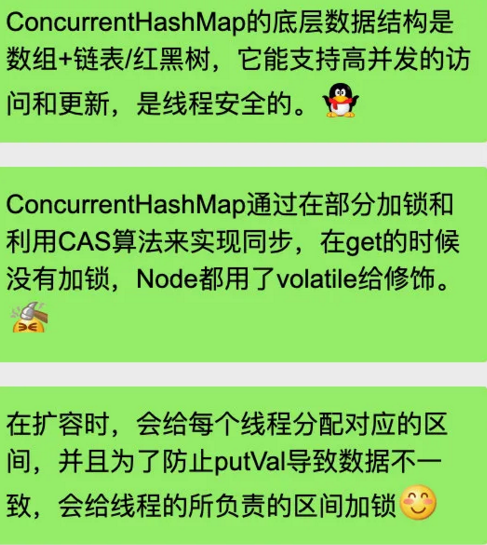

简单说一下hashmap

hashmap是由 数组 链表 红黑树 构成的

1.当我们初始化一个hashmap的时候

默认大小为16。负载因子为0.75，当我们hashmap中元素的数量超过了 大小*0.75的时候 就会进行扩容

2.然后，hashmap的大小必须是2的次幂

因为做hash映射的时候 用位运算代替取mod 可以加快速度 而这个前提就是 length是2的倍数。即 x % (2^N) == x & (2^N-1)，所以jdk里面使用(n - 1) & hash这个操作，因为与运算比较的快。

3.put实现

​	1.put实现第一步就是对key进行hash运算，计算出改key，所在的index。hash值计算 是与高16位作异或运算，

​	2.然后这里就要判断是否碰撞了，如果没有碰撞，就直接放在数组中，如果碰撞了，那就插入链表或者是红黑树。

如果key是和原来相同的，则替换原来的值。

​	3.最后要判断是否超过了负载值，超过。扩容

4.get实现

通过计算key的hash值，将hash值与Node数组的长度-1与操作，得到对应的数组的位置。

没有冲突直接返回，有冲突，去链表或者红黑树里面去找。

5.判断数据相等

放进hashmap内的元素要重写hashcode和equals方法。hashmap首先会比较hash值，随后会用==和equals判断该元素是否相同。

6.什么时候转红黑树

当数组大小大于64，且链表大小 大于8的时候会转成红黑树。当红黑树大小为6时，会退化成链表。

转红黑树是为了查询和插入的一个复杂度。链表插入O（1） 查询O（n）；红黑树都是O（logn）

7..扩容操作

当目前数组长度超过了装载因子的比例的时候会进行扩容。扩容都是两倍扩容。生成个新的数组，然后遍历旧数组。

如果对应位置只有一个节点。如果只有一个结点，那么对直接进行hash映射（Node的hash值和新的数组的长度计算位置），放到新数组里面。

如果有多个节点，将对应的节点hash值与旧数组长度进行一个与（e.hash & oldCap），如果结果是0，则不需要改变其位置；

如果是1，改变后的新位置是当前位置加上旧数组长度，即**i + oldCap**。

这里也可以看到一个两倍扩容的2个优点：能够按位与，效率高；扩容的时候只需要根据数组长度计算的结果，维持原位置或者在原位置上移动原数组长度个位置即可。


采用这种方法不需要对每个链表结点进行重新计算位置了。之后因为还是要保证链表本身的顺序，所以定义了几个指针，将刚刚的需要移动的和不需要移动的分别连起来，最后将头节点放入新的数组中。

最后将新的Node数组返回。


8.别说了

线程不安全的。A放进去，bget不出来的情况。


# 1.简单说一下map


1.再java里面 hash表实现是有 数组+链表组成的

2.Hashmap底层数据机构是 数组+ 链表、红黑树

**红黑树的特性**:
**（1）每个节点或者是黑色，或者是红色。**
**（2）根节点是黑色。**
**（3）每个叶子节点（NIL）是黑色。 [注意：这里叶子节点，是指为空(NIL或NULL)的叶子节点！]**
**（4）如果一个节点是红色的，则它的子节点必须是黑色的。**
**（5）从一个节点到该节点的子孙节点的所有路径上包含相同数目的黑节点。**

3.LinkedHashMap底层数据结构是 数组+链表+双向链表

4.Treemap底层也是红黑树

5.currentHashmap 底层是 数组+ 链表 +红黑树

# 2.new 一个hashMap的时候 会发生什么？


因为做hash映射的时候 用位运算代替取mod 可以加快速度 而这个前提就是 length是2的倍数


然后，刚刚说的 


# 3.Put

## 3.1如何计算hash值？


## 3。2Put的实现


# 4。Get


# 5，判断一个元素是否相同？


# 6.什么时候转红黑树


# 7.LinkedHashMap


# 8.TreeMap


# 9.线程安全问题


## 9。1currentHashMap的实现




因该说 1.8 用了 cas和synchronized来实现了 没有用区间锁了


Java容器

# 目录


# HashMap

## 重写equals()和hashcode()方法

```java
public class Student {
    private int id;
    private String name;
    
    @Override
    public boolean equals(Object o) {
        if (this == o) return true;
        if (o == null || getClass() != o.getClass()) return false;
        Student student = (Student) o;
        return id == student.id &&
                Objects.equals(name, student.name);
    }

    @Override
    public int hashCode() {
        return Objects.hash(id, name);
    }
}
```

- 自己写的类放入HashMap需要重写equals和hashcode方法。
- 重写的equals方法里面是根据类的属性来判断。hashcode方法也是针对属性进行一些数学计算得到的结果。

- equals相等的话，hashcode必须相等；hashcode不相等，equals必不相等。所以要重写这两个。不重写的话是比较内存地址。


看equals的代码

- 首先判断是不是同一个对象，是的话返回true。
- 之后判断o是不是null或者两个的Class不是同一个，如果是返回false
- 之后强制转型o为Student类，判断属性是否相同

这里面重写的时候用到了Objects类里面的几个方法，如下：

```java
//Objects类
public static boolean equals(Object a, Object b) {
    return (a == b) || (a != null && a.equals(b));
}

public static int hash(Object... values) {
        return Arrays.hashCode(values);
}


//Arrays类
public static int hashCode(Object a[]) {
    if (a == null)
        return 0;

    int result = 1;

    for (Object element : a)
        result = 31 * result + (element == null ? 0 : element.hashCode());

    return result;
}
```

hashcode里面加上31的可能解释

- 31是一个不大不小的质数，是作为 hashCode 乘子的优选质数之一。乘上31可以使得得到的结果分别的不是很小的区间也不是特别的大。
- 31可以被 JVM 优化，`31 * i = (i << 5) - i`


## 为什么要重写hashcode方法

1.使用hashcode方法进行比较对象是否相同，可以避免每一次比对都调用equals方法，提高效率

2.保证equals比较两个对象内容相等的时候，相同的对象返回相同的hashcode值。如果重写了equals方法，而没有重写hashcode方法，会出现equals相等的对象，hashcode不相等的情况。比如说插入进hashmap里面，因为hashmap是按照hashcode计算hash值存储的，所以如果不重写的话，可能放了一个对象进去，下次查询另一个一样equals对象会说不存在。或者是插入两个equals相同的对象会因为hashcode不同插入到不同的地方去。


## 一些哈希函数

构造哈希函数的原则是：

①函数本身便于计算；

②计算出来的地址分布均匀，即对任一关键字k，f(k) 对应不同地址的概率相等，目的是尽可能减少冲突

比如除数取余法，

hashmap里面的前后为异或法，

平方取中法。求出平方值，然后按需要取平方值的中间几位作为哈希地址。


## 处理哈希冲突的方法

1.开放地址法

如果当前位置出现哈希冲突，则向下接着寻找位置，直到找到不冲突的位置位置。有几种方法：

1.1线性探测再散列

即在冲突的位置线性查找下一个位置，直到找到位置。

1.2二次探测再散列

即在冲突的位置左右跳跃式查找不冲突的位置

1.3随机数探测再散列

使用随机数进行向下查找不冲突的位置

线性探测容易产生二次聚集问题，因为在处理冲突的时候向下寻找不冲突的位置插入，这在下次插入数据的时候可能会占用其他的hash位置，就会越来越聚集。线性探测的优点是：只要哈希表不满，就一定能找到一个不冲突的哈希地址，而二次探测和随机探测则不一定能保证。

2.再哈希法

预先设定几个不同的哈希函数，冲突了就换一个计算。缺点是增加了计算时间

3.拉链法

如同hashmap的设计方式，遇到hash冲突的时候使用链表连接冲突的数据。优点是查找删除都很方便。缺点是需要额外的空间。


## HashMap时间复杂度分析

个人认为，是时间复杂度接近于O(1)，并且如果出现不是O(1)的情况，其常数系数也很小。

首先根据hashcode计算hash值找到数组对应的位置，这个是O(1)的时间，之后可能会遍历链表，但是根据分析和计算，链表长度超过8的概率很小，所以可以近似认为遍历链表的是常数长度和常数时间，所以最终的时间是O(1)。（个人认为是这样）


## HashMap简介——源码

HashMap和HashTable大致相当，但是不是同步的并且支持null值。HashMap不保证map的顺序，尤其不保证随着时间推移map的顺序保持不变。

get和put的时间复杂度都是常数级别。

HashMap不是线程安全的，在添加或者删除元素的时候会造成结构性的调整，这时候可能出问题，修改已经存在的值不会出问题。

使用Collections.synchronizedMap实现线程安全。看了一下源码，里面的get和put方法都是加了synchronized

```java
Map<Student, Integer> map = new HashMap<>();
Map<Student, Integer> map2 = Collections.synchronizedMap(map);
```

## Node——基本组成部分

```java
/**
 * Basic hash bin node, used for most entries.  (See below for
 * TreeNode subclass, and in LinkedHashMap for its Entry subclass.)
 */
static class Node<K,V> implements Map.Entry<K,V> {
    final int hash;// hash值
    final K key;//key
    V value;//value
    Node<K,V> next;//next指针。

    Node(int hash, K key, V value, Node<K,V> next) {
        this.hash = hash;
        this.key = key;
        this.value = value;
        this.next = next;
    }

    public final K getKey()        { return key; }//获取key
    public final V getValue()      { return value; }//获取value值
    public final String toString() { return key + "=" + value; }

    public final int hashCode() {
        return Objects.hashCode(key) ^ Objects.hashCode(value);
    }

    public final V setValue(V newValue) {
        V oldValue = value;
        value = newValue;
        return oldValue;
    }

    public final boolean equals(Object o) {
        if (o == this)
            return true;
        if (o instanceof Map.Entry) {
            Map.Entry<?,?> e = (Map.Entry<?,?>)o;
            if (Objects.equals(key, e.getKey()) &&
                Objects.equals(value, e.getValue()))
                return true;
        }
        return false;
    }
}
```

Node是HashMap的基本组成部分，每一个Node就是一个键值对。里面的属性有hash值，key，value，next指针。

从构造方法和结构来看key和value是Node的属性，所以可以使用getKey()和getValue()方法获取每个Node的key和value值。

```java
final int hash;
final K key;
V value;
Node<K,V> next;
Node(int hash, K key, V value, Node<K,V> next) {
        this.hash = hash;
        this.key = key;
        this.value = value;
        this.next = next;
}
public final K getKey()        { return key; }
public final V getValue()      { return value; }
```


## hash方法

> \>>是带符号右移。正数右移高位补0，负数右移高位补1。比如：4 >> 1，结果是2；-4 >> 1，结果是-2。-2 >> 1，结果是-1。
>
> \>>>是无符号右移。无论是正数还是负数，高位通通补0。对于正数而言，>>和>>>没区别。对于负数而言，-2 >>> 1，结果是2147483647（Integer.MAX_VALUE），-1 >>> 1，结果是2147483647（Integer.MAX_VALUE）。

将key的hashCode右移16位和hashCode作异或操作

```java
/**
 * Computes key.hashCode() and spreads (XORs) higher bits of hash
 * to lower.  Because the table uses power-of-two masking, sets of
 * hashes that vary only in bits above the current mask will
 * always collide. (Among known examples are sets of Float keys
 * holding consecutive whole numbers in small tables.)  So we
 * apply a transform that spreads the impact of higher bits
 * downward. There is a tradeoff between speed, utility, and
 * quality of bit-spreading. Because many common sets of hashes
 * are already reasonably distributed (so don't benefit from
 * spreading), and because we use trees to handle large sets of
 * collisions in bins, we just XOR some shifted bits in the
 * cheapest possible way to reduce systematic lossage, as well as
 * to incorporate impact of the highest bits that would otherwise
 * never be used in index calculations because of table bounds.
 */
static final int hash(Object key) {
    int h;
    return (key == null) ? 0 : (h = key.hashCode()) ^ (h >>> 16);
}
```

## 一些初始参数

### 装载因子

```java
static final float DEFAULT_LOAD_FACTOR = 0.75f;
```

当hashmap的entry的数量超过容量和装载因子的乘积之后，hashmap回扩容，重建其内部数据结构

默认装载因子为0.75在时间和空间消耗上实现了比较好的折衷trade off。装载因子过高，更高的值减少了空间开支但是增加了查找代价，

而如果装载因子过低，虽然可以减少查询时间成本，但是空间利用率很低，同时提高了rehash操作的次数。

### 初始容量

默认初始容量设置为16。

```java
static final int DEFAULT_INITIAL_CAPACITY = 1 << 4; // aka 16
```

### 最大容量

这个应该是小于int最大值的最大的2的整数次方的数了。

```java
static final int MAXIMUM_CAPACITY = 1 << 30;
```

### 红黑树相关

```java
static final int TREEIFY_THRESHOLD = 8;
```

根据试验，按照目前的设计，hashcode的随机分布导致单个Node数组下的链表长度超过8个概率很小，所以红黑树的转换很少被用到。

也是因为红黑树本身的size是Node的两倍。这边应该是链表结点大于等于8的时候转红黑树。

> 至于为什么红黑树结点大，我觉得是TreeNode的结点里面的属性比较多，有父节点，左右结点，前结点。

```java
static final int UNTREEIFY_THRESHOLD = 6;
```

~

```java
static final int MIN_TREEIFY_CAPACITY = 64;
```

## get方法

返回key值对应的value，如果不含这个key返回null。

如果是null，也可以认为是不存在。

### 源码

```java
/**
 * Returns the value to which the specified key is mapped,
 * or {@code null} if this map contains no mapping for the key.
 *
 * <p>More formally, if this map contains a mapping from a key
 * {@code k} to a value {@code v} such that {@code (key==null ? k==null :
 * key.equals(k))}, then this method returns {@code v}; otherwise
 * it returns {@code null}.  (There can be at most one such mapping.)
 *
 * <p>A return value of {@code null} does not <i>necessarily</i>
 * indicate that the map contains no mapping for the key; it's also
 * possible that the map explicitly maps the key to {@code null}.
 * The {@link #containsKey containsKey} operation may be used to
 * distinguish these two cases.
 *
 * @see #put(Object, Object)
 */
public V get(Object key) {
    Node<K,V> e;
    return (e = getNode(hash(key), key)) == null ? null : e.value;
}
```

```java
/**
 * Implements Map.get and related methods.
 *
 * @param hash hash for key
 * @param key the key
 * @return the node, or null if none
 */
final Node<K,V> getNode(int hash, Object key) {
    Node<K,V>[] tab; Node<K,V> first, e; int n; K k;
    if ((tab = table) != null && (n = tab.length) > 0 &&
        (first = tab[(n - 1) & hash]) != null) {
        if (first.hash == hash && // always check first node
            ((k = first.key) == key || (key != null && key.equals(k))))
            return first;
        if ((e = first.next) != null) {
            if (first instanceof TreeNode)
                return ((TreeNode<K,V>)first).getTreeNode(hash, key);
            do {
                if (e.hash == hash &&
                    ((k = e.key) == key || (key != null && key.equals(k))))
                    return e;
            } while ((e = e.next) != null);
        }
    }
    return null;
}
```

### 解析

简单总结一下get方法。

主要是通过key获取那个对应的Node。通过计算对象的hash值，将hash值与Node数组的长度-1与操作，得到对应的数组的位置。

> hashcode都是很大的，计算hash值也很大。
>
> 查阅资料，如果一个数是2的整数次方，则对这个数取余数相当于对这个数减一计算按位与。
>
> 即 x % (2^N) == x & (2^N-1)，所以jdk里面使用(n - 1) & hash这个操作，因为与运算比较的快。
>
> 所以后面hashmap扩容也必须是要2的次方。

首先检查第一个结点，如果第一个结点就是我们要找的那个key的结点，直接返回这个Node即可。

之后如果第一个结点不是我们要找的Node，如果第一个结点是TreeNode，接着调用getTreeNode方法查找结点。如果还是正常的链表结构，那么就按照next指针一直往下找，找到后返回，如果没有找到，返回null。

> 补充：
>
> 应该是，当这个对象本身是子类的对象，但是是用父类来定义的时候，父类可以强制转型成子类。因为这里面有一个将Node强制转成TreeNode的过程，我认为这里面因为这个结点本身就是TreeNode才能这么转的，而TreeNode是继承了Node的

## put方法

### 源码

```java
/**
 * Associates the specified value with the specified key in this map.
 * If the map previously contained a mapping for the key, the old
 * value is replaced.
 *
 * @param key key with which the specified value is to be associated
 * @param value value to be associated with the specified key
 * @return the previous value associated with {@code key}, or
 *         {@code null} if there was no mapping for {@code key}.
 *         (A {@code null} return can also indicate that the map
 *         previously associated {@code null} with {@code key}.)
 */
public V put(K key, V value) {
    return putVal(hash(key), key, value, false, true);
}

/**
 * Implements Map.put and related methods.
 *
 * @param hash hash for key
 * @param key the key
 * @param value the value to put
 * @param onlyIfAbsent if true, don't change existing value
 * @param evict if false, the table is in creation mode.
 * @return previous value, or null if none
 */
final V putVal(int hash, K key, V value, boolean onlyIfAbsent,
               boolean evict) {
    Node<K,V>[] tab; Node<K,V> p; int n, i;
    if ((tab = table) == null || (n = tab.length) == 0)
        n = (tab = resize()).length;
    if ((p = tab[i = (n - 1) & hash]) == null)
        tab[i] = newNode(hash, key, value, null);
    else {
        Node<K,V> e; K k;
        if (p.hash == hash &&
            ((k = p.key) == key || (key != null && key.equals(k))))
            e = p;
        else if (p instanceof TreeNode)
            e = ((TreeNode<K,V>)p).putTreeVal(this, tab, hash, key, value);
        else {
            for (int binCount = 0; ; ++binCount) {
                if ((e = p.next) == null) {
                    p.next = newNode(hash, key, value, null);
                    if (binCount >= TREEIFY_THRESHOLD - 1) // -1 for 1st
                        treeifyBin(tab, hash);
                    break;
                }
                if (e.hash == hash &&
                    ((k = e.key) == key || (key != null && key.equals(k))))
                    break;
                p = e;
            }
        }
        if (e != null) { // existing mapping for key
            V oldValue = e.value;
            if (!onlyIfAbsent || oldValue == null)
                e.value = value;
            afterNodeAccess(e);
            return oldValue;
        }
    }
    ++modCount;
    if (++size > threshold)
        resize();
    afterNodeInsertion(evict);
    return null;
}
```

### 解析

首先，判断获取的Node数组Node<K,V>[] tab是否为null，如果为空，说明没有初始化，则执行resize()方法进行初始化。

之后还是通过计算找到hash值在数组上的位置，如果当然数组里面是空的，说明第一个位置没有结点，则直接新建结点放进去就行。

否则，说明数组这个位置是有结点的。首先获取这个结点，（*如果这个结点又是红黑树，则调用树的putTreeVal方法插入数据*。）

如果是Node结点，则首先判断第一个结点的key是不是我们要放入的key，如果是的话，说明这个key是存在的，将其value覆盖为新的value即可。

如果第一个结点不是对应的key，则向下遍历，如果找到了key对应的结点，则替换其value的值为put方法的值。如果没有找到，就在最后一个结点后面插入新的结点，代表本次put的key-value。之后判断如果链表长度超过了转换成树的阈值，就进行树的转换。

最后将整体的size++，如果超过了扩容阈值，则进行扩容操作。


## resize扩容方法

### 源码

```java
/**
 * Initializes or doubles table size.  If null, allocates in
 * accord with initial capacity target held in field threshold.
 * Otherwise, because we are using power-of-two expansion, the
 * elements from each bin must either stay at same index, or move
 * with a power of two offset in the new table.
 *
 * @return the table
 */
final Node<K,V>[] resize() {
    Node<K,V>[] oldTab = table;
    int oldCap = (oldTab == null) ? 0 : oldTab.length;
    int oldThr = threshold;
    int newCap, newThr = 0;
    if (oldCap > 0) {
        // 超过最大值就不再扩充了，就只好随你碰撞去吧
        if (oldCap >= MAXIMUM_CAPACITY) {
            threshold = Integer.MAX_VALUE;
            return oldTab;
        }
        // 没超过最大值，就扩充为原来的2倍
        else if ((newCap = oldCap << 1) < MAXIMUM_CAPACITY &&  //注意这边newCap也扩充了两倍
                 oldCap >= DEFAULT_INITIAL_CAPACITY)
            newThr = oldThr << 1; // double threshold   threshold代表到达这个值 我们需要扩容了
    }
    else if (oldThr > 0) // initial capacity was placed in threshold
        newCap = oldThr;
    else {               // zero initial threshold signifies using defaults
        newCap = DEFAULT_INITIAL_CAPACITY;
        newThr = (int)(DEFAULT_LOAD_FACTOR * DEFAULT_INITIAL_CAPACITY);
    }
    // 计算新的resize上限
    if (newThr == 0) {//考虑0的情况
        float ft = (float)newCap * loadFactor;
        newThr = (newCap < MAXIMUM_CAPACITY && ft < (float)MAXIMUM_CAPACITY ?
                  (int)ft : Integer.MAX_VALUE);
    }
    threshold = newThr;//正常不为0的情况 
    @SuppressWarnings({"rawtypes","unchecked"})
        Node<K,V>[] newTab = (Node<K,V>[])new Node[newCap];//直接生成了两倍的一个数组
    table = newTab;
    if (oldTab != null) {
        // 把每个bucket都移动到新的buckets中
        for (int j = 0; j < oldCap; ++j) {
            Node<K,V> e;
            if ((e = oldTab[j]) != null) {
                oldTab[j] = null;
                if (e.next == null)
                    newTab[e.hash & (newCap - 1)] = e;
                else if (e instanceof TreeNode)
                    ((TreeNode<K,V>)e).split(this, newTab, j, oldCap);
                else { // preserve order
                    Node<K,V> loHead = null, loTail = null;
                    Node<K,V> hiHead = null, hiTail = null;
                    Node<K,V> next;
                    do {
                        next = e.next;
                        // 原索引
                        if ((e.hash & oldCap) == 0) {
                            if (loTail == null)
                                loHead = e;
                            else
                                loTail.next = e;
                            loTail = e;
                        }
                        // 原索引+oldCap
                        else {
                            if (hiTail == null)
                                hiHead = e;
                            else
                                hiTail.next = e;
                            hiTail = e;
                        }
                    } while ((e = next) != null);
                    // 原索引放到bucket里
                    if (loTail != null) {
                        loTail.next = null;
                        newTab[j] = loHead;
                    }
                    // 原索引+oldCap放到bucket里
                    if (hiTail != null) {
                        hiTail.next = null;
                        newTab[j + oldCap] = hiHead;
                    }
                }
            }
        }
    }
    return newTab;
}

```

### 解析

注意，扩容是对数组的长度进行扩容。但是比较是针对目前存放的数据量和数组长度 * 装载因子

获取当然的数组长度和扩容阈值，阈值就是数组长度和装载因子的乘积。

首先进行判断，如果当前的HashMap的存有的容量超过了MAXIMUM_CAPACITY，那么就不进行扩容。因为扩容是要数组长度变成2倍，这样会溢出int。之后如果当前容量扩大成两倍后不会超过MAXIMUM_CAPACITY最大容量，则将旧的容量乘以2，更新新的容量和新的扩容阈值。

之后开始扩容。新建一个以新的容量为长度的数组newTab。针对之前旧的数组oldTab进行遍历，如果存在Node结点，首先将旧数组在当前位置的引用置为null  (oldTab[j] = null)。如果只有一个结点，那么对Node的hash值和新的数组的长度计算位置，放到新数组里面。

下面比较重要，就是旧数组的位置存在不止一个结点的时候。首先利用hash值判断这些结点在扩容后会不会改变其在数组的位置。根据位运算，e.hash & oldCap，即将hash值和旧数组长度做按位与，这样如果结果是0说明不需要改变位置，如果是1说明要改变位置，改变后的新位置是当前位置加上旧数组长度，即**i + oldCap**。这个部分是根据位运算计算出来的。采用这种方法不需要对每个链表结点进行重新计算位置了。之后因为还是要保证链表本身的顺序，所以定义了几个指针，将刚刚的需要移动的和不需要移动的分别连起来，最后将头节点放入新的数组中。

最后将新的Node数组返回。


## 两倍扩容的优点

**每次扩容都是将原数组大小加倍**。好处首先是保持2的倍数的话，可以在使用hash值获取数组位置的时候使用按位与，效率高。第二就是在扩容的时候只需要根据和数组长度计算的结果，维持原位置或者在原位置上移动原数组长度个位置即可。


## removeNode方法

大概看了一下，主要是找到对应的结点，将链表的索引指向下一个结点。大概也是利用两个指针，一个是指向cur，一个是pre的那种方法。


## HashMap线程不安全的地方

在put方法中，如果两个线程同时执行。并且插入的hash值在数组的位置相同。假设这个数组里面是空的，就是直接插入即可。但是如果一个线程同时判断出来是空的。一个插入了一个在等会，然后之后再插入。因为之前判断这边没东西，所以会覆盖掉。

我觉得普通的put也是可能会产生问题的，比如都找到了链表的那个位置，要往下插入，然后就可能出现next指针被覆盖的情况。

大概就是在put方法里面，多线程同时执行的时候，会出现覆盖的问题。

还有就是下面的那个size++的问题，这个是判断是否需要扩容的问题。遇到size++这种，基本上都可能出问题。++不是原子操作


## 快速失败(fail-fast)和安全失败(fail-safe) 

### 快速失败（fail—fast）

在用迭代器遍历一个集合对象时，如果遍历过程中对集合对象的内容进行了修改（增 加、删除、修改），则会抛出 Concurrent Modification Exception。

原理：迭代器在遍历时直接访问集合中的内容，并且在遍历过程中使用一个modCount 变量。集合在被遍历期间如果内容发生变化，就会改变modCount 的值。每当迭代器使 用 hashNext()/next()遍历下一个元素之前，都会检测 modCount 变量是否为 expectedmod Count 值，是的话就返回遍历；否则抛出异常，终止遍历。

注意：这里异常的抛出条件是检测到 modCount！=expectedmodCount 这个条件。如 果集合发生变化时修改 modCount 值刚好又设置为了 expectedmodCount 值，则异常不会抛出。因此，不能依赖于这个异常是否抛出而进行并发操作的编程，这个异常只建议用于检 测并发修改的 bug。

场景：java.util 包下的集合类都是快速失败的，不能在多线程下发生并发修改（迭代过程中被修改。

### 安全失败（fail—safe）

采用安全失败机制的集合容器，在遍历时不是直接在集合内容上访问的，而是先复制原有集合内容，在拷贝的集合上进行遍历。

原理：由于迭代时是对原集合的拷贝进行遍历，所以在遍历过程中对原集合所作的修改并不能被迭代器检测到，所以不会触发 ConcurrentModificationException异常。

缺点：基于拷贝内容的优点是避免了 ConcurrentModificationException，但同样地，迭代器并不能访问到修改后的内容，即：迭代器遍历的是开始遍历那一刻拿到的集合拷贝， 在遍历期间原集合发生的修改迭代器是不知道的。

场景：java.util.concurrent 包下的容器都是安全失败，可以在多线程下并发使用，并发修改。

快速失败和安全失败是对迭代器而言的。 快速失败：当在迭代一个集合的时候，如果有另 外一个线程在修改这个集合，就会抛出 ConcurrentModification 异常，java.util下都是快速 失败。 

安全失败：在迭代时候会在集合二层做一个拷贝，所以在修改集合上层元素不会影响下层。在 java.util.concurrent下都是安全失败


## HashMap的一些问题

### 1.为什么hashmap要放object类型的数据？

> 因为只有Object的数据才有hashcode方法


# 线程安全——HashTable

HashTable的key和value都不能为null。

```java
public synchronized V put(K key, V value);
public synchronized V put(K key, V value);
```

HashTable是线程安全的，看源码里面把包括get和put的几乎所有的方法都给用synchronized修饰了。


# 线程安全——synchronizedMap

Collections.synchronizedMap类。

synchronizedMap类里面有两个属性，一个是map，一个是mutex代表锁的对象，可以通过一个构造方法导入这两个对象。还有一个是只有一个map的构造方法，这里面就是默认这个锁对象是这个map自己。

```java
private final Map<K,V> m;     // Backing Map
final Object mutex;        // Object on which to synchronize

SynchronizedMap(Map<K,V> m) {
    this.m = Objects.requireNonNull(m);
    mutex = this;
}

SynchronizedMap(Map<K,V> m, Object mutex) {
    this.m = m;
    this.mutex = mutex;
}
```

然后里面所有的方法都是对mutex对象加sunchronized锁，然后调用正常的map的方法。


# 线程安全——ConcurrentHashMap

## get方法

```java
/**
 * Returns the value to which the specified key is mapped,
 * or {@code null} if this map contains no mapping for the key.
 *
 * <p>More formally, if this map contains a mapping from a key
 * {@code k} to a value {@code v} such that {@code key.equals(k)},
 * then this method returns {@code v}; otherwise it returns
 * {@code null}.  (There can be at most one such mapping.)
 *
 * @throws NullPointerException if the specified key is null
 */
public V get(Object key) {
    Node<K,V>[] tab; Node<K,V> e, p; int n, eh; K ek;
    int h = spread(key.hashCode());
    if ((tab = table) != null && (n = tab.length) > 0 &&
        (e = tabAt(tab, (n - 1) & h)) != null) {
        if ((eh = e.hash) == h) {
            if ((ek = e.key) == key || (ek != null && key.equals(ek)))
                return e.val;
        }
        else if (eh < 0)
            return (p = e.find(h, key)) != null ? p.val : null;
        while ((e = e.next) != null) {
            if (e.hash == h &&
                ((ek = e.key) == key || (ek != null && key.equals(ek))))
                return e.val;
        }
    }
    return null;
}
```

get方法里面是正常的获取，和普通的hashmap差不多

里面没有加锁，但是是有一些手段保证线程安全的。

Node结点里面的int value和Node next都是volatile修饰的。因为保证了可见性，所以可以保证get方法的安全


## put方法

```java
/**
 * Maps the specified key to the specified value in this table.
 * Neither the key nor the value can be null.
 *
 * <p>The value can be retrieved by calling the {@code get} method
 * with a key that is equal to the original key.
 *
 * @param key key with which the specified value is to be associated
 * @param value value to be associated with the specified key
 * @return the previous value associated with {@code key}, or
 *         {@code null} if there was no mapping for {@code key}
 * @throws NullPointerException if the specified key or value is null
 */
public V put(K key, V value) {
    return putVal(key, value, false);
}

/** Implementation for put and putIfAbsent */
final V putVal(K key, V value, boolean onlyIfAbsent) {
    if (key == null || value == null) throw new NullPointerException();
    int hash = spread(key.hashCode());
    int binCount = 0;
    for (Node<K,V>[] tab = table;;) {
        Node<K,V> f; int n, i, fh; K fk; V fv;
        if (tab == null || (n = tab.length) == 0)
            tab = initTable();
        else if ((f = tabAt(tab, i = (n - 1) & hash)) == null) {
            if (casTabAt(tab, i, null, new Node<K,V>(hash, key, value)))
                break;                   // no lock when adding to empty bin
        }
        else if ((fh = f.hash) == MOVED)
            tab = helpTransfer(tab, f);
        else if (onlyIfAbsent // check first node without acquiring lock
                 && fh == hash
                 && ((fk = f.key) == key || (fk != null && key.equals(fk)))
                 && (fv = f.val) != null)
            return fv;
        else {
            V oldVal = null;
            synchronized (f) {
                if (tabAt(tab, i) == f) {
                    if (fh >= 0) {
                        binCount = 1;
                        for (Node<K,V> e = f;; ++binCount) {
                            K ek;
                            if (e.hash == hash &&
                                ((ek = e.key) == key ||
                                 (ek != null && key.equals(ek)))) {
                                oldVal = e.val;
                                if (!onlyIfAbsent)
                                    e.val = value;
                                break;
                            }
                            Node<K,V> pred = e;
                            if ((e = e.next) == null) {
                                pred.next = new Node<K,V>(hash, key, value);
                                break;
                            }
                        }
                    }
                    else if (f instanceof TreeBin) {
                        Node<K,V> p;
                        binCount = 2;
                        if ((p = ((TreeBin<K,V>)f).putTreeVal(hash, key,
                                                       value)) != null) {
                            oldVal = p.val;
                            if (!onlyIfAbsent)
                                p.val = value;
                        }
                    }
                    else if (f instanceof ReservationNode)
                        throw new IllegalStateException("Recursive update");
                }
            }
            if (binCount != 0) {
                if (binCount >= TREEIFY_THRESHOLD)
                    treeifyBin(tab, i);
                if (oldVal != null)
                    return oldVal;
                break;
            }
        }
    }
    addCount(1L, binCount);
    return null;
}
```

首先是判断表是否初始化，如果没有初始化，就进行初始化。

之后根据hash值计算找到数组的位置，如果当前位置是没有Node的，那么使用compareAndSet方式进行存入，不加锁。CAS是比较然后插入，个人认为是因为这边是判断是否为空的时候作为expect的值，所以是可以使用CAS的。

如果不使用CAS，一开始看的时候是空，插的时候可能就不是了，会造成并发问题，而CAS会进行比较，是空的话就插入，不是空说明有线程操作了就不插入。并且如果有线程操作了，返回之后进入循环的下面接着判断就行了。

也可以使用synchronized，这样就可能对性能造成影响。下面的用synchronized的地方也不能用cas，因为万一有线程插入在下面，你单单判断链表的值没有意义。

> CAS 的思想很简单：三个参数，一个当前内存值 V、旧的预期值 A、即将更新的值 B，当 且仅当预期值 A 和内存值 V 相同时，将内存值修改为 B 并返回 true，否则什么都不做，并返回 false。 
>
> 是本地方法

```java
static final <K,V> boolean casTabAt(Node<K,V>[] tab, int i,
                                    Node<K,V> c, Node<K,V> v) {
    return U.compareAndSetReference(tab, ((long)i << ASHIFT) + ABASE, c, v);
}
```

```java
public final native boolean compareAndSetReference(Object o, long offset,
                                                   Object expected,
                                                   Object x);
```

之后是取出这个结点，如果结点的hash值是-1代表正在扩容，则执行helpTransfer方法帮助扩容。

再之后，如果当前位置有元素，对当前位置的Node加synchronized锁，向下遍历。如果存在这个key的Node，替换value值，如果不存在，则添加新的结点。


所以在ConcurrentHashMap里面保证并发安全是使用CAS+synchronized保证的。


在遍历的时候我发现无法调用HashMap里面的内部类Node，后面我发现是因为我的测试类和HashMap不在一个包里面，所以无法访问的。

一个类的静态变量可以通过new的对象用点的的方式调用但是不推荐，IDEA也没有自动联想出来，但是使用类名.静态变量是可以的。


## ConcurrentHashMap一定线程安全吗

不是的。真正的线程安全是synchronizedMap。

因为ConcurrentHashMap是fail safe的，所以每次迭代器遍历时候是实现的对容器的一个复制，所以如果迭代的时候别的线程对其进行修改，就不行了。这时候应该使用synchronizedMap。


# List

ArrayList底层是数组，初始容量是10，每次扩容是扩大当前数组的一半容量。

如果在数组中间某个位置插入数据，如果当前位置没有超过最大容量，那么可以将位置之后的全部向后复制，在中间的空位上插入数据即可。如果超过了容量，要进行扩容，即新建一个是原数组长度1.5倍的新数组，将就数组复制过去即可。

**扩容1.5倍可以使用原长度加上长度右移1位实现。JVM可以在运算时加速**。还要就是可能可以实现内存复用，具体的不是太了解。


LinkedList底层是双向链表，LinkedList也实现了Deque双端队列接口。


线程安全的List

synchronizedList()&

CopyOnWriteArrayList


## CopyOnWriteArrayList

使用volatile修饰数组

对get的时候直接获取 

put的时候新建一个数组，使用synchronized修饰。进行put，put操作结束之后，再将新的创建的数组赋给那个用来表示数组的变量。

因为是会对数组的内容修改的操作put的时候，直接复制了，所以get不会造成并发错误，读取的是旧的数据。因为put操作是使用synchronized修饰，所以put时候不允许其他线程get读取。这种设计既保证了线程安全，又保证了在get操作较多的时候的并发效率问题。


# 自己实现hashmap

```java
作者：helloworld.net
链接：https://zhuanlan.zhihu.com/p/348282906
来源：知乎
著作权归作者所有。商业转载请联系作者获得授权，非商业转载请注明出处。

public class QHashMap<K, V> {
    //默认的数组的大小
    private static final int DEFAULT_INITIAL_CAPACITY = 16;

    //默认的扩容因子，当数组的大小大于或者等于当前容量 * 0.75的时候，就开始扩容
    private static final float DEFAULT_LOAD_FACTOR = 0.75f;

    //底层用一个数组来存放数据
    private QEntry[] table;

    //数组大小
    private int size;

    //一个点节，数组中存放的单位
    public static class QEntry<K, V> {
        K key;
        V value;
        int hash;
        QEntry<K, V> next;

        public QEntry(K key, V value, int hash, QEntry<K, V> next) {
            this.key = key;
            this.value = value;
            this.hash = hash;
            this.next = next;
        }
    }

    public QHashMap() {
        table = new QEntry[DEFAULT_INITIAL_CAPACITY];
        size = 0;
    }

    //根据key获取value
    public V get(K key) {

        //同样为了简单，key不支持null
        if (key == null) {
            throw new RuntimeException("key is null");
        }

        //对key进行求hash值
        int hash = hash(key.hashCode());

        //用hash值进行映射，得到应该去数组的哪个位置上取数据
        int index = indexFor(hash, table.length);

        //把index位置的元素保存下来进行遍历
        //因为e是一个链表，我们要对链表进行遍历
        //找到和key相等的那个QEntry，并返回value
        QEntry<K, V> e = table[index];
        while (e != null) {

            //比较 hash值是否相等
            if (hash == e.hash && (key == e.key || key.equals(e.key))) {
                return e.value;
            }
            
            //如果不相等，继续找下一个    
            e = e.next;
        }

        return null;
    }

    /**
     * 1 参数key,value很容易理解
     * 2 返回V，我们知道，HashMap有一个特点，
     * 如果调用了多次 map.put("name","tom"); map.put("name","lilei");
     * 后面的值会把前面的覆盖，如果出现这种情况，返回旧值，在这里返回"tom"
     */
    public V put(K key, V value) {
        //1 为了简单，key不支持null
        if (key == null) {
            throw new RuntimeException("key is null");
        }

        //不直接用key.hashCode()，我们对key.hashCode()再作一次运算作为hash值
        //这个hash()的方法我是直接从HashMap源码拷贝过来的。可以不用关心hash()算法本身
        //只需要知道hash()输入一个数，返回一个数就行了。
        int hash = hash(key.hashCode());

        //用key的hash值和数组的大小，作一次映射，得到应该存放的位置
        int index = indexFor(hash, table.length);

        //看看数组中，有没有已存在的元素的key和参数中的key是相等的
        //相等则把老的值替换成新的，然后返回旧值
        QEntry<K, V> e = table[index];
        while (e != null) {
            //先比较hash是否相等，再比较对象是否相等，或者比较equals方法
            //如果相等了，说明有一样的key,这时要更新旧值为新的value,同时返回旧的值
            if (e.hash == hash && (key == e.key || key.equals(e.key))) {
                V oldValue = e.value;
                e.value = value;
                return oldValue;
            }
            e = e.next;
        }

        //如果数组中没有元素的key与传的key相等的话
        //把当前位置的元素保存下来
        QEntry<K, V> next = table[index];

        //next有可能为null，也有可能不为null，不管是否为null
        //next都要作为新元素的下一个节点(next传给了QEntry的构造函数)
        //然后新的元素保存在了index这个位置
        table[index] = new QEntry<>(key, value, hash, next);

        //如果需要扩容，元素的个数大于 table.length * 0.75 (别问为什么是0.75，经验)
        if (size++ >= (table.length * DEFAULT_LOAD_FACTOR)) {
            resize();
        }

        return null;
    }

    //扩容，元素的个数大于 table.length * 0.75
    //数组扩容到原来大小的2倍
    private void resize() {
        //新建一个数组，大小为原来数组大小的2倍
        int newCapacity = table.length * 2;
        QEntry[] newTable = new QEntry[newCapacity];

        QEntry[] src = table;

        //遍历旧数组，重新映射到新的数组中
        for (int j = 0; j < src.length; j++) {
            //获取旧数组元素
            QEntry<K, V> e = src[j];

            //释放旧数组
            src[j] = null;

            //因为e是一个链表，有可能有多个节点，循环遍历进行映射
            while (e != null) {
                //把e的下一个节点保存下来
                QEntry<K, V> next = e.next;

                //e这个当前节点进行在新的数组中映射
                int i = indexFor(e.hash, newCapacity);

                //newTable[i] 位置上有可能是null，也有可能不为null
                //不管是否为null，都作为e这个节点的下一个节点
                e.next = newTable[i];

                //把e保存在新数组的 i 的位置
                newTable[i] = e;

                //继续e的下一个节点的同样的处理
                e = next;
            }
        }

        //所有的节点都映射到了新数组上，别忘了把新数组的赋值给table
        table = newTable;
    }

    //对hashCode进行运算，JDK中HashMap的实现，直接拷贝过来了
    static int hash(int h) {
        h ^= (h >>> 20) ^ (h >>> 12);
        return h ^ (h >>> 7) ^ (h >>> 4);
    }

    //根据 h 求key落在数组的哪个位置
    static int indexFor(int h, int length) {
        //或者  return h & (length-1) 性能更好
        //这里我们用最容易理解的方式，对length取余数，范围就是[0,length - 1]
        //正好是table数组的所有的索引的范围

        h = h > 0 ? h : -h; //防止负数

        return h % length;
    }

}

public static void main(String[] args) {
        QHashMap<String, String> map = new QHashMap<>();
        map.put("name", "tom");
        map.put("age", "23");
        map.put("address", "beijing");
        String oldValue = map.put("address", "shanghai"); //key一样，返回旧值，保存新值

        System.out.println(map.get("name"));
        System.out.println(map.get("age"));

        System.out.println("旧值=" + oldValue);
        System.out.println("新值=" + map.get("address"));
    }


```

