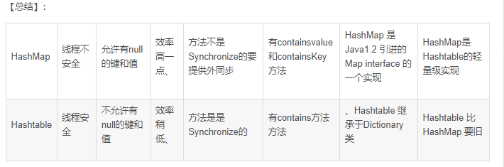

# String 相关

# ArrayList相关

不完整，1.5倍扩容也没说

# Hashmap和hashtable

**第一、继承不同**

第一个不同主要是历史原因。Hashtable是基于陈旧的Dictionary类的，HashMap是Java 1.2引进的Map接口的一个实现。

**第二、线程安全不一样**

Hashtable 中的方法是同步的，而HashMap中的方法在默认情况下是非同步的。在多线程并发的环境下，可以直接使用Hashtable，但是要使用HashMap的话就要自己增加同步处理了。

第三、允不允许null值

从上面的put()方法源码可以看到，Hashtable中，key和value都不允许出现null值，否则会抛出NullPointerException异常。
而在HashMap中，null可以作为键，这样的键只有一个；可以有一个或多个键所对应的值为null。当get()方法返回null值时，即可以表示 HashMap中没有该键，也可以表示该键所对应的值为null。因此，在HashMap中不能由get()方法来判断HashMap中是否存在某个键， 而应该用containsKey()方法来判断。

