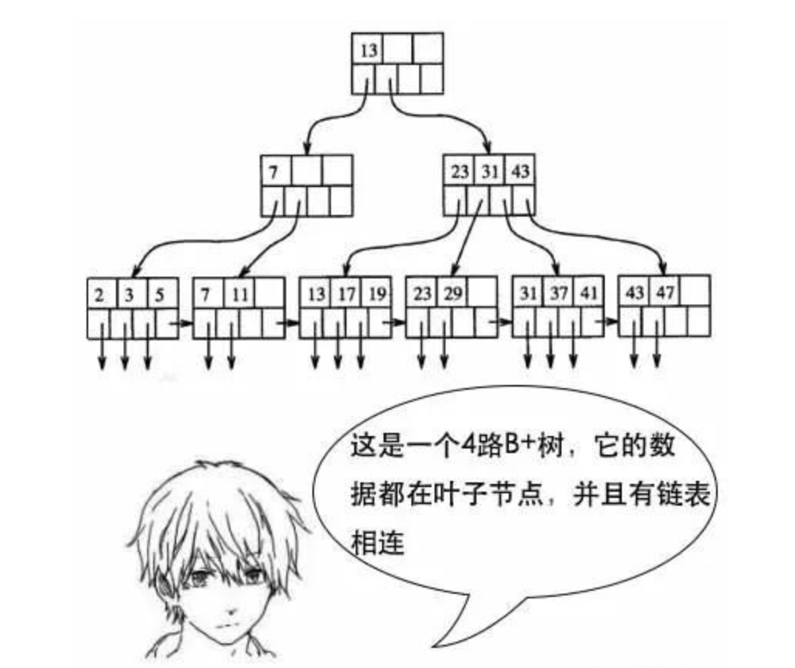

# 1.总体概述：

比方说b b+ 红黑树首先都是搜索树，

https://zhuanlan.zhihu.com/p/335036067

但是b b+ 是多叉的，红黑树是二叉的，b 树的每一个节点本身都是数据、b+树要到叶子才行，
b+的叶子结点有串成了一个链表，
红黑树的颜色规则什么的，

**红黑树的特性**:
**（1）每个节点或者是黑色，或者是红色。**
**（2）根节点是黑色。**
**（3）每个叶子节点（NIL）是黑色。 [注意：这里叶子节点，是指为空(NIL或NULL)的叶子节点！]**
**（4）如果一个节点是红色的，则它的子节点必须是黑色的。**
**（5）从一个节点到该节点的子孙节点的所有路径上包含相同数目的黑节点。**

b树适合文件索引，因为IO次数少，
b+适合数据库索引，不仅IO次数少而且可以一次get多个数据，
红黑树用在hashmap、treemap


```
 1、红黑树放弃了追求完全平衡，追求大致平衡，在与平衡二叉树的时间复杂度相差不大的情况下，保证每次插入最多只需要三次旋转就能达到平衡，实现起来也更为简单。
  2、平衡二叉树追求绝对平衡，条件比较苛刻，实现起来比较麻烦，每次插入新节点之后需要旋转的次数不能预知。

AVL树是最早出现的自平衡二叉(查找)树
红黑树和AVL树类似，都是在进行插入和删除操作时通过特定操作保持二叉查找树的平衡，从而获得较高的查找性能。
红黑树和AVL树的区别在于它使用颜色来标识结点的高度，它所追求的是局部平衡而不是AVL树中的非常严格的平衡。

红黑树是牺牲了严格的高度平衡的优越条件为代价红黑树能够以O(log2 n)的时间复杂度进行搜索、插入、删除操作。
此外，由于它的设计，任何不平衡都会在三次旋转之内解决。
当然，还有一些更好的，但实现起来更复杂的数据结构能够做到一步旋转之内达到平衡，但红黑树能够给我们一个比较“便宜”的解决方案。
红黑树的算法时间复杂度和AVL相同，但统计性能比AVL树更高.
```

```
2.红黑树与B树的区别

(B-树，即为B树。因为B树的原英文名称为B-tree，而国内很多人喜欢把B-tree译作B-树，其实，这是个非常不好的直译，很容易让人产生误解。如人们可能会以为B-树是一种树，而B树又是一种一种树。而事实上是，B-tree就是指的B树。特此说明。)


B树又叫平衡多路查找树。B树是为了磁盘或其它存储设备而设计的一种多叉（下面你会看到，相对于二叉，B树每个内结点有多个分支，即多叉）平衡查找树。与红黑树很相似，但在降低磁盘I/0操作方面要更好一些。 许多数据库系统都一般使用B树或者B树的各种变形结构，如下文即将要介绍的B+树，B*树来存储信息。

红黑树与B树的区别在于，B树的结点可以有许多子女，从几个到几千个。那为什么又说B树与红黑树很相似呢?因为与红黑树一样，一棵含n个结点的 B树的高度也为O（lgn） ，但可能比一棵红黑树的高度小许多，应为它的分支因子比较大。所以， B树可以在O（logn）时间内，实现各种如插入（insert），删除（delete）等动态集合操作


```


## b树：适合做文件索引 为什么？（换个问题 为什么不能退化成链表？）

**文件系统和数据库的索引都是存在硬盘上的，并且如果数据量大的话，不一定能一次性加载到内存中**。那这个时候 就用b树多路存储的性质，每次加载b树的一个节点 然后一步步往下找。

如果在内存中，红黑树比b树效率更高，但是涉及磁盘操作的话，b树更优。


## b+树：数据库索引

B+树是在B树的基础上进行改造，它的**数据都在叶子结点**，同时叶子结点之间还加了指针形成链表。



为什么用b+树：数据库中 Select 数据，不一定只选一条，很多时候会选多条，比如按照 ID 排序后选 10 条。

如果是多条的话，B 树需要做局部的中序遍历，可能要跨层访问。

而 B+ 树由于所有数据都在叶子结点，不用跨层，同时由于有链表结构，只需要找到首尾，通过链表就能把所有数据取出来了。


问题：既然hash比b+更快 为什么 mysql还用b+来做索引呢？

这和业务场景有关。如果只选一个数据，那确实是 Hash 更快。但是数据库中经常会选择多条，这时候由于 B+ 树索引有序，并且又有链表相连，它的查询效率比 Hash 就快很多了。而且数据库中的索引一般是在磁盘上，数据量大的情况可能无法一次装入内存，B+ 树的设计可以允许数据分批加载，同时树的高度较低，提高查找效率。


