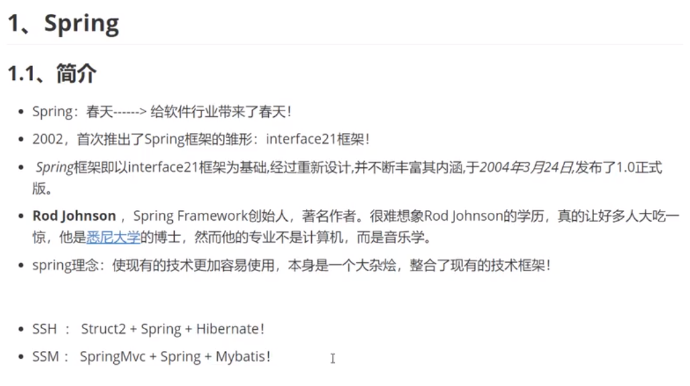
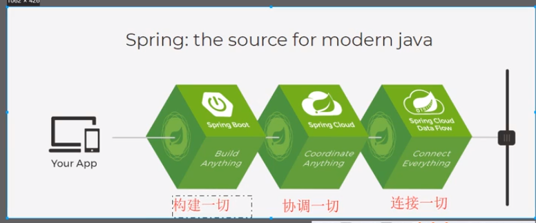

# 1.简介



官网：https://spring.io/projects/spring-framework#learn

官方文档：https://docs.spring.io/spring-framework/docs/current/reference/html/

下载地址：https://repo.spring.io/release/org/springframework/spring/

github：https://github.com/spring-projects/spring-framework/releases


导的包：https://mvnrepository.com/search?q=spring  

里面的Spring MVC

```
<!-- https://mvnrepository.com/artifact/org.springframework/spring-webmvc -->
<dependency>
    <groupId>org.springframework</groupId>
    <artifactId>spring-webmvc</artifactId>
    <version>5.2.13.RELEASE</version>
</dependency>


<!-- https://mvnrepository.com/artifact/org.springframework/spring-webmvc -->
<dependency>
    <groupId>org.springframework</groupId>
    <artifactId>spring-jdbc</artifactId>
    <version>5.2.13.RELEASE</version>
</dependency>

```


## 1.2优点

spring是一个开源的免费的框架

Spring是一个轻量级的，非入侵的框架

控制反转（IOC） 面向切面编程（AOP）

支持事务处理，对框架整合的支持

但总结一句话：Spring 是一个轻量级的 控制反转（IOC） 面向切面编程（AOP）的框架


## 1.3 组成


## 1.4、拓展

再Spring官网有这个介绍：现代化的开发！说白了就是Soring 的开发



SpringBoot 

快速开发的脚手架

基于SpringBoot可以快速地开发单个为服务

约定大于配置


SpringCloud

基于SpringBoot实现


因为现在大多数公司都在使用SpringBoot进行快速开发，学习SpringBoot的前提要完全掌握Spring和SpringMVC

弊端：发展了太久之后，违背了原来的理念。配置十分繁琐，配置地狱。


# 2。IOC理论推导

1.UserDao接口

2.UserDaoimpl


