## **图像恢复介绍**

   图像恢复是指从其劣质图像中恢复未知真实图像的任务。 图像损耗可能在图像形成，传输和存储期间发生。 该任务广泛的用于卫星成像，低光摄影。由于数字技术的进步，计算和通信技术从退化图像恢复清晰图像非常重要。

图像恢复主要有三个任务：

### **图像去噪：**

图像去噪是指恢复受附加噪声污染的图像。 这是图像恢复中最简单的任务，因此已被多个技术社区广泛研究。

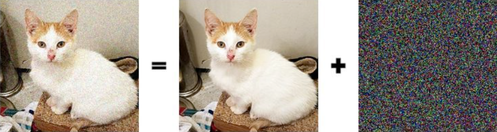

### **超分辨率**：

超分辨率是指从一组低分辨率图像产生高分辨率图像（或一系列高分辨率图像）的过程。

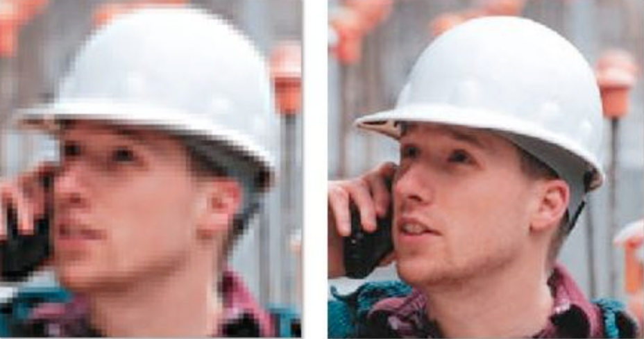

### **图像重建**：

绘画中的图像是重建图像劣化部分丢失的过程。 绘画实际上是一种古老的艺术，需要人类绘制绘画中和丢失的部分。 但在今天的世界研究中，已经提出了许多方法来使用深度卷积网络自动完成这项任务。

## **什么是Deep Image Prior？**

随着Alexnet在2012年图像网络竞争中的成功，卷积神经网络已经变得非常流行并且已经被用于每个计算机视觉和图像处理任务中。

深度卷积网络因其能够从大量图像数据集中学习而获得成功。 Dmitry Ulyanov的论文“Deep Image Prior”表明，为了解决像图像恢复这样的逆问题，**网络的结构已经足够**，并且足以从劣质图像恢复原始图像。本文强调，为了执行这些任务，不需要预训练网络或大图像数据集，并且可以**仅考虑劣质图像**来执行。

为了完成图像恢复的任务，**学习先验**和**显式先验**是两种研究人员流行和主要使用的方法。

学习先验是一种直接的方法，训练深度卷积网络通过数据集了解世界，数据集将噪声图像作为输入，清晰图像作为所需输出。

另一方面，显式先验或人为的先验方法，其中我们嵌入硬约束并且从合成数据教导什么类型的图像是自然的等。在数学上表达像自然这样的约束是非常困难的。

在深度图像先验中，作者试图通过构造一个新的显式先验，使用卷积神经网络来弥合两种流行方法之间的差距。

## **先验理论**

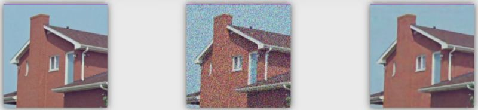

x→原始图像（label）

ẋ→劣质图像（image）

x *→恢复图像（result）

我们可以使用**最大后验分布**来估计经验数据中的未观察值

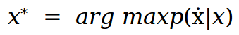

使用贝叶斯规则，我们可以将其表示为先验。

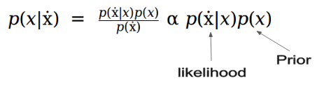

我们可以将方程式表示为优化问题，而不是单独使用分布（李航  统计学习方法 取对数 ）：

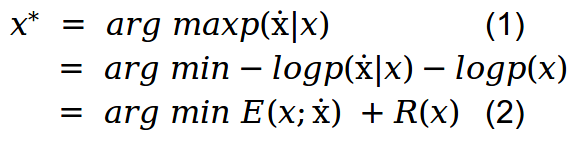

E（x;ẋ）是数据项，它是似然的负对数，R（x）是图像先前项，它是先验的负对数。

现在的任务是最小化图像x上的Eq（2）。 传统方法是用随机噪声初始化x，然后计算函数相对于x的梯度并遍历**图像空间**直到我们收敛到某个点。

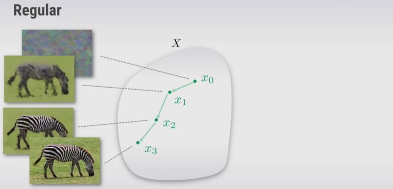

另一种方法是构造函数g，其用随机θ初始化，来自不同空间的输出可以被映射到图像x并使用梯度下降来更新θ，直到它在某个点收敛。 因此，我们可以优化θ，而不是优化图像空间。

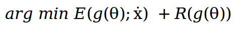

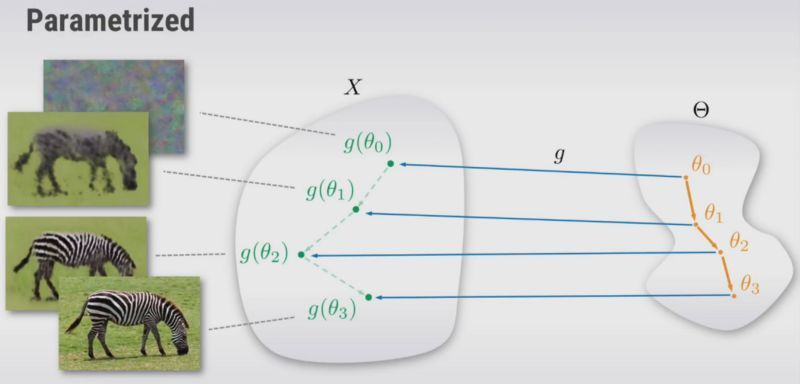

   但是，为什么这种方法可行，我们为什么要使用它呢？ 这是可行的，因为从理论上讲，如果g是满射g：θ↦x（如果至少一个θ映射到图像x）那么这个优化问题是等价的，即它们具有相同的解。 但实际上，**g会极大地改变优化方法搜索图像空间的方式**。 我们实际上可以将g视为超参数并对其进行调整。 如果我们观察到，g（θ）作为一个先验，它有助于选择一个良好的映射，给出一个所需的输出图像，并防止使用得到错误的图像。

现在，方程2可以表示为：

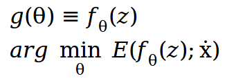

其中，**z是随机固定输入图像**，**θ是随机初始化的权重**，将使用梯度下降更新以获得所需的输出图像。

   理论上乍一看，它似乎会产生原始的嘈杂图像。 在论文中，作者进行了一项实验，该实验表明，当使用梯度下降来优化网络时，卷积神经网络不会产生噪声图像，并且更快速，更容易地下降到自然的图像。
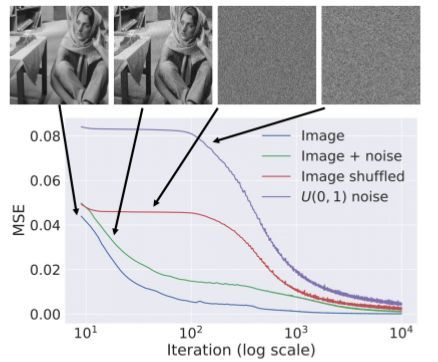

## **Deep Image Prior 步骤**

ẋ = corrupted image (observed)

1.初始化z。 ：用**均匀噪声**或任何**其他随机图像**填充输入z。

2.使用基于梯度的方法求解和优化函数。

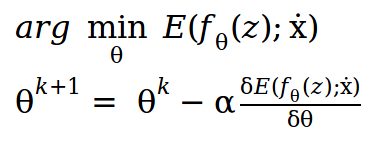

3.最后，当我们找到最佳θ时，我们可以通过将固定输入z向前传递到具有参数θ的网络来获得最佳图像。

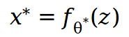

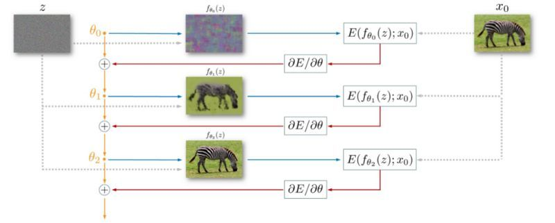

## LFNet的方法可借鉴和不同的地方

可学习的点：
理论的推导+ 实验的论证
不同的点：

我们是分割的任务

冠脉图像更加复杂，结合之前说的challenges：
少量数据从头开始训练网络所造成的性能下降（我们还是需要标签）
网络对细小的管状结构不敏感
血管的scale变化大，我们没法对血管进行统一的增强

在图像的层面，我们从数据分布的角度上（何学长的分享），去描述我们这个事情。在多任务学习中，相似的分布能够带来更好的耦合性。

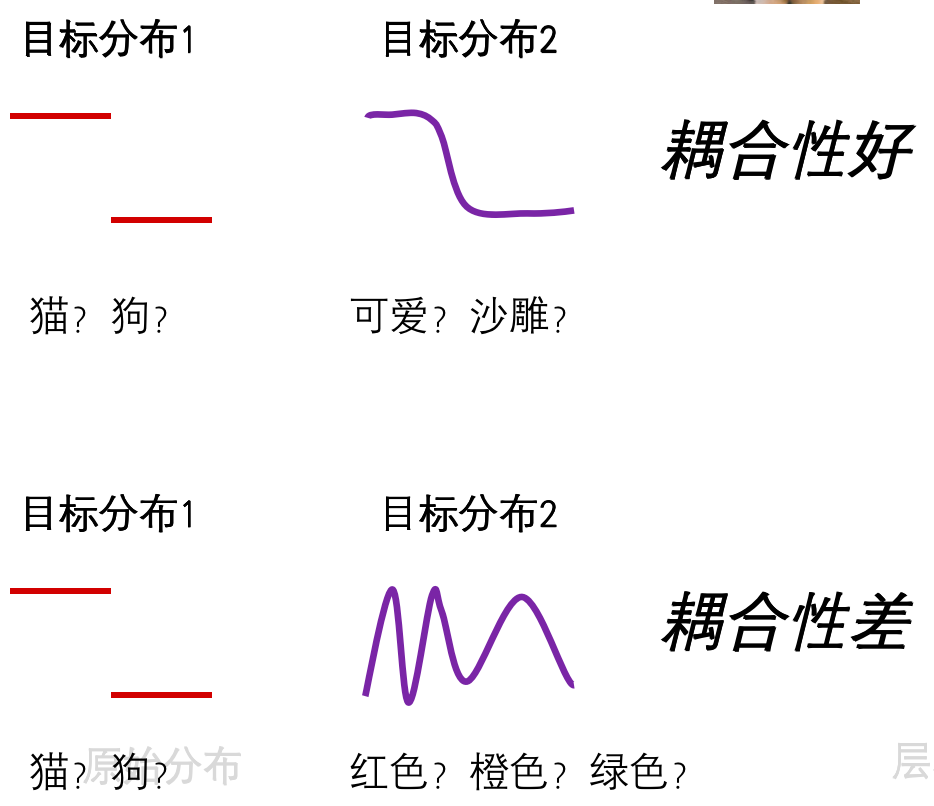

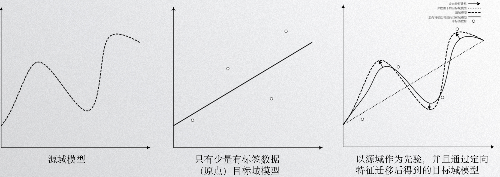

论文角度：
手工描述子，加快深度学习的训练 引导网络更好地学习。
高效 少标签的学习。

借鉴一下 何学长 小波的论文。写作的思路。

参考知识：

https://blog.csdn.net/silver1225/article/details/88914652（求最大似然估计的步骤）：
(1) 写出似然函数;
(2) 对似然函数取对数,得到对数似然函数;
(3) 求对数似然函数的关于参数组的偏导数,并令其为0,得到似然方程组;
(4) 解似然方程组,得到参数组的值.参考知识：

