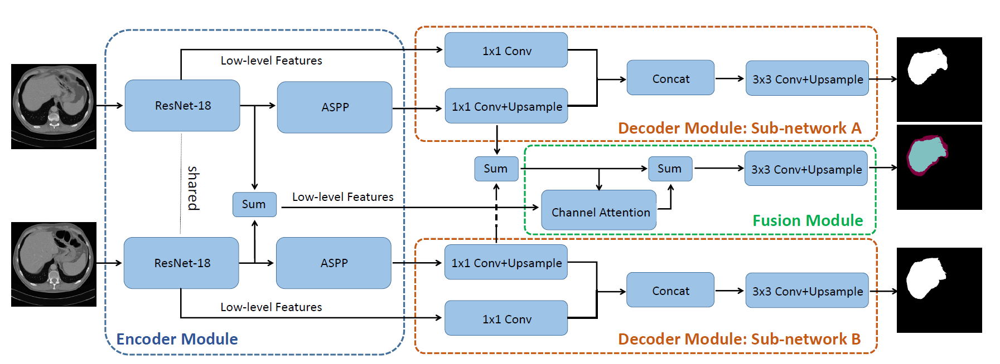
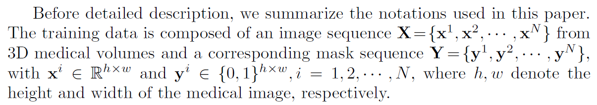
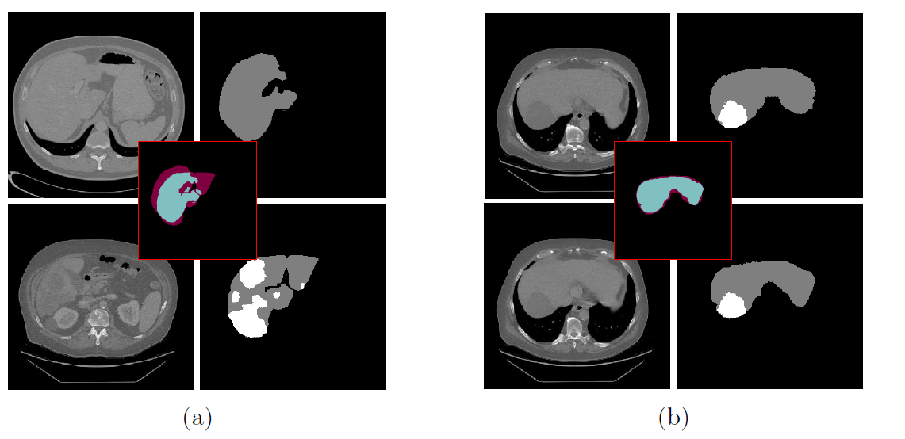
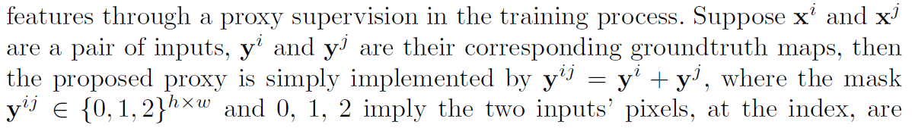
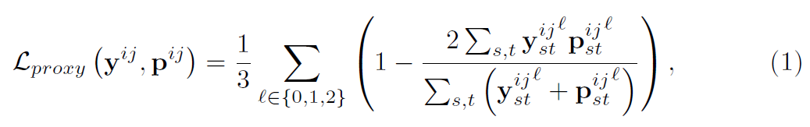
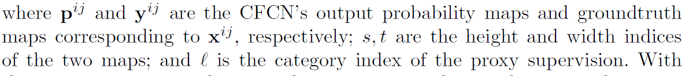
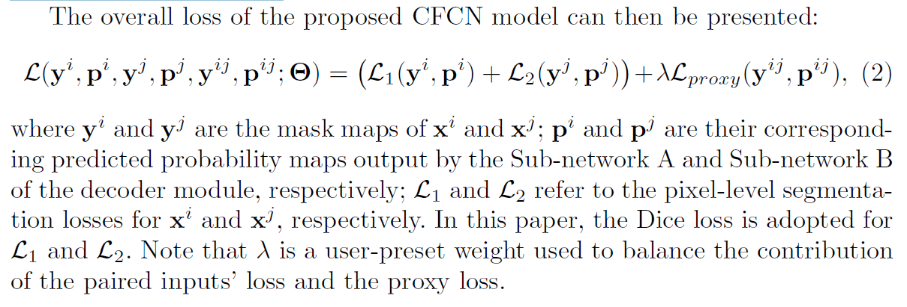

# 基于共轭全卷积网络的成对语义分割

## Abstract.

语义分割已经被广泛使用全卷积网络(FCNs)来解决，如果训练集足够多样和大，结果会令人印象深刻。然而，在医学影像学检查中，由于手动标记样本数量有限，fcn经常无法获得满意的结果。针对这一挑战性问题，本文提出了一种共轭全卷积网络(CFCN)。CFCN是 一种新颖的框架，其中**成对样本**被输入并且在网络中被协同地分段以捕获丰富上下文表示。为了避免在少量训练样本中因外观和形状变化引入过拟合，设计了一个**融合模块**，为网络训练过程提供代理监督。定量评估- 评估表明，所提出的方法在病理肝脏分割方面具有显著的性能改进。

## Introduction

语义分割是一项计算机视觉任务，旨在预测图像每个像素的语义标签。得益于近年来深度学习的发展，它在自然图像分割方面取得了很大的成功[8] [4]。虽然2D/3D医学图像分割可以利用类似的技术(如U-Net [13]和V-Net [9])来获得良好的结果，但仍有一些挑战需要广泛关注。例如，在肝脏分割中，周围器官的相对位置对肝脏的定位非常重要，有助于肝脏的分割。其次，不同图像中目标物体的光滑度、像素强度等个体差异需要大量的训练样本才具有判别性。在训练样本有限的情况下，如何在精确地对目标对象的流形建模与鲁棒地表示个体差异之间进行权衡，这是全卷积网络(FCN)及其变体的瓶颈。e.g., U-Net [13] and V-Net [9].

  在目标对象的流形建模或先验知识建模方面有一些引人注目的工作。**一组利用同一类像素之间的内在联系来提高模糊聚类网络的性能**。例如，在[3]中，作为保留对象边界的后处理步骤，密集条件随机场(CRF)被附加到FCN。同样，柯等人[6]提出了一种自适应亲和域，通过训练过程中的标签关系对空间结构信息和几何规律进行编码。**另一组方法通过显式或隐式建模医学图像/体积中不同对象之间的形状、拓扑结构等高阶先验知识，提高了FCNs的分割性能**。Chen等[2]在多任务学习框架下，将腺体对象和轮廓作为辅助信息，从组织学图像中推进腺体分割。[12]中，通过卷积自动编码器(CAE)预先学习非线性形状模型来对形状流形空间进行建模，然后将其纳入到一个FCN算子中。Ravishankar等[11]提出了一种基于深度学习的框架来联合学习前景、背景和形状，以提高分割精度。在[1]中，提出了一种拓扑感知损失来训练FCN编码组织学腺体分割中包容和分离的几何和拓扑先验。

  考虑到语义分割是一个结构化的预测任务，位于不同图像/体积中的目标对象应该具有一致的标签。这意味着不同体积切片或不同图像块中的物体通常在上下文、形状和位置之间具有内在关系。为了对这些**内在关系进行建模**，我们提出了一种**共轭全卷积网络(CFCN)**来对医学对象进行成对分割。一般来说，我们的CFCN有两个共轭子网络，每个子网络用于分割成对输入的单个样本。为了捕捉成对输入的内在关系并对目标对象的流形进行编码，两个子网络在编码器主干中共享相同的权重，这意味着CFCN捕捉到的低层特征应该足以**表示目标对象**并对**区分背景具有鲁棒性**。（which implies that the low-level features captured by CFCN should be sufficient to represent the target object and robust for distinguishing backgrounds.）在剩余的层中，两个共轭子网络具有独立的权重，这使得CFCN能够学习用于表示两个输入中的每一个的区别特征。由于医学图像分割是一项位置感知任务，其中解剖结构的相对位置对于定位目标物体非常重要，因此我们设计了一个**融合子网络**，为类内不一致性建模和先验形状知识提供代理监督。与FCNs的小批量训练方式不同，在CFCN，成对输入的特征在融合模块中相互影响和引导，提供了一种**新的数据增强方法**，即一个样本可以与不同的样本配对(多镜头)。（could be paired with (multi-shot by) different samples.）我们证明了我们的方法在典型的病理肝脏分割问题上的有效性。与传统的fcn相比，本文的主要贡献有三个方面:

1.首先，提出一种新的共轭网络框架来成对挖掘样本的语义信息，并隐式建模两个输入样本之间的相关性。

2.其次，设计了一种新的融合模块，为消除类内不一致性提供代理监督，并对目标对象的形状先验进行建模，提高分割精度。

3.再次，成对输入可以增大训练样本的大小，在训练样本有限的情况下为医学图像分割提供一种新的解决方案。

图1。提出的共轭全卷积网络综述。该体系结构由三部分组成:编码器模块、解码器模块和融合模块。该网络采用两个不同的输入，并在解码器模块的两个子网络中输出相应的分割概率图。此外，融合模块的额外输出被用来适应代理监控。

## Method

在这一节中，我们将详细介绍所提出的成对分段网络CFCN。CFCN模型由三部分组成:一个编码器模块，一个
解码器模块和融合模块。编码器模块将一对样本作为输入，并联合捕获它们的表示。**解码器模块**由**两个共轭子网络组成**，这两个共轭子网络将来自编码器模块的低级和高级特征作为其输入，并在各自的**基础真值图监督下**学习用于分割每个输入的判别特征。（learn the discriminative features for segmenting each input under the supervision of their own ground truth maps.）**融合模块**将来自**编码器模块的低层特征**之和与来自**解码器模块的高层特征**之和作为输入，在**代理的监督**下捕获位置感知表示。（The fusion module uses the summation of low-level features from the encoder module, and the summation of high-level features from the decoder module, as its input to capture the location-aware representation under the proxy supervision.）Our CFCN for medical image segmentation is illustrated in **Fig. 1.**

Before detailed description, we summarize the notations used in this paper.

### 2.1 Encoder module

编码器模块有两个权值共享的并行全卷积子网络，每个子网络由一组级联的残差块==[5]==组成，用于逐渐提取更抽象的特征。然后，两个子网络中的每一个子网络后面都有一个**阿特鲁空间金字塔汇聚(ASPP)**模块，以捕获如[4]所示的多尺度语义信息。为了减少参数个数，提高计算效率，基于ResNet 18构建了本文的编码器模块，该模块有4个残差块，共18层。

​		不同于传统的医学图像分割网络，我们的编码器模块以**成对样本**作为输入，并尝试使连体子网络在训练过程中相互引导。如上所述，医学图像/体积全局地位于低维流形中，并且成对输入通常在上下文、形状、位置等方面具有固有关系。利用该策略，编码器模块在鲁棒地将目标对象与背景区分开来的同时，能够学习到丰富的表示目标对象的语义信息。在融合模块中，我们进一步挖掘了成对输入的内在关系。各子网络的输出分别为来自**ASPP的高层特征**和**低层特征**以及**ResNet-18的前几个残差块**，作为解码器模块和融合模块的输入。

图2。医学图像分割面临的两个典型挑战。组内不一致:一对切片来自两个不同的体积，肝脏在外观上有很大差异。而下面病理肝脏上的局部语境就大不相同了。协同预测两个掩码的交集和差异可以消除类内不一致，如中心子图所示。端到端的形状建模。为了解决这个问题，从一个体积中沿轴向以小间隔采样一对切片，两个掩模的差异可以编码肝脏的形状先验，如中心子图所示。请注意，为了更好的可视化，病变被掩盖了。

### 2.2 Decoder module

解码器模块由两个共轭卷积子网络(子网络A和子网络B)组成，用于对配对输入的每个样本进行分段。每个解码器子网络采用与==[4]==相同的体系结构，来自编码器ASPP模块的高级特征经卷积层滤波，上采样至与低级特征相同的大小，然后与ResNet-18的低级特征级联。将生成的特征映射馈送到具有3×3卷积的卷积层，并进行双近上采样，使其大小与掩码映射相同。请注意，如果移除两个共轭子网络中的一个，则与编码器模块连接的另一个可单独视为带有ResNet-18中枢的DeepLabv3+ ==[4]==，这是语义分段方面的最先进体系结构。

### 2.3 Fusion module

  融合模块的设计考虑了以下动机:**第一个是类内不一致性**，即不同图像/体积中的**目标对象共享相同的语义标签**但**外观不同**。例如，在肝脏分割中，个体解剖差异和成像设备差异都可能导致类内不一致，如图2(a)所示。特别是在训练数据有限的情况下，网络对类内不一致很敏感，容易出现过度学习。**第二个动机是以端到端的方式进行形状学习。**如图2(b)所示，如果两个输入是沿轴向以小间隔从同一体积采样的，则掩模的差异(其中用红色掩蔽的区域表示两个输入的像素中只有一个属于目标对象)可以编码目标对象的形状先验。为此，我们设计了一个融合模块，在训练过程中通过**代理监督**来学习位置感知特征。假设xi和xj是一对输入，yi和yj是它们对应的基础真值映射，那么所提出的代理简单地由yij = yi + yj实现，其中掩码yij 2f 0；1；2ghw和0，1，2意味着两个输入的像素，在索引处，都属于背景，一个属于目标对象，两个分别属于目标对象。

and 0, 1, 2 imply the two inputs' pixels, at the index, are both belonging to the background, one for the target object and **both belonging to the target object**, respectively.换句话说，我们可以通过一个额外的3类分割任务来实现代理监督，其中标签构成三个地图，分别包括背景的交集、目标对象的差异和交集(对应于标签0、1、2)。换句话说，我们可以通过增加一个3类分割任务来实现代理监督，其中标签分别构成背景的相交、目标对象的差异和相交(对应于标签0、1、2)三个映射。

​	如上所述，**代理监督是抽象的先验知识，需要融合模块挖掘成对输入的低级和高级特征的语义信息**。为此，我们明智地添加低级和高级特征，并将整体特征作为融合模块的输入。此外，受==[14]==的启发，我们采用了通道注意块来细化低级特征。通过这种设计，**融合模块**能够以可忽略的计算成本自适应地学习全局上下文信息。为了进一步融合，我们从通道注意块和高级特征中总结特征。然后，这些特征被馈送到一个3×3卷积层，并被双上采样到与对应于代理监督图的输出相同的大小。

 In this paper, we employ **multi-class Dice loss** to learn the proxy supervision:

where pij and yij are the CFCN's output probability maps and groundtruth maps corresponding to xij , respectively;s；t是两个地图的高度和宽度索引and l‘’ is the category index of the proxy supervision.

在代理监督下，网络容易将不同输入上的目标物体预测为同一类别，不同的掩膜图可以对轮廓信息进行编码。

## 3 Experiments and discussions

然后，我们证实了我们提出的框架对异常肝脏的2D分割的鲁棒性和泛化能力。由于任何病理或异常的存在都可能严重扭曲扫描的纹理，因此准确的病理肝脏分割仍然是对深度fcn的一个挑战，尤其是对于少量或中等数量的训练数据。

