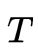
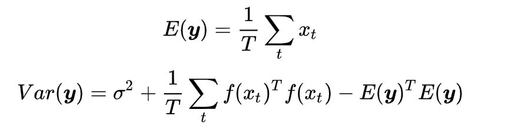
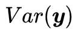
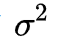

# 【实验笔记】深度学习中的两种不确定性（上）

最近写Honor Thesis被老板分到了一个以前不是很熟悉的方向，做了一个quarter之后总算是入了门。在这里写一篇笔记来记录下过程，同时也希望能帮助到需要的人，这个方面目前还比较新，中文文献较少。

*注: 本文中，概念、公式与实验均基于 Alex Kendall & Yarin Gal的论*

https://arxiv.org/pdf/1703.04977.pdf

## **不确定性（Uncertainty）**

目前深度学习在很多领域的表现都非常好，像是无人驾驶使用的语义分割上的准确率相当惊人。但是众所周知，Tesla无人驾驶一段时间前发生了很多起事故。其中导致一人死亡。最终原因是算法误将一辆浅色卡车误判为天空。

这个事故暴露出的一个问题便是，现在我们传统深度学习算法几乎只能给出一个特定的结果，而不能给出模型自己对结果有多么confident. 的确，在分类问题中，我们会在网络的最后一层添加一个softmax函数来获得概率，但是试想下边这样一个情况：假如我训练了一个分类人脸和猩猩脸的模型。但是我在test阶段给了模型一个大脸猫的图片，我们的模型很会给出一个相当不准确的结果，而没有办法告诉我们“我真不知道这是个什么鬼。” 可能有人说，在这种情况下，最终结果会不会输出一个[0.5,0.5]的结果，来表示自己对结果不确定呢？其实，softmax函数的特性决定了这种情况下网络不太可能输出[0.5,0.5]这样的结果[1]。

这个问题是一个很重要的问题，我曾经在知乎看到过一个搞航天器的朋友回答，为什么ML现在在航空航天领域没有办法应用，他的回答说NN可以在多数情况下给出一个特别特别好的结果，但是偶尔会给出一个特别糟糕的结果，然而这个特别糟糕的结果在他们这个领域是绝对无法被接受的。**如果模型可以在输出这个结果的同时，给出一个非常低的置信度，人类就可以被告知需要介入了，那么ML就可以在更广泛的领域进行应用**。

那么如何让网络获得一个置信度的输出呢？目前一个非常普遍的方法是利用**BNN (Bayesian Neural Network)**。BNN的原理大体上是，我们网络中**每个参数的weight将不再是一个特定的数字，取而代之的是一个先验分布**。这样我们train出来的网络将不再是一个函数，而是一个**函数的分布[2]**。通过这个分布，我们便可以得到一个对**结果的置信度**。但是，实现过BNN和使用过pyro的朋友们应该知道，BNN是比较难应用在动辄上百卷积层的大型网络上的。它的训练速度，计算复杂度，都限制了它的发展。

本文将讨论深度学习中不同原因导致的不确定性，并介绍如何量化这些不确定性。我们将通过一种名为MC Dropout (Monte Carlo Dropout)的方法来进行贝叶斯推断，之后对loss function的修改来得到不确定性。

## **偶然不确定性和认知不确定性（Aleatoric Uncertainty & Epistemic Uncertainty）**

我们先来解释深度学习中存在的两种种类不同的不确定性。

1. **偶然不确定性**

我们初高中学物理的时候，老师肯定提过偶然误差这个词。我们做小车下落测量重力加速度常数的时候，每次获得的值都会有一个上下起伏。这是我们因为气流扰动，测量精度不够等原因所造成的，是无法被避免的一类误差。在深度学习中，我们把这种误差叫做**偶然不确定性**。

从深度学习的角度来举例子，我们举一个大家应该很比较熟悉的人脸关键点回归问题[3]:

我们可以看到，对于很相似的一组数据，dataset的标注出现了比较大的误差（见右图的右侧边缘）。这样的误差并不是我们模型带入的，而是数据本来就存在误差。**数据集里这样的bias越大，我们的偶然不确定性就应该越大。**

**2.认知不确定性**

认知不确定性是我们**模型中存在的不确定性**。就拿我们文章一开始举的例子来说，假设我们训练一个分类人脸和猩猩脸的模型，训练中没有做任何的增强，也就是说没有做数据集的旋转，模糊等操作。如果我给模型一个正常的人脸，或者是正常猩猩的脸，我们的模型应该对他所产生的结果的置信度很高。但是如果我给他猫的照片，一个模糊处理过得人脸，或者旋转90°的猩猩脸，模型的置信度应该会特别低。换句话说，**认知不确定性测量的，是我们的input data是否存在于已经见过的数据的分布之中**。

## **两种不确定性的量化**

*注：本文只关注对回归问题不确定性的量化。对于分类问题，我下方列出的公式会变得更为复杂，我将会在 《深度学习中的两种不确定性（下）》中详细叙述。*

**1. 认知不确定性的量化**

和我们以往所做的不同，本文为了获得认知不确定性，**将不会在测试阶段禁用Dropout**。

这是为什么呢？我们还是需要从BNN说起。

BNN归根结底的原理，是想求一个后验分布

所以归根结底，如何获得认知不确定性呢？虽然上边的原理非常的晦涩，但实际上，这个操作非常的简单，你只需要把数据喂进网络 次，然后把得到的结果取一个平均值，就是你的最终预测，把结果算一个方差，结果就是你的**认知不确定性**，公式如下所示：

其中这个就是你的认知不确定性。至于这个 是哪来的，我们在接下来讲。

**2. 偶然不确定性的量化**

