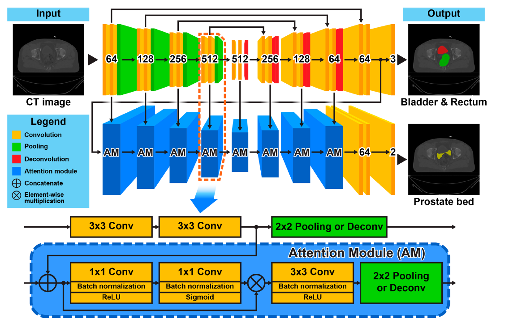
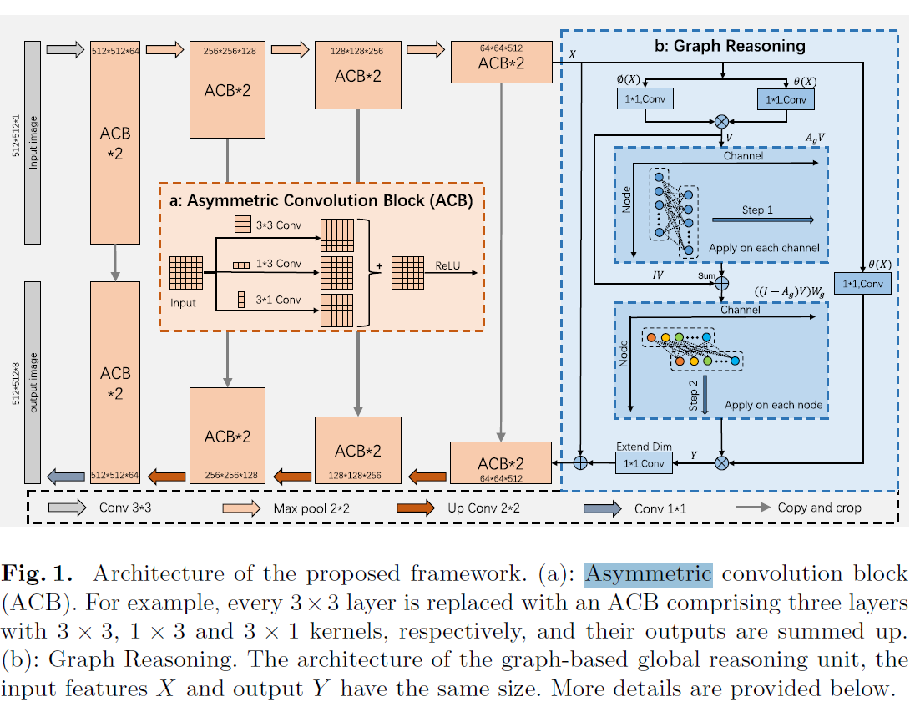
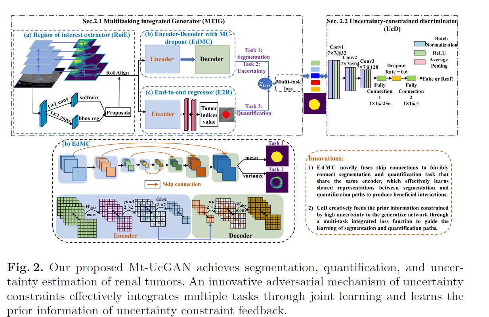

利用先验知识进行分割 miccai

2020

Asymmetrical Multi-task Attention U-Net for the Segmentation of Prostate Bed in CT Image （p470）

（开源）

Graph Reasoning and Shape Constraints for **Cardiac Segmentation** in Congenital Heart Defect

（开源）

Convolutional Bayesian Models for Anatomical Landmarking on Multi-dimensional Shapes

Mt-UcGAN: Multi-task
Uncertainty-Constrained GAN
for Joint Segmentation, Quantification
and Uncertainty Estimation of Renal
Tumors on CT

2019

Right ventricle segmentation in short-axis MRI using a shape constrained dense connected U-Net.

2017

Integrating statistical prior knowledge into convolutional neural networks.

