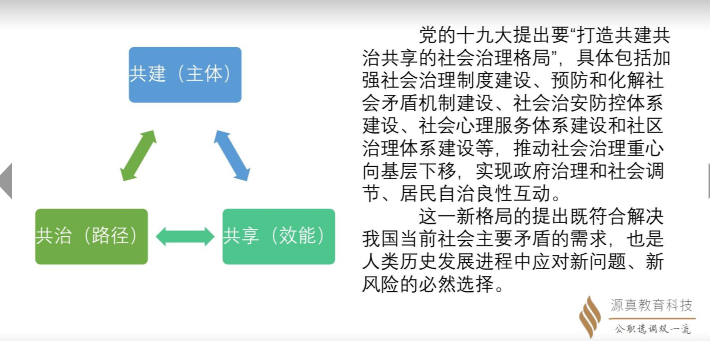

今年五月份 李总理提出的：

进入媒体的，还是社会治理的相关工作

10.17 浙江对清北的定向  城市治理的人文性和系统思维

放管服：是简政放权、放管结合、优化服务的缩写。2018年9月1日，公安部宣布全面推行公安交管实行放管服政策，主要目的是为群众生活及办事增加便利，同时，减轻企业经济负担。2020年5月22日，国务院政府工作报告中提出将纵深推进放管服的改革。

公共服务的优质共享

回馈到前面的四个点。 其实都是公共服务。

专家认为就是出题人的观点

从长远来看，人文单独是不能靠人文来解决的。要有系统思维，要从经济、生态、城市治理的微观方向去发展人文。这是个全生命周期管理的概念。

精神：三地是红色。是精神谱系，

要求：在精神谱系下，我们要有要求。所以就是做窗口，就是做共同富裕示范区的窗口。

解决方法：那怎么去建立好这个窗口呢？ 要以全生命周期管理意识和系统思维 来推导。那怎么推导呢？

执行：在这个意识下，我们要有两个夹角，就是以大数据和科学技术为支撑（技术领先），以制度建设为保障（制度建设）。

务虚：

凭什么是浙江来干？为什么不是别的省份？

共同富裕到底长成什么样子？共同富裕有一个模样。村子或者什么的材料 里面要有共同富裕的雏形。

共同富裕长什么样子？

1.公共服务（富裕） 均等化（共同）   城市公共资源的充沛与否->生活的幸福感   上海都出现共享义肢了 可以去租对应的轮椅了。

2.经济体水平

3.富口袋和富脑袋。文化是需要经济支撑的。文化是城市发展的一面镜子。

4.政治制度的建设。 共同富裕的体制和政策框架的基本建立

5.形成一批可复制可推广的成功经验（背后有要有政策的支撑 要有民生的落脚）。 长三角一体化  浙江能干 上海方便学 还能学得起来 能够抄作业

能完成示范区 窗口 

6.城乡发展差距、城乡居民收入和生活水平差距要缩小。 核心是产业兴旺。临安的核桃 台州的仙居杨梅 绍兴的纺织品  （制度一定要有人去推广 去实施 ）

为什么是浙江？  聚焦在两个： 

1.产业链：浙江的大部分产业链最后都在省内回笼，自主可控性强；厂办在省外，七山二水1分田；经济体在哪里无所谓，产业链都在浙江。 这个也是浙商模式。

2.民营经济极为发达。（李克强总理强调）

（这两个发生碰撞之后，加上浙商精神，才能在浙江完成这个共同富裕的任务）

什么是示范区？

第一点和最后一点 是能在考场上出现的。（副材料）

2 3 就很像材料的头尾中出现的核心材料。（主材料）

里面那些官方的话要多写。

为什么要考选调生？

心里归属 和价值认同。

这个最优秀的制度，共产主义制度，是有追求的目标和意义的。 

我们一定要规避群众思维。 心理归属感认同，感受城市温度，有序参与治理。

有序参与治理：共同富裕，离不开群众的奋斗，企业不能坐以待毙。那就开会啊，视点啊

感受城市温度：东北限电就是反例子。城市的温度就是基础建设，建设方和决策者共同打造的。

心里归属认同：

流浪汉：感受到了城市温度，对城市有了心里归属认同。  精神追求被满足了，城市就有了吸引力。

共享只是个表象，我们要从共建的角度去看，什么人都能参与进来。那怎么去做呢，共治：(有序参与治理)

共建是主题 共治是渠道   决策方   | 共享是结果  被服务方

底层 智能化 精细化 人性化

无人机播种

疑难杂症能进医保了

城市的便利，乡村的发展

向上

一条：今年清北的 城市的人文性 就是人民至上

另外一条：去年长三角区域发展 就是科学擘（bò）画 （制度的温度）

空气式 ：需要我了，我就出现，不需要我了，我就不在。就和中共共产党一样

沉浸式： 周围全是服务者

交互式：以前没人进行回答的任务，现在有人回答了

最底层：智能化 精细化 左边| 人性化 右边

上一层：技术支撑 

再上一层：上层设计

一切两半：左边是科学擘画，右边的是老百姓的感受，人民至上

来个材料：

下姜村是省委书记的联络点

第一段第二段 ：生活快乐无忧：乡村发展的前景

最后落地：共同富裕示范区的新使命，绿富美。 这个就是核心思想。

下姜村乡村振兴联合体（浙江那个四层中的 第四层的政策）：体制机制 政策框架基本建立 是制度上的创新

资源、产业、品牌：资源是绿 产业是富 品牌是美  。

干 600字的应用文  

现在要做数学  数学运算为主 55 30题数学  资料分析 这个还是得 

-------------------------------------------------------理论实践下半场-----------------------------------------------------------------------------

上面的三个层面不能忽视。

摸清楚材料的两条线：

往哪里走，从题设去做。

“一件事集成改革”：*一件事*一次办 

“飞地经济”：打破区域限制 结对子 公共服务共享

反垄断与防资本无序扩张：针对企业

邻居老王：农名工。

最美浙江人：精神建设

碳排放：GEP

江苏本地的劳动力，跨空间的开发，资源互补，协调发展。

浙江精神谱系。

浙商精神 是贯穿于共同富裕背景下的 浙江的精神

浙商精神孕育在浙江大地，会反哺浙江大地。孕育了浙江的思维方式，筚路蓝缕的创业精神。

浙江的本土精神。

1.0 是自主的

2.0 是产业转移。

3.0 桐庐经济 快递 数字经济。快递公司 基本都是浙江的。 3.0渠道建立好之后 就会有致富的化学反应。

创新创业创造 是浙商精神的决胜密码。

红船精神。首创创新精神

今天讲的是示范：

1.0版本（材料）

桐庐 义务模式。1.什么政策帮扶 2.是谁在干 企业要求政府配合  3.获得：社会面貌改变了  群众收入提高了  政府口碑提高了 

 杂事全是选调生做的：

1.党政代表团 什么人 什么旅店 什么行程 。认真 滴水不漏 错了。我们只是通过这个辅助工作了解这个工作脉络，今天做的什么事情，讨论的是什么政策背景下，做的什么事情，挑头的事情是谁来挑头的，最后的获利放是政府还是企业 还是老百姓。

2.0版本（出题）

要素：就是1.0的1 2 3

思路：别人有的，不一定我们有。所以，我们得补要素。人不足 补人。要素是由思路决定的

本位：思路要有本位决定的。 曹县  缺什么 缺铁路 那别人是怎么补上的 那就是经验。

衢州怎么转型？不知道

跳出去，看新疆克拉玛依 看东北大庆  但是本位是永远的出发点。

3.0 评论

评论的核心是态度

经验可取否？ 态度！ 所以就出现了模式。 瘦点经济我们要嘛？ 什么经济我们要嘛？

那我们所有经济都要嘛？不是

所以，我们态度要从经验的角度上，我们不能直接抄别人的经验。

国外的水治理经验 我们不一定要向别人学习，别人是先破坏后保护。

我们要站在中国文化的立场上，不能走短时路线，所以态度是否定的，我们不能重走之前的老路。

请你谈一谈 县委书记是不是作秀。

那是人家的经验，概括他们的本位思想，从长远来看。别去折腾

**站位**：他跳伞是人民立场，是为了当地的旅游项目有更大的曝光率。 所以，这个不是作秀。

但是 这个是不是宣扬，我们是另外个态度。

**概括**：这个里面到底体现了什么呢？体现了这个人敢于担当，用于实践，精神谱系，肯定这个人的干劲

**展望**：这种经验 人家是自己做出决定之前，统筹之后的结论。没有别的办法去逆势突围了，于是才想到了这个方法，这个方法虽然有一定的危险性，但是能提振全县老百姓的信心。 

展望：逆势突围，是通过站位和概括得到的展望。

  模式：

往上：精神谱系

往右：经验 

往左：政府和企业共同合作

往下：个体。全县老百姓要向共富走。

社会治理：新时代枫桥经验 一件事集成改革

生态文明建设:GEP 绿水青山

社会主义先进文化发展：浙江精神 最美浙江人

区域协调发展：飞地经济

公共服务优质共享：一网通办 一件事

收入制度改革：农名工 中等收入群体扩卡

经济高质量发展：烂账 坏账去掉 反垄断

找模式：股权模式

我们由多种新模式，构成了什么什么共富模式。

政策的创新。

技术的赋能。通过数字变革，

技术赋能之后，完成了资源共享格局。

