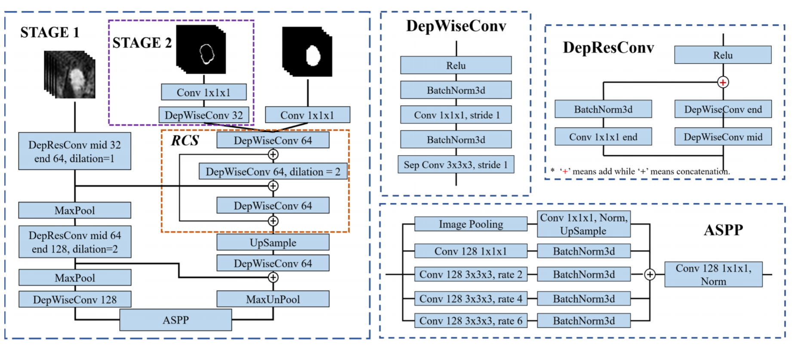

## 1.Harnessing Uncertainty in Domain Adaptation for MRI Prostate Lesion Segmentation

利用域自适应中的不确定性进行MRI前列腺病变分割（没太多关系）

abstract 

对训练数据的需求会阻碍基于学习的医学图像分析采用新的成像模式。域自适应方法通过将训练数据从相关源域转换到新的目标域来部分地减轻该问题，但是通常假定一对一的转换是可能的。我们的工作解决了适应更具信息性的目标域的挑战，在该目标域中，单个源样本可以产生多个目标样本。特别是，我们考虑将mp-MRI转换为justice，这是一种更丰富的MRI模式，涉及用于癌症表征的优化采集协议。我们明确说明了这种映射的固有不确定性，并利用它来生成以单个输入为条件的多个输出。结果表明，当与简单的基于CycleGAN的基线以及集成了区分性分割损失和/或残差适配器的更强大方法结合使用时，这使我们能够系统地提取目标域的更好图像表示。与确定性方法相比，我们的方法在广泛的数据集大小、日益增强的基线和评估措施方面都有显著的改进。

## 2.Deep Learning Automatic Fetal Structures Segmentation in MRI Scans with Few Annotated Datasets

低注释数据集下MRI扫描胎儿结构的深度学习自动分割

有一定的相关性： 这三个步骤在我们的任务中可以是 分割 uncertainty 然后是atles的引导

abstract：本文提出了一种在磁共振成像中，采用极少数带注释扫描训练的深度学习网络，实现胎儿结构端到端自动体积分割的新方法。它包括三个主要阶段：

1） 自定义三维U网的两步结构自动分割；2）分割误差估计（3）分段误差修正。（（1) two-step automatic structure segmentation with custom 3D U-Nets; 2) segmentation error estimation, and; 3) segmentation error correction.）**自动结构分割阶段**首先在缩小的扫描上计算感兴趣区域（ROI），然后在裁剪的ROI上计算最终分割。**分割误差估计阶**段使用输入扫描的预测时间增量来计算多个分段，并估计单个切片和整个扫描的分割不确定性。然后，**分割误差校正阶段**使用这些估计来定位最容易出错的切片，并基于已验证的相邻切片来校正这些切片中的分段。我们的方法在胎儿体(63例，9例用于训练，55例用于测试)和胎儿脑MRI扫描(35例，6例用于训练，29例用于测试)上的实验结果显示，两者的平均Dice系数均为0.96，平均对称面距离分别为0.74 mm和0.19 mm，低于观察者描绘可变性。

## 3.Self-Loop Uncertainty: A Novel Pseudo-Label for Semi-supervised Medical Image Segmentation

自循环不确定性：一种新的半监督医学图像分割伪标签

abstract：随着深度学习神经网络在自然图像处理中的成功，越来越多的研究者开始开发基于深度学习的医学图像分割框架。然而，由于医学图像的像素级标注既费时又费钱，因此标注的数据量往往不足以很好地训练神经网络。在本文中，我们提出了一种半监督的方法来训练神经网络，用有限的标记数据和大量的未标记图像进行医学图像分割。利用一种新的自监督任务神经网络循环优化生成的伪标签（即**自循环不确定性**）作为未标记图像的基本真实值，以增加训练集，提高分割精度。所提出的自环不确定性可以看作是对多个模型进行组合而得到的不确定度估计的近似值，并且显著减少了推理时间。在两个公开数据集上的实验结果证明了我们的半监督方法的有效性。

我们的半监督分割框架的流水线。该框架通过自监督学习任务对FCN的编码部分进行循环优化，生成未标记数据的伪标签。在我们的框架中，有两种损失，即分段损失LSEG和不确定性引导损失LU，用于监督有标记和未标记数据的分割。我们的框架生成Q置换（P1。。。P Q）对一幅图像（有标记或无标记）产生相应的Q分割预测（S1，。。。SQ）用于估算自环不确定度ysl（如算法1所示）。（在线彩色图）

**Estimation of Self-loop Uncertainty for Unlabeled Data**

The generation procedure of our self-loop uncertainty is presented in Algorithm 1

自监督子任务能够在一次迭代中循环优化神经网络，因为自监督信号可以自驱动而无需人工注释。将自监督优化的不同阶段（即{θi e，θd}，i∈{1，…，Q}）看作不同的模型，使所提出的自环不确定性可以用单个神经网络逼近集合不确定性。（The different stages (i.e., {θi e, θd}, i ∈ {1, ..., Q}) of self-supervised optimization are seen as different models, which enable the proposed self-loop uncertainty to approximate the ensemble uncertainty with a single neural network.）置换（排列）后的图像经过FCN得到一组分割预测Si，i∈{1，…，Q}。由于计算出的自监督损失(l)可以明确表示神经网络恢复困难的困惑图像，因此我们将l表示为相应分割结果S(通过范数(。)和算法1中定义的ω)，以修正其对最终伪标签的贡献。因此，我们的自循环不确定性是由自监督优化的不同阶段生成的分割预测的加权平均值。（Our selfloop uncertainty thereby is the weighted average of the segmentation predictions produced by different stages of self-supervised optimization.）

**Uncertainty-Guided Loss.**

分割预测的集合(S1，...，SQ}如图1所示，其中红色代表前景的高得分。权值平均的自环不确定性ysl可用作维持可靠预测(即高得分)的指导，作为神经网络从未标记数据中学习的目标。为了实现这一目标，对于包含未标记数据和伪标记ysl的网络优化，我们采用均方误差(MSE)损失作为不确定性导向的损失LUG，可定义为:

## Uncertainty-Guided Efficient Interactive Refinement of Fetal Brain Segmentation from Stacks of MRI Slices

从运动损坏的胎儿磁共振切片的堆叠中分割胎儿大脑对于运动校正和高分辨率体积重建是重要的。虽然卷积神经网络(CNNs)已被广泛用于胎儿大脑的自动分割，但它们的结果仍可能受益于具有挑战性的切片的交互式细化。（Although Convolutional Neural Networks (CNNs) have been widely used for automatic segmentation of the fetal brain, their results may still benefit from interactive refinement for challenging slices.）

为了提高交互精化过程的效率，我们提出了一个不确定性引导的交互精化框架。（Uncertainty-Guided Interactive Refinement (UGIR)）。我们首先提出了一种基于分组卷积的CNN，以在单个正向通道中获得具有不确定性估计的多个自动分割预测，然后引导用户仅在具有最高不确定性的切片子集内提供交互。（. We first propose a grouped convolution-based CNN to obtain multiple automatic segmentation predictions with uncertainty estimation in a single forward pass, then guide the user to provide interactions only in a subset of slices with the highest uncertainty.）

提出了一种新的交互式水平集方法，在给定初始分割和用户交互的情况下，获得一个精确的结果。（ A novel interactive level set method is also proposed to obtain a refined result given the initial segmentation and user interactions. Experimental results show that: (1)）我们提出的神经网络实时获得与误分割相关的不确定性估计

## Weakly Supervised Deep Learning for Breast Cancer Segmentation with Coarse Annotations

（基于弱监督深度学习的粗糙标注乳腺癌分割）

癌症病灶分割在乳腺癌诊断和治疗计划中起着至关重要的作用。针对为大型医学图像数据集创建标签耗时、费力且容易出错的问题，提出了一种利用边界涂鸦生成的粗标注来训练深度卷积神经网络的框架。

As creating labels for large medical image datasets can be time-consuming, laborious and error prone,a framework is proposed in this paper by using coarse annotations generated from boundary scribbles for training deep convolutional neural networks. 这些粗略的注释包括病变的位置，但缺乏关于边界的准确信息。（These coarse annotations include locations of lesions but are lack of accurate information about boundaries.）**为了减轻标注错误的负面影响**，我们提出了一种自适应加权约束损失，它可以根据学习过程改变特定任务惩罚项的权重。**为了对边界施加进一步的监督**，生成了基于不确定性的边界图，这可以为模糊的边界提供更好的描述。在包含154次核磁共振扫描的数据集上的验证显示，平均骰子系数为82.25%，与精细注释的结果相当，证明了所提出方法的有效性。

Examples of different weak annotations on two small breast cancer lesions. Image-level tags are binary labels (benign or malignant) of cancer lesions. Bounding boxes are squares or cubes which include the entire lesion. Scribbles are points or lines inside the lesion. Boundary scribbles are coarse lesion edges and predictions are our segmentation results.

两个小乳腺癌病灶上不同弱注释的例子。图像级标签是癌症病变的二进制标签(良性或恶性)。边界框是包含整个病变的正方形或立方体。涂鸦是病灶内部的点或线。边界涂鸦是粗糙的病变边缘，预测是我们的分割结果。

## Double-Uncertainty Weighted Method for Semi-supervised Learning

尽管深度学习最近已经取得了先进的性能，但是在医学成像领域它仍然是一个具有挑战性的任务，因为获得可靠的标记训练数据是耗时且昂贵的。本文提出了一种基于师生模型的双不确定性加权半监督分割方法。教师模型通过惩罚学生对标记和未标记数据的不一致预测来为学生模型提供指导。我们使用贝**叶斯深度学习**来训练教师模型，以获得双重不确定性，即分割不确定性和特征不确定性。首次将分割不确定性估计扩展到特征不确定性，揭示了信道间信息捕获的能力。可学习的不确定性一致性损失被设计用于在预测和不确定性之间以交互方式进行的无监督学习过程。在没有监督的基础事实的情况下，它仍然可以激励更准确的教师预测，并促进模型减少不确定的估计。此外，我们提出的双重不确定性作为每个不一致性惩罚的权重，以平衡和协调监督和非监督的训练过程。我们通过定性和定量分析验证了所提出的特征不确定性和损失函数。实验结果表明，该方法优于现有的基于不确定性的半监督方法 在两个公共医疗数据集上。

我们的模型概述。教师模型利用学生模型的均线权重，生成预测和双重不确定性估计。不确定性以互动的方式改变老师，并作为一种权重。学生通过最小化根据标记数据计算的分割损失和标记和未标记数据的一致性损失的加权和，向老师学习。

不确定性估计作为数据选择标准促进全监督学习

Uncertainty Estimates as Data Selection Criteria to Boost Omni-Supervised Learning

对于许多医疗应用来说，常规地获得大量的成像数据，但是为该数据获得高质量的标签可能是困难和耗时的。我们提出了一种新的基于不确定性的方法来提高分割网络的性能。We estimate segmentation uncertainty on unlabeled data using test-time augmentation and test-time dropout（我们使用测试时间增加和测试时间丢失来估计未标记数据的分割不确定性）。然后，我们使用不确定性度量来选择未标记的样本，以便在半监督学习框架内进行进一步训练。与随机数据选择相比，该方法显著提高了半监督体积分割中的Dice系数，适用于EADC-ADNI/HARP MRI数据集和大规模共生-21世纪超声数据集。

